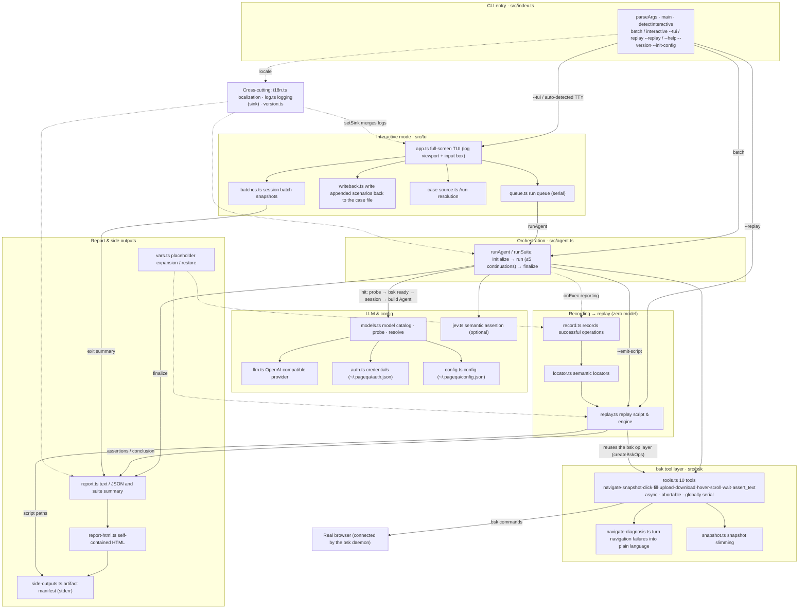

# pageqa

> 中文文档：[README.zh-CN.md](./README.zh-CN.md)

A natural-language-driven page testing agent. It orchestrates test steps with **pi-agent-core** (a stateful LLM agent), drives a real browser via **browserskill (`bsk`)**, and parses natural language through a configurable LLM endpoint. It produces both a human-readable text report and a machine-readable JSON report, and returns an exit code that can feed directly into CI.

<https://github.com/user-attachments/assets/d5315f93-7e02-4445-a7cf-506b3bfcaa2d>

- Runtime: **Node.js + TypeScript**, distributed as an npm package with a CLI entry point; the repo uses **pnpm** for development (lockfile is `pnpm-lock.yaml`).
- Browser driver: **browserskill (`bsk`)**, which connects to an already-running real browser (Chrome/Edge) and supports both public pages and authenticated pages.
- Natural-language driver: the **pi-agent-core** stateful agent parses natural-language intent into browser operation steps and orchestrates them automatically; the LLM backend plugs into a configurable OpenAI-compatible endpoint (base URL / API key / model are all configurable).

## Prerequisites

### 1. Install and configure browserskill (`bsk`)

`bsk` is the driver that connects to a real browser (Chrome/Edge); this project executes page operations through it.

- Project home and installation: **<https://github.com/Tencent/BrowserSkill>**
- Install the `bsk` CLI per that repo's README (one-time setup).

> **No need to start the daemon manually**: when `pageqa` runs it automatically checks for and background-starts the daemon (`bsk daemon start`) if it is not running, once per process. You can also use `bsk status` to check status.

**The browser connection is still up to you** (it is a physical action pageqa cannot automate): install the bsk extension in the browser and complete the connection. If no connected browser is detected at startup, pageqa reports it clearly and asks you to connect first, rather than hanging.

Verify the install and connection:

```bash
bsk status           # view daemon and connected browsers
bsk session start    # optional: manually create a session (pageqa auto-creates one if --session is omitted)
```

> Tip: this tool's `--session <id>` comes from the `session_id` returned by `bsk session start`; if omitted the CLI auto-creates one (assuming a browser is already connected).

> **Important: to run "file upload" cases, you must enable "Allow access to file URLs" on the bsk browser extension first, otherwise uploads will always fail.**
>
> How to enable (Edge / Chrome): open `edge://extensions` (or `chrome://extensions`) → find the BrowserSkill extension → click "Details" → toggle on "Allow access to file URLs" → back on the extension card, click "Reload" once (restart the browser if necessary).
>
> Typical errors when not enabled: `the upload trigger did not activate a file input`, and `the browser could not attach the staged file to the input ... {"code":-32000,"message":"Not allowed"}`.
>
> This is a browser-level setting that **neither pageqa nor bsk can enable automatically** (the Agent Window also cannot open `edge://` pages), so it must be done once by hand; afterwards all local upload cases become usable.

### 2. LLM backend (configurable OpenAI-compatible endpoint)

Natural-language parsing depends on an OpenAI-compatible LLM endpoint. The endpoint address, key, and model can all be set via config file or environment variables:

- Default address: `http://127.0.0.1:3000/v1` (can be overridden to any OpenAI-compatible endpoint)
- Default key: `codebuddy-proxy-key`

Environment variables take precedence over the config file:

- `PAGEQA_LLM_BASE_URL`
- `PAGEQA_LLM_API_KEY`
- `PAGEQA_LLM_MODEL`

### 3. User-level config file (optional but recommended)

The tool auto-creates a config file in your **home directory** to persist LLM settings, so you don't have to set environment variables every time:

- Config directory: `~/.pageqa` (Windows: `%USERPROFILE%\.pageqa`)
- Config file: `config.json`

```json
{
  "baseUrl": "http://127.0.0.1:3000/v1",
  "apiKey": "codebuddy-proxy-key",
  "model": "hunyuan-2.0-instruct",
  "locale": "zh"
}
```

- The file is auto-created on first run (or by running `pageqa --init-config`); edit it to switch models / endpoint addresses / keys.
- **Precedence (high → low)**: environment variables `PAGEQA_LLM_*` > user config file `config.json` > built-in defaults.
- For example, to switch to another OpenAI-compatible endpoint, just change `baseUrl`/`apiKey`/`model` — no code changes needed.

### 4. Jev semantic assertion (optional enhancement)

> **What is Jev?** Jev is the [System One model](https://docs.typesafe.ai) from TypeSafe AI, designed for structured decision-making. It does not generate text; instead it returns calibrated probability values directly (e.g. a match score of 0.93). pageqa uses it for **semantic re-checking after a literal match fails**, correcting false FAILs caused by "synonyms / near-synonyms / formatting differences".

**To enable**: add a `jev` field to `~/.pageqa/config.json`, or set environment variables:

```json
{
  "baseUrl": "http://127.0.0.1:3000/v1",
  "apiKey": "codebuddy-proxy-key",
  "model": "hunyuan-2.0-instruct",
  "jev": {
    "enabled": true,
    "apiKey": "your-typesafe-api-key",
    "model": "jev-latest",
    "threshold": 0.5
  }
}
```

| Jev config | Description | Default |
| --- | --- | --- |
| `enabled` | Whether to enable Jev semantic assertion | `false` |
| `apiKey` | TypeSafe API key | (none) |
| `model` | Jev model ID | `jev-latest` |
| `threshold` | Semantic match probability threshold (0~1) | `0.5` |

**Environment variable overrides** (higher precedence than the config file):

- `PAGEQA_JEV_ENABLED=true`
- `PAGEQA_JEV_API_KEY=<your-key>`
- `PAGEQA_JEV_MODEL=jev-latest`
- `PAGEQA_JEV_THRESHOLD=0.6`

**Getting an API key**:

1. Visit [console.typesafe.ai/settings/keys](https://console.typesafe.ai/settings/keys) (early-access approval required)
2. Or obtain one via the Vercel AI Gateway

**How it works (called on demand)**: `assert_text` first does a string-contains match — **a literal hit is accepted without calling Jev** (saving a remote round-trip and avoiding judging visible text as not-matching); only on a **literal miss** is the page snapshot text sent to Jev for a semantic re-check, where Jev decides whether the page content semantically matches the assertion expectation (match probability ≥ `threshold` means pass). So Jev is used only where it is truly needed: false FAILs from synonyms, near-synonyms, or formatting differences. At most one Jev call per assertion, so long flows are not slowed down assertion-by-assertion.

**Degradation mechanism**: if the Jev API call fails (network / timeout / auth error), it automatically falls back to the original string-contains match, ensuring tests do not fail because the Jev service is down.

**Architecture sketch**:

```text
Natural-language intent
   └─> pi-agent-core Agent (LLM -> configurable OpenAI-compatible endpoint)
          └─> bsk tools: navigate / snapshot / click / fill / hover / scroll / wait
                 └─> real browser (connected by bsk)
          └─> assert_text ──→ literal hit accepted; on miss ask Jev API (optional, semantic re-check)
          └─> conclusion & evidence -> report (text/JSON) + exit code
```

## Installation

> **Node version requirement: ≥ 22.19**. Interactive mode depends on `@earendil-works/pi-tui`, which requires `node >= 22.19.0` (declared in `package.json`'s `engines`).

Local development (the repo uses pnpm; install it first: `npm install -g pnpm`):

```bash
pnpm install --frozen-lockfile
pnpm run build
```

Global install (after publish):

```bash
npm install -g pageqa   # or pnpm add -g pageqa
pageqa --init-config   # create the config file ~/.pageqa/config.json in the user directory
```

> The first run after a global install also auto-creates the config file; use `--init-config` to explicitly create/reset it.

## Usage

```bash
# inline natural language (multiple sentences separated by lines)
pageqa --session <id> "Open https://example.com
and assert the title contains Example"

# read a script file (auto-detects multiple scenarios separated by `## `, runs each and summarizes)
pageqa examples/smoke.md

# JSON report
pageqa --json examples/smoke.md

# force multi-scenario suite mode (even for a single scenario)
pageqa --suite "Open https://example.com and assert the title contains Example"
```

### Multi-scenario suite

Use `## scenario name` in a script (`.md`/`.txt`) to separate multiple independent test scenarios. The CLI runs each one, gives a verdict for each, and summarizes the overall PASS/FAIL and a single exit code (any scenario failure means overall failure).

### Model connectivity check (probe before running)

Before every scenario, pageqa sends one tiny real request (same provider path, `max_tokens=16`) to confirm the model actually answers. The probe runs **before the bsk daemon check, session creation and browser window**, so an unreachable model means no window is ever opened. When the probe fails, **no scenario is executed**:

- **Batch**: stderr reports "model unreachable: `<provider>/<model>`: <reason>" plus what to do, the exit code is `1`, and nothing is printed to stdout (nothing ran, so a report-shaped output would be a lie);
- **Interactive**: that scenario is honestly recorded as FAIL (never as "cancelled", which is excluded from the exit code), the remaining pending items are cancelled, and the viewport explains why.

Why probe **every** scenario instead of once at startup: the model may die halfway through the previous scenario — "it answered at startup" says nothing about scenario 8. Covered failures: endpoint down (connection refused), wrong `baseUrl`/`apiKey` (401), unknown model id (404), network unreachable (timeout, 20s). Aborting with `Esc` is not treated as "unreachable" — it stays a "cancelled" run. See `docs/adr/0006`.

### Interactive mode (add scenarios while a run is in progress)

A long flow can take ten-plus minutes in one run, and during that time you could only wait idly if you wanted to add a case. Interactive mode lets the run keep going while you submit new scenarios at any time:

```bash
pageqa --tui examples/smoke.md

# or open a session first and decide what to run later (no case file needed)
pageqa
```

Entry condition: it enters **automatically** when run in an interactive terminal (`stdin` and `stdout` are both a TTY) and `--json` is not given; `--tui` / `--no-tui` can force it on/off, or `PAGEQA_NO_TUI=1` can disable it. With **no arguments at all** it also enters — that session starts with an empty queue and **no write-back target**, and you load a case file whenever you want with `/run`. Inline text still does not enter (batch mode is the right place for a one-off case) and `--tui "<inline text>"` still errors. Explicit `--tui` in a non-TTY errors out immediately rather than silently degrading (silent degradation would make people think the UI is broken).

The **write-back target** is the case file that appended scenarios are written back to: the startup case file, or the most recent `/run` file, whichever came later. It is always shown in the status bar, and switching it is announced in the viewport. With no target, appended scenarios exist only in this session and nothing is written to disk — the viewport says so on submit, and the exit summary says how many were never written.

The UI is "scrollable log on top + fixed input box at the bottom": progress logs, bsk command timings, and each step's success/failure all stream into the viewport in real time, while stdout stays reserved for the final report. When the log outgrows the viewport, `PageUp`/`PageDown`, `Ctrl+↑`/`Ctrl+↓`, `↑`/`↓` and the mouse wheel scroll back through it; scrolling up pauses following the end, and the label on the last row (or `End`) jumps back to the bottom. Submitting input always returns to the bottom.

**Directly below the input box** there is a permanent line with this session's token usage, worded exactly like the report's last line:

```text
Token usage: input 301 / output 117 / cache read 9536 / cache write 0 / total 9954 (LLM calls 4)
```

It is the **session total** (settled values of finished scenarios + the running scenario's live value), refreshed after every LLM call — so a long flow tells you how much it has burned halfway through. When the endpoint returns no usage that line says so itself (it never passes `0` off as "nothing consumed"). Each scenario also gets its own detail line in the viewport when it ends, and the exit summary and `--json` keep exactly the same shape as before.

**Some terminals deliver the mouse wheel as `↑`/`↓`** (VS Code's alternate buffer does exactly that: when the app gets no mouse events, the terminal translates the wheel into arrow keys so that pagers like `less`/`man` still work). A wheel and a real arrow key are byte-identical, so the app dispatches by context: **while the input box is empty, `↑`/`↓` belong to the log viewport** (which is what makes the wheel scroll the log, same step as the wheel), and input history moves to `Ctrl+P`/`Ctrl+N`; as soon as the input box has content, `↑`/`↓` go straight back to the editor (cursor movement / history browsing). Rationale in `docs/adr/0007`.

| Key | Action |
| --- | --- |
| `Enter` | Submit (if the input contains `## title`, it becomes the scenario name; otherwise the first-line summary is used) |
| `Shift+Enter` | Newline (for writing multi-scenario cases) |
| `Esc` | Abort the current scenario: recorded as "cancelled", not counted in the exit code, not written to the replay script |
| `Ctrl+C` | Finish: abort current + cancel all pending, restore the terminal and output the summary report (**a normal exit, never a hard kill**; pressing it again while winding down stops waiting for the queue) |
| `PageUp` / `PageDown` | Scroll the log one page up/down |
| `↑` / `↓` | Scroll the log (only while the input box is empty; terminals often report the wheel as these) |
| `Ctrl+↑` / `Ctrl+↓` | Scroll the log one line (always works, even while writing a multi-line case) |
| `Ctrl+P` / `Ctrl+N` | Input history: previous / next submitted text (was `↑`/`↓`) |
| `Home` / `End` | Jump to the start of the log / back to the end (follows the end again) |
| Mouse wheel | Scroll the log (3 lines per notch); scrolling up also pauses following — click the label on the last row to go back to the bottom |

`Ctrl+C` (same as `/exit`) goes through the **normal exit path**: abort the current scenario → cancel all pending → restore the terminal (leave the alt screen, show the cursor) → print the summary report → exit the process. It never kills the process outright — a signal-killed process never restores the terminal, leaving it in the alt screen with a hidden cursor (which looks like the terminal was closed or hung, with no report at all). When raw mode is not in effect (early startup, or after the terminal is restored during teardown) the terminal turns `Ctrl+C` into a `SIGINT` signal; pageqa routes the signal through the same path. Pressing it again while winding down means "stop waiting for the queue" — the report is still printed. Rationale in `docs/adr/0008`.

Commands: `/status` (view the run queue), `/run <path or keyword>` (load an existing case file into the run queue), `/new` (start a new session: clears the viewport and the run queue), `/cancel <n>` (cancel a not-yet-started pending item), `/model` (choose the model used by this session), `/login` (sign in a provider), `/logout` (remove a provider's local credentials), `/setting` (change settings: test report / replay script / language, persisted to `~/.pageqa/config.json`), `/help`, `/exit`. Typing `/` at the start of the input pops up a fuzzy-filtered command list, and `/cancel` additionally completes pending queue numbers (Tab accepts).

- **`/run` loads a case file at runtime**: `/run examples/github-star.md` (exact path), `/run examples` (every case file in that directory), or `/run github-star` (filename keyword — `node_modules`, dot-directories and similar are skipped). A single match loads directly; with several matches the **candidate filenames** (never their contents) are handed to the model to pick from, and if it can't decide — or the model is unavailable — a selector lets you pick yourself. The loaded file's scenarios are appended to the queue, its scenarios are **not** written back (they are already in the file), and the write-back target switches to it. The model is deliberately not given file-reading tools: if case contents bypassed pageqa, step numbering, the `k ↔ case text` mapping and the write-back/recording correspondence would all break, and it would gain read access to any file on the machine.

- **`/model` switches the model**: a selector pops up (`↑↓` to move, `Enter` applies to this session, `Ctrl+S` also persists it as the startup default in `config.json`, `Esc` cancels). The list covers two kinds of providers — the **custom endpoint** (`baseUrl`/`apiKey`/`model` in `config.json` is always available) and **built-in providers** (anthropic / openai / deepseek / github-copilot …, which appear only after `/login` or when the matching env var like `ANTHROPIC_API_KEY` is set). Switching affects only **later** scenarios; a running one is never interrupted. See `docs/adr/0004`.
- **`/login` signs in**: pick a provider, then follow its login flow (API key or subscription OAuth); the authorization link / device code is printed to the screen, text/key prompts use the bottom input box, `Esc` cancels. Credentials are written to `~/.pageqa/auth.json`, which is **not** part of the git repo. After signing in, `/model` offers that provider's models.
- **`/logout` removes credentials**: lists providers with local credentials, `Enter` removes the corresponding entry from `~/.pageqa/auth.json` (env-var and `config.json` auth are untouched).
- **Startup default**: `modelProvider` + `model` in `~/.pageqa/config.json` decide which model is used on the next start; `/model` with `Ctrl+S` rewrites them. If the startup default points at a built-in provider that is later unsigned-in / retired, interactive mode warns and falls back to the custom endpoint's default model instead of failing the first scenario.

Key points:

- **`/new` starts a new session without leaving the process**: the viewport and run queue are cleared and the token counter starts over, but **nothing from the previous batch is lost** — it still goes into the exit summary and the replay script ("I cleared the screen" is not "nothing ran"). The fresh viewport opens with a recap of the previous batch (one line per scenario with its verdict). While something is running or pending, `/new` refuses and tells you what to do (`Esc` to abort the running one, `/cancel <n>` to drop pending items) instead of silently discarding submitted-but-not-run scenarios. The **write-back target is kept** (silently dropping it would stop later typing from being written to disk); use `/run` to switch case files. See `docs/adr/0009`.
- **Nothing runs while the model is unreachable**: every scenario is preceded by a connectivity probe; when it fails, that scenario is recorded as FAIL, the remaining pending items are cancelled, and the viewport states the reason and the way out (see "Model connectivity check").
- **Appended scenarios are written back to the write-back target immediately** (pure append; the case's original text and runtime placeholders are preserved verbatim — never the expanded concrete values). Because "what you type is the case you want to keep"; writing it after the run would let Ctrl+C discard the entire pending queue.
- **`/run` appends to the tail of the queue, it never replaces it**: a running scenario is unaffected and new ones line up behind the pending list. Loading is just a bulk submit — the promise that "submitted means it will run" (`docs/adr/0002`) is exactly why loading does not get to throw anything away. Use `/cancel` or Ctrl+C to drop something.
- **Loaded scenarios are never written back**: they are already in the file they came from. Only appended scenarios are written. Placeholders in a loaded file expand from the **session's** single moment (the same one appended scenarios use), not from the load time — the replay script does the reverse lookup "concrete value → placeholder" per script, and a file's scenarios and its appended ones end up in the same script.
- **Scenarios run serially**: each scenario creates and closes its own bsk session and browser window (created only when its turn comes in the queue), so no windows fight for focus; after one scenario ends (pass / fail / cancelled) the next starts automatically.
- **"Cancelled" is a third terminal state**: Esc means "I don't want to wait for this anymore", not "this case is broken", so it does not enter the exit code nor the replay script (half a trace recorded there would let replay run half a case and possibly report PASS).
- **Aborting is a real abort**: pressing Esc kills the bsk command currently running, rather than waiting for it to time out. This requires the bsk operation layer to be async (a synchronous child process blocks the event loop, during which the UI does not render at all and cannot receive Esc) — rationale in `docs/adr/0003`.
- **Replay scripts are generated by default** (turn it off in `/setting`; an explicit `--emit-script` always wins): on exit, the run scenarios are frozen into replay scripts — **one script per case file**, each written next to its own source (`examples/smoke.replay.json`), because a script's header carries a single `source { path, hash }`. Cancelled scenarios are excluded, and appended scenarios belong to whichever target they were written to. **Scenarios with no target at all produce no script** (the side-outputs summary says why) — to make them replayable, open a case file with `/run` first. Generated paths are listed in the exit "side outputs" summary. Giving an explicit script path for a run with several sources is an **error** rather than a silent partial write, and a run in which nothing ever ran writes no script at all. The hash is based on the **post-writeback** file content, so the first replay won't falsely report "source case changed".
- Cannot be combined with `--json` (needs exclusive stdout), `--replay` (sub-second, zero-model, no waiting), or `--session` (conflicts with "each scenario has its own session").
- Batch mode (pipes, redirection, `--json`, CI) behavior is unchanged: `tests/smoke.test.mjs` goes through piped stdio and degrades automatically.

### Writing cases: assertion lines must line up with the assertions tools produce

The report's integrity check compares "how many assertion lines the case has" with "how many assertion results were actually produced", so **the number of lines containing the word 断言 (assert) must equal the number of tool calls that produce an assertion**:

- Each `assert_text` produces one assertion → one "assert the page contains …" line maps to exactly one.
- `download` (see "Export and download") **is itself an assertion** → say so on that very line (e.g. "… capture the exported file and assert the file is on disk"). Do **not** add a separate "assert the file was downloaded" line: the case would count 2 while the tools produce 1, and the run ends with a **false** "all assertions in the case executed (actual 1/2)".
- Incidental checks that are not meant to decide pass/fail (e.g. "confirm no export-failure message appeared") must **not** be written as 断言: no tool result corresponds to them.
- Two occurrences of 断言 on one line count as two; phrasings that treat it as a topic (`断言失败/不成立/结果/的/写法/…`) are excluded, everything else counts (rule in `countAssertions`, `src/report.ts`).
- **Comments do not count**: `#` headings and `>` comment lines count neither as steps nor as assertions (same rule as `numberSteps`), so explanatory text in a case never inflates the expected count — only real step lines count.

This also drives the agent's continuation logic: when the expected count exceeds the produced one, pageqa appends one more "continue the remaining steps" round — a wasted round that still ends with "not all assertions executed". `examples/sms-log.md`'s S2 is written this way.

### Failure diagnosis (step numbering + execution trace)

On a long-flow failure, seeing only "steps done: 23/42" is useless for fixing the case — you don't know which line of the case it got stuck on. For this:

1. **pageqa numbers every step uniformly**: each non-empty line of the case (ignoring `#`/`>` comment lines) is numbered as `### step k: <original text>` before being handed to the model. The model must execute by number and output the same numbering as "step k done: …" / "steps done: k/n". So `k` maps directly back to a line of the case.
2. **The report outputs the execution trace**: each scenario in the suite report appends tool calls and step self-descriptions (last 25), making the failure cause and the stuck point obvious at a glance.
3. **Name the next unrun step directly when incomplete**: the integrity check's failure items give "last progress" and "unexecuted step (step k/n): <case original text>", so you can locate the line to fix by following it.
4. The JSON report additionally provides `steps` (the case step list) and `trace` (execution trace array) fields; suite mode also provides `scenarios[]` (per-scenario `name/status/steps/trace/assertions`) for CI-side failure attribution.

- `durationMs` (optional, milliseconds): this scenario's / suite's duration; suite per-scenario detail `scenarios[].durationMs` is the same field.

Example report fragment on failure:

```text
--- Scenario 1: P1 product → catalog → material → … [FAIL] ---
  - [PASS] the product `自动化测试产品202609210905` already appears on the page (evidence: first list row shows…)
  - [FAIL] all steps executed completely (23/36) (agent self-reported step completeness insufficient; last progress: step 23 done: clicked the "操作" dropdown and selected "检出"; unexecuted step (step 24/36): click the "待办事项" in the page's right-side menu bar, enter "待办列表"; trace tail: [tool] snapshot → [tool-ok] click → [tool-error] click)
  - [FAIL] all assertions in the case executed (actual 2/6) (…; last progress: step 23 done…)
  Execution trace (last 25/25):
    [tool] navigate
    step 1 done: opened the product list page
    [tool-ok] snapshot
    …
    [tool-error] click
    step 23 done: clicked the "操作" dropdown and selected "检出"
```

### Token consumption

After each run, the report's **end** shows the LLM token consumption for that run (multi-scenario suites output one line per scenario and one at the total):

```text
---
Token consumption: input 446 / output 136 / cache read 6720 / cache write 0 / total 7302 (4 LLM calls)
```

- Data comes from the `usage` of each round's assistant message (including auto-retried rounds); `input/output/cache read/cache write` are the breakdown, and `total` is the endpoint's `totalTokens`.
- In the JSON report (`--json`) it is the `usage` field: `{ input, output, cacheRead, cacheWrite, reasoning, total, calls }`.
- If the LLM endpoint returns no usage (total is 0), the same line notes "endpoint returned no usage", avoiding misreading 0 as real consumption.

### HTML report

Every run (batch, replay, interactive exit) writes a self-contained HTML report that can be
opened directly in a browser into the current directory; the path and generation time are
printed to stderr:

```text
pageqa-report/report-20260923-153001.html
```

- The filename carries a timestamp, so multiple runs never overwrite each other; `pageqa-report/` is already ignored in `.gitignore`.
- Contents: overall summary (scenario count / passed / failed / cancelled / duration / tokens), per-scenario status and assertions, collapsible execution traces.
- The test report and the replay script are both **side outputs**: neither enters stdout, only their paths go to stderr, and a write failure only warns — it never changes the exit code.
- The JSON report (`--json`/`--out`) gains an optional `durationMs` field (milliseconds); older reports lack this field.

### Side outputs and `/setting`

Every run ends with two **side outputs** (neither enters stdout; only their paths go to stderr):

| Output | Default | Location |
| --- | --- | --- |
| Test report (HTML) | generated | `pageqa-report/report-<timestamp>.html` |
| Replay script | generated | next to the **currently open case file** (`examples/smoke.md` → `examples/smoke.replay.json`), fixed name, overwritten on each run |

On exit, a single summary lists both paths and the replay command:

```text
[pageqa] side outputs:
[pageqa]   test report: pageqa-report/report-20260923-153001.html
[pageqa]   replay script: examples/smoke.replay.json
[pageqa]   replay with: pageqa --replay examples/smoke.replay.json
[pageqa]   downloaded file: C:\Users\me\.pageqa\downloads\20260923-153012-report.xls (removed after the assertion passed)
```

Files captured by the `download` tool are listed one per line (see "Export and download"). They have **no "generate it or not" switch**: turning one off would not make the file disappear, it would only make it unfindable. The line appears only when a file was captured, and entries removed after a passing assertion are marked (`(removed after the assertion passed)`) so the path never lies. The default location is `~/.pageqa/downloads` (change it with `downloadDir` in `~/.pageqa/config.json`); whether the file is removed after the assertion passes is controlled by `downloadCleanup` (**missing means on**).

Turn either one off with `/setting` in interactive mode (three rows: `test report (HTML)` / `replay script` / `language`; `↑↓` to select, `Enter` to toggle, `Esc` to close). The switches live in `~/.pageqa/config.json` as `htmlReport` / `replayScript` — **keys you never touched are never written**, and a missing key means "on".

- The switches cover **side outputs only**: `--json`, `--out` and the stdout text report never change.
- **Explicit flags win**: `--emit-script` (with or without a path) still generates even when the switch is off.
- Scenarios without a target (appended scenarios in a source-less session, inline text) produce **no script**, and the summary says why; to make them replayable, open a case file with `/run` first.
- **A run in which no case executed writes no report**: exiting an empty session, or cancelling every scenario before any of them starts, leaves no empty report file (the summary says "no case ran this session"). A scenario that did start and was then aborted still has a real half trace, so it is kept.
- `/toggle-language` still works in interactive mode, but no longer appears in `/help` or the completion list (the new entry point is `/setting`).

Rationale: `docs/adr/0011`.

### Snapshot slimming and reuse (save tokens and time)

A single snapshot of a long page can be thousands to tens of thousands of characters, and it is read dozens of times in a long flow — eating both context and inference time. For this, pageqa does two things to snapshots:

**1) Slimming**: only enabled when the original exceeds 8000 characters; rules are conservative and do not change locating:

- Lines with `@eN` are **never truncated, never dropped** (the model relies on them to click, and the semantic locator for recording/replay also parses them for role/name);
- the **ancestor chain** of `@eN` lines is **never dropped** (the ancestor path is the basis for disambiguating same-named elements, see "Replay script" below);
- meta-info lines (`@vom`/`@view`/`@layers`/`L1 page`) are kept; blank lines are omitted;
- other text lines: truncated only if they exceed 160 characters (head preserved); if still over 20000 characters after slimming, the longest non-critical lines are dropped entirely first, with short text (titles/labels/status hints) preserved preferentially;
- a one-line note is appended at the end (`[pageqa] snapshot slimmed: a → b chars…`) so the model knows some content is unseen, rather than thinking the page is only that small.

Therefore **the text the model sees and the text used for locator parsing are the same copy**, with role/name/ancestor path unchanged; `--debug` prints the character-count change of each slimming.

**2) Reuse**: all actions that mutate the page (`navigate`/`click`/`fill`/`upload`/`download`/`hover`/`scroll`/`wait`) invalidate the previous snapshot, so reuse only happens **after pure reads**:

- the model does `snapshot` then immediately `assert_text` → the assertion reuses that snapshot directly, saving a bsk round-trip (assertion window 5s, `snapshot`'s own dedup window 1s); note the assertion's literal match uses the **pre-slimming** full snapshot — slimming only affects the context fed to the model, not the page full text the assertion relies on;
- in replay, "previous step was an assertion, next step needs to locate an element" is the same; before a retry it does `wait`, which necessarily invalidates, so the existing behavior of "re-fetch a snapshot on every retry" is preserved.

Deviations from the page's own async updates are caught by the short window: anything outside the window is re-fetched.

### Script placeholders (runtime variables)

You can write placeholders like `${timestamp}` in a script, and the CLI expands them by the machine's current time when reading the script. All placeholders within one run share the same moment, so cases like "name + timestamp" neither collide in name nor require manually editing the timestamp every time:

```md
## P1 create product

Open https://example.com/product
Click "新增", fill product name `自动化测试产品${timestamp}`
Assert the page contains `自动化测试产品${timestamp}`
```

| Placeholder | Expands to |
| --- | --- |
| `${timestamp}` | `yyyyMMddHHmm`, e.g. `202609191146` |
| `${date}` / `${time}` | `yyyyMMdd` / `HHmmss` |
| `${datetime}` | `yyyyMMddHHmmss` |
| `${timestamp:<format>}` | custom format, supports `yyyy` `yy` `MM` `dd` `HH` `mm` `ss` `SSS`, e.g. `${timestamp:yyyy-MM-dd HH:mm}` |

Unrecognized placeholders (e.g. `${PATH}`) are kept as-is and not replaced. Full example: `examples/smoke.md`.

### Replay script (rerun the same case with zero models)

Once a case is run through by the LLM once, its operation sequence is fixed. By **default** pageqa freezes this successful run into a **replay script** (`--emit-script` remains the explicit switch, and you can turn the default off in `/setting`), then use `--replay` later to rerun with zero models: no LLM is called, it completes in sub-second, and no LLM endpoint needs to be configured. Ideal for wiring "run once with the model, then regress daily with the script" into CI.

```bash
# 1) first run through with the LLM and generate the script (writes to examples/smoke.replay.json next to the source case if no path given)
pageqa --emit-script examples/smoke.md

# 2) then each time, replay with zero models
pageqa --replay examples/smoke.replay.json
pageqa --replay examples/smoke.replay.json --json       # machine-readable report, for CI
pageqa --replay examples/smoke.replay.json --semantic   # assertions use Jev semantic judgment
```

Key points:

- **No `@eN` stored**: bsk's `@eN` is only valid within the snapshot that produced it; the numbering is re-laid at replay time. The script stores **semantic locators** (role + accessible name + same-name index), resolved against the current snapshot at replay time, so small page adjustments (changed copy, added prefix/suffix, swapped node type) usually still hit; when it cannot be resolved it falls back to the recorded `target` (still usable if it's a CSS selector), and if both fail it errors clearly rather than guessing "the most similar" element — clicking the wrong element manufactures a false pass.
- **Placeholders stay reusable**: `自动化测试产品${timestamp}` is written into the script as a placeholder — including **the name inside the locator** (when clicking "the just-created one" in a list, the name also carries the timestamp) and the case original text; re-expanded at replay time (one run shares one moment), so cases like "create xxx${timestamp}" can be replayed repeatedly without name collisions. If the model made up its own value (didn't follow the placeholder), it is frozen to the recorded concrete value.
- **Old scripts self-heal**: scripts generated by early versions may retain the recorded concrete values inside locator names or case original text. The script carries `recordedValue` / `recordedExpectation` as evidence, so `--replay` uses them to restore these hard-coded values back to placeholders on load (printing a line "restored the hard-coded recorded values in the script to placeholders"), **without re-running a ten-plus-minute LLM case for one field**. Local file paths (`upload`'s `file`) and `target`/`url` are deliberately not rewritten.
- **Hover-triggered dropdowns**: write such cases as "first hover to trigger the button, wait for the menu to expand, then click the menu item" (the agent system prompt has this convention built in). `hover` is recorded and replayed normally, and you can see `hover` steps in the script; directly clicking the trigger button often fails to open the menu at replay, or clicks another same-named dropdown on the page (e.g. a page-level and a region-level "操作" exist simultaneously on a detail page), causing cascading failures in later steps.
- **Same-named elements disambiguated by ancestor path**: besides "role + accessible name + same-name index", the locator also records the **ancestor path** (e.g. `menu "Dropdown List"`, `tabpanel "结构"`). When there are many same-named elements (multiple "操作" dropdowns, one "删除" per row), "which same-named one" drifts as element counts change, whereas "under which region" is more drift-resistant. Path names are truncated (to 60 chars) and depth-limited (only the deepest 3 levels) to avoid mixing in whole-page text like `main`.
- **Each step retries at most 3 times** (500ms interval, re-fetching a snapshot each time): to align with bsk-side timing jitter (e.g. `el-upload` fails on first trigger, succeeds on retry) and page animation/popup delays.
- **Locator failure explains the cause**: the report distinguishes three cases — a similarly-named element exists (renamed), elements of that role exist but all with different names (likely clicked the wrong same-named menu), or not a single element of that role exists (the menu/popup never opened).
- **Failure semantics in three classes**:
  - **Element not found → skip and continue, not a failure**. Lesson from practice: during recording the model often casually clicks a补救 action like "取消" (submit popup didn't close, so it clicks again); at replay the page is smoother, the popup already closed, and that button doesn't exist at all. If we stopped on failure, a 65-step case would be scrapped at step 12, getting no info from the remaining 53 steps. Skips are **explicitly listed in the report** (`skipped N steps (element not found)` and `[replay-skip]` in the trace), never silently omitted.
  - **Other failures** (element found but operation errored, assertion not established) → recorded as failure and **continue to the end**, getting a complete health report for the whole case in one go; the report points to "replay step n (kind) / corresponding case step k: <case original text>". Exit code is still non-zero, failure is not swallowed.
  - **navigate failure** → subsequent steps are meaningless, abort directly.
  - Want the old "stop on first failure" behavior: add `--fail-fast`.
- **Assertions default to string contains**: zero-model replay touches no remote service. Assertions that **relied on Jev semantic re-check to pass** at record time (phrasings like "检出成功" / "title contains Example" that don't literally appear on the page) are marked one by one as semantic assertions: before replay starts it warns how many such assertions are in the script (literal match will necessarily fail), and on failure prompts "try adding `--semantic`". Literal-hit assertions are not marked — replay passes them with string match too.
- **Multi-scenario**: one script file contains all scenarios, replayed one by one (each with its own session and browser window); any scenario failure means overall failure, exit code `1`.
- **Source case changed**: the script records the source case content hash; if the source file has been modified at replay time it warns on stderr (warning only, not a failure), reminding you to regenerate the script.
- **Both PASS and FAIL are generated**: failure traces are also exportable, convenient for investigating "what the model actually did this time"; but when the model didn't successfully execute a single step the script is empty, and replay refuses to run directly rather than faking "0 steps all passed".
- **Cancelled scenarios are not included in the script**: in interactive mode, scenarios aborted via Esc leave only a half trace; writing them into the script would let `--replay` run half a case and possibly report PASS — a rehash of the lesson that "false pass is far more dangerous than an error".
- **Output path syntax**: `--emit-script ./replay`, `--emit-script reports/run1.json` both work (doesn't have to end in `.json`). The token immediately following is treated as an output path only when it "looks like a path" — if it's a `.md`/`.txt` or text with spaces, it's treated as case input, so `pageqa --emit-script examples/smoke.md` also works. Only one case input is accepted; giving a second errors out directly.

### Run progress log

A long flow (create product → create material → inspect → approve …) can take ten-plus minutes in one run. To avoid "no terminal output, don't know which step it's stuck on", pageqa outputs a **timestamped progress log to stderr in real time** (stdout keeps only the final report, the two don't interfere):

```text
08:48:45 [pageqa] ===== startup =====
08:48:45 [pageqa] read script file examples/smoke.md (892 chars)
08:48:45 [pageqa] run mode: single scenario
08:48:45 [pageqa] case starts: open http://localhost/ … (892 chars)
08:48:45 [pageqa] LLM ready: model=hunyuan-2.0-instruct
08:48:45 [pageqa] checking bsk daemon and browser connection…
08:48:45 [pageqa] bsk daemon not running, background-starting (first time may take seconds)…
08:48:47 [pageqa] bsk daemon ready (1.6s)
08:48:47 [pageqa] bsk connected to 1 browser
08:48:47 [pageqa] bsk session=abc123
08:48:47 [pageqa] case submitted, waiting for model and browser to execute…
08:48:48 [pageqa] model started outputting, advancing steps…
08:48:49 [pageqa] ▶ #1 navigate …
08:48:52 [pageqa] ✓ #1 navigate 2874ms
08:48:52 [pageqa] ▶ #2 snapshot …
08:48:53 [pageqa] ✓ #2 snapshot 412ms
...
08:53:10 [pageqa] steps not finished, initiating retry #1 (progress 12/16, assertions 2/4)
08:55:02 [pageqa] case ended: PASS, 4 assertions, elapsed 376.4s
```

- Key nodes covered: script read, LLM ready, bsk daemon start/ready timing, browser connection count, session, each step's tool call (number + name + timing + success/failure + **failure reason**), auto-retry, final conclusion and total elapsed time.
- Tool failures carry the reason (e.g. `✗ #1 navigate: net::ERR_CONNECTION_REFUSED 169ms`) and are written into the report's execution trace. Without it you can't tell apart "local service not started" / "wrong URL" / "selector didn't match" — three cases with completely different handling.
- **`navigate` failures are translated into plain language** (`src/bsk/navigate-diagnosis.ts`). bsk returns the same three-line text for any navigation failure:

  ```text
  error: browser rejected the underlying CDP call
  hint: confirm the tab is still in a loaded state and retry; reloading the tab usually resets a stuck DevTools session
  details: Page.navigate rejected: net::ERR_CONNECTION_REFUSED
  ```

  Only the third line's `net::ERR_*` code is useful, and it's buried after the noise; that `hint` line is even **advising a retry** — in practice the model used it to retry `navigate` over and over when "the local service wasn't up". pageqa now translates that code into a definite explanation and next step, and drops that generic hint:

  ```text
  Cannot open http://localhost:18888/smoke-test-page.html: connection refused — no service is listening on the target port (net::ERR_CONNECTION_REFUSED).
  This is a local address: please start the service on that port before retrying; retrying navigate before the service is up will not succeed
  ```

  The boundary is drawn deliberately hard: **translate only, don't guess**. If it recognizes `net::ERR_*` it explains; if it's `net::ERR_*` but not catalogued, it honestly says "not yet catalogued, no explanation" and keeps the original `details:` line; if there is **no `net::ERR_*` at all** (bsk daemon down, session invalid, etc.) it throws the original verbatim, not a single character altered — force-fitting a category is worse than no explanation, for the same reason as "replay doesn't guess elements".
- Add `--debug` to see finer detail: each `bsk` command verbatim and its timing, snapshot size and slimming stats, snapshot reuse, context trimming, Jev request details.
- When you need to separate logs from the report: the report is on stdout (`--json` also goes to stdout), logs are always on stderr, so `pageqa --json … > report.json` is free of log interference.

### CLI options

| Option | Description |
| --- | --- |
| `--session <id>` | Specify an existing bsk session (auto-created by default) |
| `--locale <zh\|en>` | Display language for the UI / progress logs / report (default `zh`; `PAGEQA_LOCALE` env also works) |
| `--json` | Output JSON report |
| `--suite` | Force multi-scenario suite mode |
| `--tui` | Force interactive mode (auto-enters in an interactive terminal by default; with no case file given it opens a session you can `/run` into; see "Interactive mode") |
| `--no-tui` | Don't use interactive mode (when you only want the scrolling log, or for troubleshooting); `PAGEQA_NO_TUI=1` also works |
| `--emit-script [path]` | Freeze successful operations into replay scripts (**on by default**, turn it off in `/setting`; both PASS and FAIL are generated). One script per case file, default `<case name>.replay.json` next to that source case. `path` is optional, written in path form (`./replay`, `reports/run1.json`; quote if it contains spaces) — valid only when the run has a single source |
| `--replay <file>` | Replay an existing script with zero models (no LLM called) |
| `--semantic` | At replay, assertions use Jev semantic judgment (default pure string match) |
| `--fail-fast` | At replay, any failure (including element not found) stops that scenario immediately; by default runs remaining steps |
| `--init-config` | Create/reset the config file in the user directory |
| `--out <file>` | Write the report to a file |
| `--debug` | Show debug logs (bsk commands and timings, snapshot size, context trimming, Jev request details) |
| `-v, --version` | Show the version (e.g. `pageqa 0.10.0`), handy for scripts and CI |
| `-h, --help` | Help |

Exit code: `0` all assertions passed; `1` any assertion failed / errored / could not execute. Can be wired directly into CI.

### Auto-close browser window

After a case finishes (whether PASS, FAIL, or errored midway), pageqa runs `bsk session stop <id>` to clean up:

- Closes the browser window where this automation operated (the bsk Agent Window), and returns any borrowed user tabs;
- multi-scenario suites run scenario by scenario, so each scenario closes its own window afterward, not accumulating;
- a `--session <id>`-passed session is also closed after the run (recreated next run);
- a close failure is only noted in the log and does not change the test conclusion.

### File upload

In a script, just write "click an upload button to upload a local file `<absolute path>`", and the agent calls the `upload` tool to complete it (run `examples/element-plus-upload.md` to try):

```md
## U1 click "Click to upload" to upload an image

Open https://element-plus.org/zh-CN/component/upload
Click the "Click to upload" button in the example and upload the local file D:\Downloads\example.png
Wait 2 seconds for the upload list to finish rendering
Assert the uploaded file name example.png has appeared on the page
```

```bash
pageqa examples/element-plus-upload.md
```

Key points (pitfalls hit before):

- **Enable extension permission first**: see the important note in "Prerequisites → 1. Install and configure browserskill". Uploads always fail if not enabled, reporting `Not allowed`.
- `target` is the element that **triggers the file picker** (the button's `@eN` or CSS selector); don't pass a hidden `input[type=file]` — it has no visible geometry and bsk rejects the click with `target element has no visible geometry`. Omitting `target` lets bsk auto-find the file input in the page.
- **Don't `click` the upload button then call upload**: the native system file picker can't be automated, and a standalone click would hang the flow. `upload` clicks the trigger element itself and takes over the file picker.
- The path must be a **local absolute path and the file must really exist**: `upload` validates first and errors out directly if not, never silently skipping.
- Components like `el-upload` ("click button → page JS triggers hidden input") may return `did not activate a file input` on the first try (a timing issue, not a permission issue); retrying once then succeeds.
- A successful upload does not mean the case passed: **truth is still decided by the page assertion**. If a site submits the file to an external interface that is unavailable (e.g. the element-plus doc example submits to `run.mocky.io`, whose cert validation fails locally), the component removes the file after the upload fails, and "assert the file appears in the list" will honestly report FAIL — this is the real behavior of the page under test, not a tool problem.

### Export and download

Write "click Export, confirm in the dialog, and verify the file has been downloaded" in a script, and the agent calls the `download` tool to complete it (run the two "download" scenarios in `examples/smoke-test.md`; start the local page with `pnpm serve:smoke` first):

```md
## E1 export a file

Open http://localhost:18888/smoke-test-page.html
Click the "文件下载" link, then the "导出数据" button
Use the download tool on the "确定" button inside the confirmation dialog as the trigger, and capture the exported file (the name ends with .txt, so pass `*.txt` as expectName)
```

```bash
pageqa examples/smoke-test.md
```

Key points:

- **Use `download`, and never `click` the trigger first**: a click-triggered download can only be caught by that tool (like `upload`, it clicks `target` itself). Click first and the download is gone, so the step necessarily reports "no download captured". bsk's `download` also requires a target (omitting it fails with `missing target`).
- `target` is the element that **triggers the download** — usually the export button itself, or the "确定" button in the "export → confirm" dialog.
- **Write the file-name expectation as a glob** (`*`/`?`, case-insensitive; without it only "a file was downloaded" is judged):
  - "the name contains something" → `*报表*`;
  - "only the extension matters" → `*.xls`;
  - exact name → `导出报表.xls` (no wildcard means equality).
  The landed name carries a timestamp prefix (`20260924-101530-导出报表.xls`), so **matching on "contains" or on the extension is more robust than hard-coding the full name** (`expectName` is checked against both the landed name and the server-suggested name).
- **Where it lands**: by default `~/.pageqa/downloads/<timestamp>-<server-suggested name>` (config key `downloadDir`; the timestamp prefix is why repeated runs never overwrite each other). Give `out` in the case to write to an exact path, where overwriting is allowed. The exit summary lists the real path.
- **Files whose assertion passed are removed when the scenario finishes** (`downloadCleanup`, missing means on): nobody looks at those files when a case passes, and a hundred regression runs would pile up a hundred files. The deletion happens **after the scenario has run**, not right after the capture — later steps/assertions in the same scenario can still see the file. **Three cases always keep it**: the case gave an explicit `out` (that file is what you asked for), the assertion failed (the file is the thing you inspect), or `downloadCleanup` is set to `false`. Entries that were really deleted are marked in the exit summary (a failed deletion is not marked, so the path never lies).
- **The wait limit defaults to 60s**: exports are often generated server-side, so pass `timeoutMs` when the case asks for a longer wait ("wait up to 2 minutes" → `120000`).
- **Match `expectName` against what bsk actually reports**: the `<a download="…">` attribute is **not** used — the server-suggested name bsk reports comes from the **URL's file name**, or from the server's `Content-Disposition` on a real site. Run once, read the actual name in the evidence, then decide the glob.
- **"No download captured" is retried once inside the tool**: measured — bsk's download capture has a **cold start**: the very first capture after a daemon/browser restart (or upgrade) always fails, and the same element succeeds immediately on the second try. And "nothing captured" is an **assertion verdict you cannot wash off** (a later successful click leaves the FAIL in the report), so the tool absorbs that jitter itself: same element, same wait limit, at most 2 clicks; a successful retry is noted in the evidence. The cost is that a genuine "no download" case waits up to 2×`timeoutMs`. When both attempts fail and bsk reports `download_capture_failed`, the evidence says the capture is not ready — reconnect the bsk browser extension rather than inspecting the page under test.
- **Three kinds of failure**: the trigger element cannot be clicked = the step never ran (tool error, the model re-snapshots and retries); clicked but no download within the limit (including that one retry) = assertion fails; the file landed but the name does not match = assertion fails (evidence carries the actual name). At replay time a missing trigger is also a FAIL, **not skipped** as "element not found" — skipping would wash "should have downloaded but didn't" into a pass.
- Judgement rules, path strategy and trade-offs: `docs/adr/0012`.

## Architecture

The diagram below is the **layered/module view** — which layer owns what and how artifacts flow between modules; the runtime sequence is in "How it works" immediately after.



## How it works

```
Natural-language intent
   └─> pi-agent-core Agent (LLM: pi-ai custom provider -> configurable OpenAI-compatible endpoint)
          └─> bsk tools: navigate / snapshot / click / fill / upload / download / hover / scroll / wait / assert_text
                 └─> real browser (connected by bsk)
          └─> conclusion & evidence -> report (text/JSON) + exit code
          └─> by default: record successful operations -> replay script (*.replay.json; off in /setting)

Replay script -> pageqa --replay -> bsk operation layer -> real browser -> report + exit code (no LLM called throughout)

Interactive mode (pageqa --tui <case file>)
   ├─> TUI: scrolling log viewport (progress log merged via setSink) + fixed bottom input box
   ├─> run queue: serial execution; submitted new scenarios written back to the source case file then enqueued
   └─> exit -> restore main screen -> summary report (stdout/--out) + exit code (cancelled not counted)
```

Available tools (`src/bsk/tools.ts`):

- `navigate(url)` open a web page
- `snapshot()` read the page's aria tree and visible text (titles, paragraphs, links, buttons, etc.); before returning it slims (see "Snapshot slimming and reuse"), and reuses the previous copy when no page change in the short term
- `click(target)` / `fill(target, value)` / `hover(target)` element interactions (target referenced by `@eN` or CSS selector)
- `upload(target, file)` upload a local file (target is the element that triggers the file picker; omitted means bsk auto-finds the file input)
- `download(target, expectName?, out?, timeoutMs?)` capture one browser download and write it to disk (target is the element that **triggers the download**; the tool clicks it itself); it is also an assertion: captured with a matching file name = pass, timeout / write failure / name mismatch = fail
- `scroll(target)` / `wait(ms)` scroll and wait
- `assert_text(expectation)` assert whether the page contains the specified text, returning "established / not established" and evidence

**Long-flow protection (auto-retry)**: after one conversation round, if the agent's self-reported progress isn't full (`steps done: k/n` with `k < n`), or the case had assertions but the report only parsed some, pageqa automatically appends a "continue remaining steps" prompt and keeps going, at most 5 rounds; it stops if progress and assertion count don't advance after a retry. This avoids the case where the model finishes one or two steps and wraps up on its own, yet the report looks normal.

The authoritative source for assertions is the structured result returned by the `assert_text` tool (expected value + established/not + evidence), not the model's self-described wording: models often write "…, assertion established.", and reverse-inferring from text is both unreliable and would report an **all-passed** case as a false failure of "all assertions in the case executed (actual 0/N)". Only when the tool result is unavailable (replay, plain-text input) does it fall back to parsing the conclusion text.

## Verification

```bash
pnpm test            # end-to-end smoke: needs bsk daemon connected to a browser + an available LLM endpoint
pnpm run test:unit   # unit tests only: no browser or LLM dependency (report parsing + locator/recording/replay script + snapshot slimming)
```

Smoke tests cover: A1 open + title assertion, A2 element interaction and assertion, A3 readable failure reason and exit code, A4 text/JSON report. Requires bsk daemon connected to a browser and an available LLM endpoint.

You can also run the suite script directly:

```bash
pageqa examples/smoke.md --json
```

## CI integration

**`.github/workflows/ci.yml`**: runs on push and PR to `master`/`main`, with the flow pnpm frozen-lockfile install (`pnpm install --frozen-lockfile`) → `pnpm run build` → `pnpm run test:unit`.

End-to-end smoke (`examples/smoke.md`) needs a bsk daemon, a connected real browser, and an available LLM endpoint, which GitHub-hosted runners don't have, so it is not run in the repo CI. To run end-to-end in your own CI, inject the LLM endpoint via environment variables (`PAGEQA_LLM_BASE_URL` / `PAGEQA_LLM_API_KEY` / `PAGEQA_LLM_MODEL`, recommended in repo Secrets):

```bash
pnpm run build
node dist/index.js --json examples/smoke.md
```

Any assertion failure returns a non-zero exit code, usable directly as a CI gate.

**`.github/workflows/release.yml`**: triggered on pushing a `v*` tag; the `check` job first does frozen-lockfile install and build, then publishes to npm via npm **OIDC trusted publishing** (relies on `id-token: write`, no `NPM_TOKEN` needed) and auto-creates a GitHub Release. The published artifact carries a SLSA provenance attestation, so the `repository` field in `package.json` must match the repo URL and must not be deleted.

## Directory

```text
src/
  index.ts       CLI entry
  agent.ts       orchestrator (pi-agent-core Agent + bsk tools + report)
  llm.ts         LLM backend (pi-ai custom provider -> configurable OpenAI-compatible endpoint)
  log.ts         progress log (writes stderr by default; sink injectable via setSink, interactive mode merges into the UI viewport)
  bsk/tools.ts   browserskill operation layer and tool layer (async, abortable, globally serial; includes upload/download and recording reporting)
  downloads.ts   download artifact paths (sanitizing, timestamped naming, rename) + captured-file list
  bsk/navigate-diagnosis.ts  translate navigation failures into plain language (translate only, don't guess; pass through verbatim if unrecognized)
  tui/app.ts     interactive mode UI (pi-tui TuiAltScreen: scrolling log viewport + fixed input box, lazily loaded)
  tui/queue.ts   run queue (scenario serial execution, append, cancel, abort)
  tui/writeback.ts  write appended scenarios back to the write-back target (pure append, placeholders preserved verbatim)
  tui/case-source.ts  resolve `/run`'s path-or-keyword into a case file (deterministic first; the model only picks among candidate filenames)
  tui/batches.ts  session batch snapshots (so `/new` archives the previous batch instead of losing it in the exit report / replay script)
  tui/theme.ts   interactive UI colors (the lib provides no default theme, self-holding 16-color + truecolor detection)
  tui/keys.ts    key adjustments (viewport scroll keys, history keys, wheel step, with the reasoning)
  record.ts      recording layer (record successful operations and assertions as replayable steps)
  locator.ts     semantic locator (snapshot parsing + replay-time relocation by role/name/index)
  snapshot.ts    snapshot slimming (keep interactive nodes and ancestor chains, truncate long text; reduce context pressure)
  replay.ts      replay script (format, read/write validation + zero-model replay engine)
  report.ts      report parsing, rendering, and suite summary (shared by LLM runs and replay)
examples/
  smoke.md                   example suite (A1–A3)
  github-star.md            GitHub Star case
  element-plus-upload.md    file upload case (click "Click to upload" to upload a local image)
  sms-log.md                sms-log case (filter by phone/channel/date, then export and verify the download)
tests/smoke.test.mjs  end-to-end verification
tests/report.test.mjs / tests/replay.test.mjs / tests/downloads.test.mjs / tests/snapshot.test.mjs / tests/tui.test.mjs
  unit tests (no browser/LLM/TTY dependency): report parsing, locator and replay, download artifact naming and its four outcomes, snapshot slimming, appended-scenario writeback, run queue, "cancelled" judgment, log sink, runtime case-file lookup (/run), per-source replay script splitting, scenario origins in the report
```

---

> **i18n**: The UI, progress logs, report rendering, and navigation-failure diagnoses are localized through `src/i18n.ts` (a `{ zh, en }` catalog + `t(key, vars)` with `{var}` interpolation). Pick the language with `--locale <zh|en>` or the `PAGEQA_LOCALE` env var; the default is `zh`. It deliberately does **not** follow `LANG`/`LC_ALL`, so the same case yields the same report language locally and in CI. Missing keys fall back to English and then to the key itself, so a partial translation never crashes the run. The data contract (JSON report fields, exit codes) is language-neutral and is not localized. Developer `--debug` internals (`[runAgent]` / `[agent]` traces) and the LLM system prompt / step-numbering protocol remain Chinese on purpose — they are the wire format the agent and the parser agree on.
