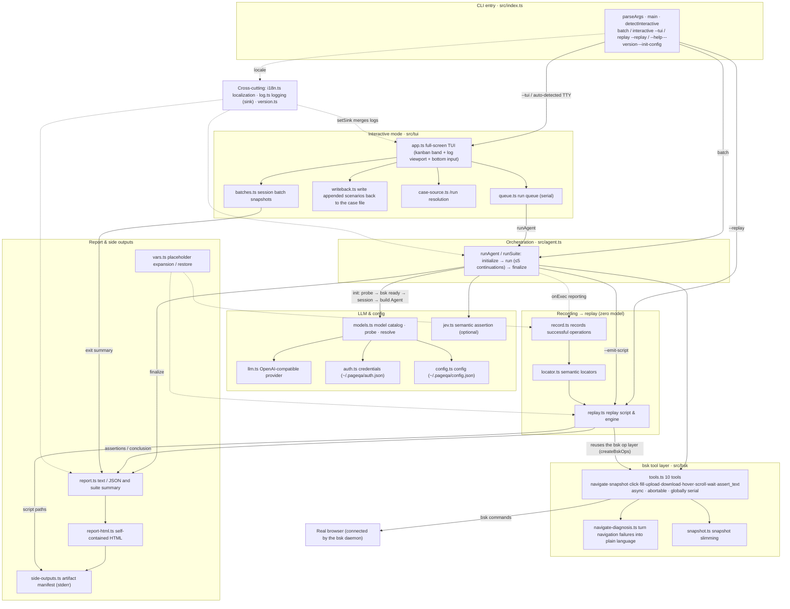

# pageqa

> 中文文档：[README.zh-CN.md](./README.zh-CN.md)

A natural-language-driven page testing agent: **an LLM parses intent → browserskill (`bsk`) drives a real browser → it emits a text/JSON report and a CI-ready exit code**. Once a case passes with the model, its operations are frozen into a replay script that can re-run the same case with zero model calls.

The interactive mode (TUI) is the default and recommended way to use it: a long flow can take ten-plus minutes, and during that time you can keep adding scenarios, switch models, and watch live progress and token usage.

<https://github.com/user-attachments/assets/d5315f93-7e02-4445-a7cf-506b3bfcaa2d>

---

## Install & prerequisites

**1. Install `pageqa`** (requires Node.js ≥ 22.19):

```bash
npm install -g pageqa      # or pnpm add -g pageqa
pageqa --init-config       # create ~/.pageqa/config.json in your home dir
```

**2. Install and connect browserskill (`bsk`)** (the plugin that drives the real browser — [project home](https://github.com/Tencent/BrowserSkill)):

```bash
bsk status                 # view daemon and connected browsers
bsk session start          # optional: create a session (pageqa auto-creates one if omitted)
```

> pageqa auto-background-starts the bsk daemon when it isn't running (once per process). But **you must connect the browser yourself**: install the bsk extension in the browser and complete the connection. If no connected browser is detected at startup, pageqa reports it clearly and asks you to connect first, rather than hanging.

**3. Configure the LLM endpoint** (default `http://127.0.0.1:3000/v1`, key `codebuddy-proxy-key`): write it into `~/.pageqa/config.json`, or use env vars `PAGEQA_LLM_BASE_URL` / `PAGEQA_LLM_API_KEY` / `PAGEQA_LLM_MODEL` (env vars > config file > built-in defaults).

```json
{ "baseUrl": "http://127.0.0.1:3000/v1", "apiKey": "codebuddy-proxy-key", "model": "hunyuan-2.0-instruct", "locale": "zh" }
```

---

## Interactive mode (TUI) — the core workflow

Run in an interactive terminal and the TUI opens automatically (both stdin and stdout are a TTY):

```bash
pageqa                       # empty session: empty queue, no write-back target; /run a case file any time
pageqa examples/smoke.md     # open a case file and run it interactively
pageqa --tui examples/smoke.md   # force interactive (errors immediately in a non-TTY)
```

Auto-entry condition: a TTY with no `--json`, and either **a case file is given** or **nothing is given**. **Inline text does not enter the TUI** (it runs in batch); `--json` / `--replay` / `--session` block the TUI. To disable: `pageqa --no-tui` or `PAGEQA_NO_TUI=1`.

### Layout

```text
┌──────────────────────────────────────────────────────────┐
│ Kanban band (rendered only when terminal width ≥ 90):      │  ← 5 status columns
│   5 columns summarizing scenarios by state                  │
├──────────────────────────────────────────────────────────┤
│                                                            │
│   Scrollable log viewport (follows end; scroll back to      │
│   review; live progress / timings / pass-fail)              │
│                                                            │
├──────────────────────────────────────────────────────────┤
│ Status line: current model · pending count · write-back     │
│ > input box (fixed at bottom)                               │
│ Token usage: input … / output … / total … (LLM calls n)     │
│ hint line                                                  │
└──────────────────────────────────────────────────────────┘
```

- **Kanban band**: all scenarios grouped into 5 columns by state (waiting / running / pass / fail / cancelled); the running column shows live elapsed time. Only the most recent few cards per column fit, with `+N more` when exceeded. Display-only (no click actions); hidden entirely below 90 columns so the log keeps the space.
- **Status line** always shows: current model, pending count, written-back count, and the **write-back target** (the case file appended scenarios are written back to; when none, it says so — appended scenarios then live only in this session and are lost on exit).

### Submitting scenarios

- Type natural language in the input box and press **Enter**; if the text contains `## title`, that line is the scenario name, otherwise the first line is used. **Shift+Enter** inserts a newline (for multi-scenario cases).
- Submitting means "write-back + enqueue": with a target it appends to the target file first, then enqueues (so "what you type is what you keep"); if a scenario is already running, the new one queues and runs automatically after.

### Commands (start a line with `/`; typing `/` pops up a fuzzy command list)

| Command | Purpose |
| --- | --- |
| `/run <path or keyword>` | Load a case file into the queue at runtime: exact path, a directory (every case in it), or a filename keyword; multiple hits let the model pick from filenames first, then a selector. Also switches the write-back target |
| `/status` | View the run queue (one line per scenario with state and origin) |
| `/cancel <n>` | Cancel the not-yet-started queued scenario #n |
| `/new` | New session: clears viewport and queue, resets token counter, but **archives the previous batch** (still in the exit report and replay script). Refuses while something is running/pending |
| `/model` | Switch this session's model (`Enter` applies now, `Ctrl+S` also saves as the startup default) |
| `/login` · `/logout` | Sign in / remove a provider's local credentials (`~/.pageqa/auth.json`) |
| `/setting` | Persistent prefs: test report (HTML) / replay script toggles, language |
| `/help` · `/exit` | Help / finish and exit (`/quit` is an alias) |

### Keybindings

| Key | Action |
| --- | --- |
| `Enter` | Submit input |
| `Shift+Enter` | Newline |
| `Esc` | Abort the running scenario (recorded as "cancelled", not counted in exit code, not written to replay); cancels a pending prompt |
| `Ctrl+C` | Finish: abort current + cancel all pending → restore terminal → print summary report (normal exit, never a hard kill; a second press during wind-down means "stop waiting") |
| `PageUp`/`PageDown` | Scroll the log a page |
| `↑`/`↓` | Scroll the log when the input box is empty (some terminals report the wheel as these) |
| `Ctrl+↑`/`Ctrl+↓` | Scroll the log one line (works while writing a multi-line case) |
| `Ctrl+P`/`Ctrl+N` | Input history previous / next |
| `Home`/`End` | Jump to log start / back to end (resume following) |
| Mouse wheel | Scroll the log (3 lines per notch; scrolling up pauses following — click the last-row hint or `End` to return) |

> `/run` loads scenarios are **not** written back (they're already in the file); only your appended scenarios are. Appended scenarios with no target are lost on exit, and the count is reported honestly at exit.

---

## Batch mode — one-shot runs / CI

Use when you don't need to interact mid-run, or to feed CI:

```bash
pageqa "Open https://example.com and assert the title contains Example"   # inline natural language
pageqa examples/smoke.md        # read a case file (auto-detects ##-separated scenarios)
pageqa --json examples/smoke.md # JSON report
pageqa --suite "..."            # force multi-scenario suite mode
pageqa --out report.txt ...     # write the report to a file
```

- stdout holds only the final report; logs go to stderr (so `pageqa --json … > report.json` is clean).
- Exit code: `0` all assertions passed; `1` any assertion failed / errored / could not execute — usable directly as a CI gate.
- Before each scenario a connectivity probe runs; if the model is unreachable that scenario is recorded as FAIL and remaining pending items are cancelled, rather than wasting browser windows.

---

## Replay — zero-model re-run

After a model-driven pass, operations are frozen into a replay script (`*.replay.json` next to the source case, on by default; toggle in `/setting`, `--emit-script` always wins). Re-run it with zero model calls — sub-second, no LLM endpoint needed — ideal for "model once, regress daily" in CI:

```bash
pageqa --emit-script examples/smoke.md              # explicitly generate the script (already auto-generated by default)
pageqa --replay examples/smoke.replay.json          # zero-model replay
pageqa --replay examples/smoke.replay.json --json   # machine-readable report
pageqa --replay examples/smoke.replay.json --semantic  # assertions use Jev semantic judgment
```

Notes: the script stores **semantic locators** (role + accessible name + same-name index + ancestor path), re-resolved against the current snapshot at replay time, so small page changes usually still hit; on unresolved elements it reports the cause instead of guessing. Element-not-found → skip and continue (listed in the report); other failures → recorded as fail and the whole case still runs; `navigate` failure → abort immediately. Add `--fail-fast` to stop a scenario on first failure.

---

## Writing cases

A case is natural-language text split into steps by non-empty lines (`#`/`>` comment lines don't count). Use `## title` to separate independent scenarios (each gets its own bsk session and browser window).

**Assertion lines must line up with assertion tool calls**: the report checks "how many lines contain 断言/assert" against "how many assertion results were actually produced" — they must match. Each `assert_text` yields one assertion, and `download` is itself one assertion (don't add a separate "assert downloaded" line). Comment lines never inflate the count.

**Runtime placeholders** (expanded once, sharing one moment per run):

| Placeholder | Expands to |
| --- | --- |
| `${timestamp}` | `yyyyMMddHHmm` |
| `${date}` / `${time}` | `yyyyMMdd` / `HHmmss` |
| `${datetime}` | `yyyyMMddHHmmss` |
| `${timestamp:<format>}` | custom, supports `yyyy yy MM dd HH mm ss SSS` |

Unrecognized placeholders (e.g. `${PATH}`) are kept as-is.

**File upload**: write "click the upload button to upload the local file `<absolute path>`" and the agent calls `upload` (enable "Allow access to file URLs" on the bsk extension first). **File download/export**: write "click export, confirm in the dialog, verify the file was downloaded" and the agent calls `download` (`target` is the element that triggers the download, `expectName` matches the filename with a glob like `*.xls`). Downloaded files are auto-cleaned after a passing assertion (disable via `downloadCleanup` in config).

---

## Config & optional enhancements

- **Config file**: `~/.pageqa/config.json` with fields `baseUrl`/`apiKey`/`model`/`locale`/`htmlReport`/`replayScript`/`downloadDir`/`downloadCleanup`. Precedence: `PAGEQA_*` env vars > config file > built-in defaults.
- **Jev semantic assertion (optional)**: add a `jev` field to config (or `PAGEQA_JEV_*` env vars) for a semantic re-check when a literal match misses, correcting false FAILs from synonyms/near-synonyms/formatting; on API failure it degrades back to string match automatically.
- **Language**: `--locale zh|en` or `PAGEQA_LOCALE`; default `zh`. The data contract (JSON fields, exit codes) is language-neutral.

---

## CLI options

| Option | Description |
| --- | --- |
| `--session <id>` | Use an existing bsk session (auto-created by default) |
| `--locale <zh\|en>` | UI / log / report language (default zh) |
| `--json` | Output JSON report (excludes the TUI) |
| `--suite` | Force multi-scenario suite mode |
| `--tui` / `--no-tui` | Force interactive on/off (`PAGEQA_NO_TUI=1` also works) |
| `--emit-script [path]` | Freeze a replay script (on by default, next to the source case) |
| `--replay <file>` | Replay an existing script with zero models |
| `--semantic` | At replay, assertions use Jev semantic judgment |
| `--fail-fast` | At replay, stop a scenario on first failure |
| `--init-config` | Create/reset the config file |
| `--out <file>` | Write the report to a file |
| `--debug` | Debug logs (bsk commands & timings, snapshot slimming, Jev requests…) |
| `-v, --version` · `-h, --help` | Version / help |

---

## Architecture (layered / module view)

The diagram below is the **layered/module view** — which layer owns what and how artifacts flow between modules; the runtime sequence is in "How it works" right after.



### How it works

```
Natural-language intent
   └─> pi-agent-core agent (LLM: configurable OpenAI-compatible endpoint)
          └─> bsk tools: navigate / snapshot / click / fill / upload / download / hover / scroll / wait / assert_text
                 └─> real browser (connected by bsk)
          └─> conclusion & evidence -> report (text/JSON) + exit code
          └─> by default: record successful operations -> replay script (*.replay.json; off in /setting)

Replay script -> pageqa --replay -> reuses the same bsk op layer -> real browser -> report + exit code (no LLM called)

Interactive mode (pageqa --tui <case file>)
   ├─> TUI: kanban band (5 status columns) + scrolling log viewport (progress logs merged via setSink) + fixed bottom input box
   ├─> run queue: serial execution; submitted new scenarios are written back to the target then enqueued
   └─> exit -> restore main screen -> summary report (stdout/--out) + exit code (cancelled not counted)
```

Available tools (`src/bsk/tools.ts`): `navigate` opens a page; `snapshot` reads the page's aria tree and visible text (with slimming and reuse); `click`/`fill`/`hover` element interactions; `upload` uploads a local file; `download` captures a browser download (itself an assertion); `scroll`/`wait` scroll and wait; `assert_text` asserts the page contains the specified text.

Long-flow protection (auto-retry): after one conversation round, if the agent's self-reported progress isn't full (`steps done: k/n` with `k < n`), or the case had assertions but the report only parsed some, pageqa automatically appends a "continue remaining steps" prompt and keeps going, at most 5 rounds.

See `src/` for the full directory breakdown.

---

## Verification & CI

```bash
pnpm install --frozen-lockfile && pnpm run build
pnpm run test:unit     # unit tests: no browser / LLM / TTY dependency
pnpm test              # end-to-end smoke: needs bsk connected to a browser + an available LLM endpoint
```

`examples/smoke.md` works as an end-to-end sample (`pageqa examples/smoke.md --json`). Inject the LLM endpoint in CI to use pageqa as a quality gate (`node dist/index.js --json examples/smoke.md`).
