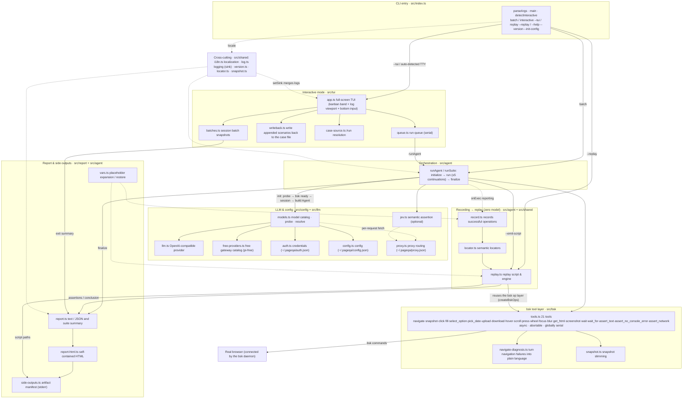

# pageqa

> 中文文档：[README.zh-CN.md](./README.zh-CN.md)

A natural-language-driven page testing agent: **an LLM parses intent → browserskill (`bsk`) drives a real browser → it emits a text/JSON report and a CI-ready exit code**. Once a case passes with the model, its operations are frozen into a replay script that can re-run the same case with zero model calls.

The interactive mode (TUI) is the default and recommended way to use it: a long flow can take ten-plus minutes, and during that time you can keep adding scenarios, switch models, and watch live progress and token usage.

<https://github.com/user-attachments/assets/d5315f93-7e02-4445-a7cf-506b3bfcaa2d>

---

## Install & prerequisites

**1. Install `pageqa`** (requires Node.js ≥ 22.19):

```bash
npm install -g pageqa      # or pnpm add -g pageqa
pageqa --init-config       # create ~/.pageqa/config.json in your home dir
```

**2. Install and connect browserskill (`bsk`)** (the plugin that drives the real browser — [project home](https://github.com/Tencent/BrowserSkill)):

```bash
bsk status                 # view daemon and connected browsers
bsk session start          # optional: create a session (pageqa auto-creates one if omitted)
```

> pageqa auto-background-starts the bsk daemon when it isn't running (once per process). But **you must connect the browser yourself**: install the bsk extension in the browser and complete the connection. If no connected browser is detected at startup, pageqa reports it clearly and asks you to connect first, rather than hanging.

**3. Configure the LLM endpoint** (default `http://127.0.0.1:3000/v1`, key `codebuddy-proxy-key`): write it into `~/.pageqa/config.json`, or use env vars `PAGEQA_LLM_BASE_URL` / `PAGEQA_LLM_API_KEY` / `PAGEQA_LLM_MODEL` (env vars > config file > built-in defaults).

```json
{ "baseUrl": "http://127.0.0.1:3000/v1", "apiKey": "codebuddy-proxy-key", "model": "hunyuan-2.0-instruct", "locale": "zh" }
```

---

## Interactive mode (TUI) — the core workflow

Run in an interactive terminal and the TUI opens automatically (both stdin and stdout are a TTY):

```bash
pageqa                       # empty session: empty queue, no write-back target; /run a case file any time
pageqa examples/smoke.md     # open a case file and run it interactively
pageqa --tui examples/smoke.md   # force interactive (errors immediately in a non-TTY)
```

Auto-entry condition: a TTY with no `--json`, and either **a case file is given** or **nothing is given**. **Inline text does not enter the TUI** (it runs in batch); `--json` / `--replay` / `--session` block the TUI. To disable: `pageqa --no-tui` or `PAGEQA_NO_TUI=1`.

### Layout

```text
┌──────────────────────────────────────────────────────────┐
│ Kanban band (rendered only when terminal width ≥ 90):      │  ← 5 status columns
│   5 columns summarizing scenarios by state                  │
├──────────────────────────────────────────────────────────┤
│                                                            │
│   Scrollable log viewport (follows end; scroll back to      │
│   review; live progress / timings / pass-fail)              │
│                                                            │
├──────────────────────────────────────────────────────────┤
│ Status line: current model · pending count · write-back     │
│ > input box (fixed at bottom)                               │
│ Token: ⬇ … / ⬆ … / read … / write … / total … · hit …%      │
│ hint line                                                  │
└──────────────────────────────────────────────────────────┘
```

- **Kanban band**: all scenarios grouped into 5 columns by state (waiting / running / pass / fail / cancelled); the running column shows live elapsed time. Only the most recent few cards per column fit, with `+N more` when exceeded. Display-only (no click actions); hidden entirely below 90 columns so the log keeps the space.
- **Status line** always shows: current model, pending count, written-back count, and the **write-back target** (the case file appended scenarios are written back to; when none, it says so — appended scenarios then live only in this session and are lost on exit).
- **Token line** (under the input box) is the same sentence as the report's last line, with the running scenarios' live values, **plus the cache hit rate**:

  ```text
  Token: ⬇ 1234 / ⬆ 567 / read 8901 / write 42 / total 10744 (LLM calls 3)  ·  hit 92%
  ```

  The short words work because the **order is the legend**: `⬇` = input (fed into the model), `⬆` = output, `read`/`write` = cache read / cache write, `total` = the sum. The trailing `hit 92%` = cache read / (input + cache read), i.e. how much of this input came back from the prompt cache. Seeing it hold steady while a run is in progress means the prompt prefix is stable and the cache keeps hitting. When the denominator is zero (replay, endpoint returned no usage, nothing called yet) that part is simply not shown, rather than printing a 0%.

### Submitting scenarios

- Type natural language in the input box and press **Enter**; if the text contains `## title`, that line is the scenario name, otherwise the first line is used. **Shift+Enter** inserts a newline (for multi-scenario cases).
- Submitting means "write-back + enqueue": with a target it appends to the target file first, then enqueues (so "what you type is what you keep"); if a scenario is already running, the new one queues and runs automatically after.

### Commands (start a line with `/`; typing `/` pops up a fuzzy command list)

| Command | Purpose |
| --- | --- |
| `/run <path or keyword>` | Load a case file into the queue at runtime: exact path, a directory (every case in it), or a filename keyword; multiple hits let the model pick from filenames first, then a selector. Also switches the write-back target |
| `/status` | View the run queue (one line per scenario with state and origin) |
| `/cancel <n>` | Cancel the not-yet-started queued scenario #n |
| `/new` | New session: clears viewport and queue, resets token counter, but **archives the previous batch** (still in the exit report and replay script). Refuses while something is running/pending |
| `/model` | Switch this session's model (`Enter` applies now, `Ctrl+S` also saves as the startup default). The list ships with a set of **free gateways** carrying a `free` badge — see [Free model gateways](#free-model-gateways) |
| `/login` · `/logout` | Sign in / remove a provider's local credentials (`~/.pageqa/auth.json`) |
| `/setting` | Persistent prefs: test report (HTML) / replay script toggles, language, **concurrency** (1/2/3/4/6/8) |
| `/proxy` | Proxy routing for model requests: on/off (saved to `~/.pageqa/proxy.json`), bypass for this session, reload the file, show counters and rules — see [Proxy for model requests](#proxy-for-model-requests) |
| `/help` · `/exit` | Help / finish and exit (`/quit` is an alias) |

### Keybindings

| Key | Action |
| --- | --- |
| `Enter` | Submit input |
| `Shift+Enter` | Newline |
| `Esc` | Abort the running scenario (recorded as "cancelled", not counted in exit code, not written to replay); cancels a pending prompt |
| `Ctrl+C` | Finish: abort current + cancel all pending → restore terminal → print summary report (normal exit, never a hard kill; a second press during wind-down means "stop waiting") |
| `PageUp`/`PageDown` | Scroll the log a page |
| `↑`/`↓` | Scroll the log when the input box is empty (some terminals report the wheel as these) |
| `Ctrl+↑`/`Ctrl+↓` | Scroll the log one line (works while writing a multi-line case) |
| `Ctrl+P`/`Ctrl+N` | Input history previous / next |
| `Home`/`End` | Jump to log start / back to end (resume following) |
| Mouse wheel | Scroll the log (3 lines per notch; scrolling up pauses following — click the last-row hint or `End` to return) |

> `/run` loads scenarios are **not** written back (they're already in the file); only your appended scenarios are. Appended scenarios with no target are lost on exit, and the count is reported honestly at exit.

---

## Batch mode — one-shot runs / CI

Use when you don't need to interact mid-run, or to feed CI:

```bash
pageqa "Open https://example.com and assert the title contains Example"   # inline natural language
pageqa examples/smoke.md        # read a case file (auto-detects ##-separated scenarios)
pageqa --json examples/smoke.md # JSON report
pageqa --suite "..."            # force multi-scenario suite mode
pageqa --concurrency 4 examples/smoke-test.md   # run up to 4 scenarios at once (default 1)
pageqa --only 2 examples/smoke.md    # run just scenario 2
pageqa --only "form filling" ...     # run one by exact title
pageqa --no-side-outputs ...    # no HTML report, no default replay script — stdout only
pageqa --out report.txt ...     # write the report to a file
```

- stdout holds only the final report; logs go to stderr (so `pageqa --json … > report.json` is clean).
- Exit code: `0` all assertions passed; `1` any assertion failed / errored / could not execute — usable directly as a CI gate.
- Before each scenario a connectivity probe runs; if the model is unreachable that scenario is recorded as FAIL and remaining pending items are cancelled, rather than wasting browser windows.

**Scenario isolation** (see `docs/adr/0013-scenario-process-isolation.md`): in suite mode **each scenario runs in its own child process**, with the parent forking them serially and aggregating the results. So when a scenario takes the browser or the bsk daemon down with it (native crash, OOM kill), only that scenario is recorded as failed (`reason: "crash"` in the report) and the rest still run. Re-running just the failed one is `--only <index|title>` — the same code path the parent uses internally when it forks.

A crash or a timeout is recorded as a failure and does not drag anyone else down; only environment-level failures (unreachable model endpoint, unusable bsk/browser) mark the remaining scenarios as "cancelled". Sessions and browser windows are owned by the parent, so a hard-killed child leaves no orphan windows.

**Running scenarios in parallel**: by default they run **one at a time** (that order is what protects implicit sequences such as create → edit → delete). Once you know they are independent, `--concurrency <n>` (or `PAGEQA_CONCURRENCY` / the `concurrency` config field) runs up to n at once: each scenario still gets its own child process, its own session and its own **browser window** — so n is literally how many windows are open at the same time, hence the cap of 8 and an error (not a silent clamp) when exceeded. Result order is unchanged: the report and the replay script always follow the case's source order, no matter who finishes first. While parallel, every log line carries a `[scenario name]` prefix, otherwise the interleaved output is unreadable.

**Interactive mode honours concurrency too**: `--concurrency` at startup is just the starting point for the session; inside, `/setting` > concurrency changes it at any time (levels 1/2/3/4/6/8). The change **takes effect immediately** — scenarios dispatched from then on use the new value, ones already running are left alone — and is written back to `~/.pageqa/config.json`. While parallel, the kanban band's "running" column holds several cards (each with its own live elapsed time), the status line swaps "k/n" for "N running · oldest … for …", and `Esc` aborts **all** running scenarios (once more than one can run, "the current scenario" is no longer a single thing). `--replay` never uses the scenario scheduler, so concurrency is inert there.

---

## Replay — zero-model re-run

After a model-driven pass, operations are frozen into a replay script (`*.replay.json` next to the source case, on by default; toggle in `/setting`, `--emit-script` always wins). Re-run it with zero model calls — sub-second, no LLM endpoint needed — ideal for "model once, regress daily" in CI:

```bash
pageqa --emit-script examples/smoke.md              # explicitly generate the script (already auto-generated by default)
pageqa --replay examples/smoke.replay.json          # zero-model replay
pageqa --replay examples/smoke.replay.json --json   # machine-readable report
pageqa --replay examples/smoke.replay.json --semantic  # assertions use Jev semantic judgment
```

Notes: the script stores **semantic locators** (role + accessible name + same-name index + ancestor path), re-resolved against the current snapshot at replay time, so small page changes usually still hit; on unresolved elements it reports the cause instead of guessing. Element-not-found → skip and continue (listed in the report); other failures → recorded as fail and the whole case still runs; `navigate` failure → abort immediately. Add `--fail-fast` to stop a scenario on first failure.

---

## Writing cases

A case is natural-language text split into steps by non-empty lines (`#`/`>` comment lines don't count). Use `## title` to separate independent scenarios (each gets its own bsk session and browser window).

**Assertion lines must line up with assertion tool calls**: the report checks "how many lines contain 断言/assert" against "how many assertion results were actually produced" — they must match. Each `assert_text` yields one assertion, and so do `download`, `assert_no_console_error` and `assert_network` (don't add a separate "assert downloaded" line for `download`). Comment lines never inflate the count.

**Runtime placeholders** (expanded once; because each scenario runs in its own child process the moment is taken **per scenario**, not once per run — see ADR-0013):

| Placeholder | Expands to |
| --- | --- |
| `${timestamp}` | `yyyyMMddHHmm` |
| `${date}` / `${time}` | `yyyyMMdd` / `HHmmss` |
| `${datetime}` | `yyyyMMddHHmmss` |
| `${timestamp:<format>}` | custom, supports `yyyy yy MM dd HH mm ss SSS` |

Unrecognized placeholders (e.g. `${PATH}`) are kept as-is.

**File upload**: write "click the upload button to upload the local file `<absolute path>`" and the agent calls `upload` (enable "Allow access to file URLs" on the bsk extension first). **File download/export**: write "click export, confirm in the dialog, verify the file was downloaded" and the agent calls `download` (`target` is the element that triggers the download, `expectName` matches the filename with a glob like `*.xls`). Downloaded files are auto-cleaned after a passing assertion (disable via `downloadCleanup` in config).

### Format lint: `pageqa lint`

Those conventions are easy to forget, and breaking one usually only shows up **ten minutes into a run** — often as a **false failure** ("assertions incomplete", "steps incomplete"). `pageqa lint` moves the same checks in front of the run: it reads text only — **no browser, no model** — and reports "which line, which rule, why" in a second:

```bash
pageqa lint examples/smoke-test.md                            # for humans
pageqa lint --json examples/smoke.md examples/smoke-test.md   # for machines (CI)
pageqa lint --strict cases/login.md                           # warnings fail too (pre-commit)
```

Step and assertion counts come from the very code the runtime uses (`numberSteps` / `countAssertions`), so a clean lint never turns into an "assertions incomplete" failure at run time.

| Severity | Rules |
| --- | --- |
| `error` (exit code 1) | text before the first `## ` (dropped), empty scenario, duplicate scenario title, `@e3` snapshot ref, `打开`/`open` without http/https, unknown placeholder (`${PATH}` is kept verbatim), upload without an absolute path |
| `warn` (non-zero under `--strict`) | fixed `wait N seconds`, a dropdown written as "fill in", a separate "assert the filename…" line after a download, prose mistaken for a step, a scenario with no assertion, **an assertion with no literal text to match** ("the table has rows", "the dialog is open") |

Exit code: `0` clean; `1` has an `error` (or a `warn` under `--strict`).

**Runs pre-check automatically too**: before every run (batch / interactive / `--only`) the same rules are applied and any findings are printed to stderr (at most 5 expanded). It is **advisory and never blocks** — a case that can run should run, a real failure is worth more than a format warning; to gate on it, wire `pageqa lint` into CI. Pass `--no-lint` to skip it.

> Turning the intro text of `examples/smoke.md` into a `>` line is not pedantry: that text is dropped entirely, yet it still counted toward the step total — its only effect was making n one larger than the steps the model could actually run.

---

## Config & optional enhancements

- **Config file**: `~/.pageqa/config.json` with fields `baseUrl`/`apiKey`/`model`/`locale`/`htmlReport`/`replayScript`/`downloadDir`/`downloadCleanup`/`autoScreenshot`/`scenarioTimeoutMs`/`concurrency`. Precedence: `PAGEQA_*` env vars > config file > built-in defaults.
- **Parallelism (optional)**: `concurrency` or `PAGEQA_CONCURRENCY` (**default 1** = one at a time, capped at 8). Parallelism is a claim that the scenarios are independent, hence off by default; the value is literally how many browser windows are open at once.
- **Per-scenario execution limit (optional)**: `scenarioTimeoutMs` or `PAGEQA_SCENARIO_TIMEOUT` (milliseconds, **unlimited by default**). In suite mode a scenario that exceeds it has its child process killed, is recorded as failed (`reason: "timeout"` in the report), and **the following scenarios still run**. Off by default: ten-plus-minute flows are normal here, so an assumed default would just be a new source of failures — set it explicitly when CI needs a gate.
- **Jev semantic assertion (optional)**: add a `jev` field to config (or `PAGEQA_JEV_*` env vars) for a semantic re-check when a literal match misses, correcting false FAILs from synonyms/near-synonyms/formatting; on API failure it degrades back to string match automatically.
- **Turning the endpoint's thinking off (optional)**: hybrid reasoning models (Hunyuan / DeepSeek / Qwen / GLM) default to **thinking on** over OpenAI-compatible endpoints — the model emits a long reasoning passage first, which is slow, burns tokens, and muddles the agent's step numbering and conclusions. Set `thinkingFormat` (or `PAGEQA_LLM_THINKING_FORMAT`) and pageqa sends the endpoint's own off-switch on **every** request:

  | `thinkingFormat` | field sent when thinking is off |
  | --- | --- |
  | `deepseek` / `zai` | `thinking: { "type": "disabled" }` |
  | `qwen` | `enable_thinking: false` |
  | `qwen-chat-template` | `chat_template_kwargs: { "enable_thinking": false, "preserve_thinking": true }` |
  | `together` | `reasoning: { "enabled": false }` |
  | `openrouter` | `reasoning: { "effort": "none" }` |
  | `string-thinking` | `thinking: "none"` |
  | `openai` / `ant-ling` / `baseten` / `chat-template` | **cannot send an off-switch** (the field only appears when a thinking level is requested), so configuring one is a no-op |

  **On by default**: with nothing configured, pageqa picks the off-switch the endpoint understands from the model id (`qwen*`/`qwq*` get `enable_thinking: false`; `deepseek*`, `hunyuan*`, `hy*`, `glm*` get `thinking: {"type":"disabled"}`; anything unrecognised falls back to the deepseek convention, the most common one). Set an explicit value from the table above to change the spelling, or `none`/`off` to stop disabling thinking altogether.
  The effective value and the field being sent are printed at startup. **If the endpoint rejects that field** (strict implementations answer 400), the probe drops it, retries once, writes the downgrade into the model object so this process never sends it again, and says so. So defaulting to off cannot break an endpoint that used to work; it costs one extra probe request only when the endpoint really is incompatible.
- **Language**: `--locale zh|en` or `PAGEQA_LOCALE`; default `zh`. The data contract (JSON fields, exit codes) is language-neutral.
- **Proxy for model requests (optional)**: `~/.pageqa/proxy.json` — see [Proxy for model requests](#proxy-for-model-requests) below.
- **Free model gateways (optional)**: `/model` ships with a set of free / login-free OpenAI-compatible gateways — see [Free model gateways](#free-model-gateways) below.

---

## Free model gateways

Alongside the custom endpoint and pi-ai's built-in providers, `/model` ships with a set of **free** OpenAI-compatible gateways (catalog data taken from [pi-free](https://github.com/apmantza/pi-free); they carry a `free` badge in `/model`):

| provider | endpoint | key env var | notes |
| --- | --- | --- | --- |
| `cline` | `https://api.cline.bot/api/v1` | `CLINE_API_KEY` | public catalog; **chat still needs a login** (`/login cline`). Models are listed logged out and the pre-flight probe reports the real error |
| `llm7` | `https://api.llm7.io/v1` | `LLM7_API_KEY` | two free selectors: `default` / `fast` |
| `fastrouter` | `https://api.fastrouter.ai/api/v1` | `FASTROUTER_API_KEY` | public catalog; `:free` routes have per-minute / per-day caps |
| `orcarouter` | `https://api.orcarouter.ai/v1` | `ORCAROUTER_API_KEY` | key required; only `-free` routes are listed |
| `xkiro` | `https://api.xkiro.com/v1` | `XKIRO_API_KEY` | key required; only `:free` routes are listed |

- **No Pi CLI needed**: pi-free itself is a Pi extension (it depends on `@earendil-works/pi-coding-agent`), so pageqa only borrows the catalog data it curated.
- **Catalog: remote first, snapshot as fallback**: opening `/model` fetches each gateway's public `/v1/models` concurrently and keeps only the free entries; when that fails the built-in snapshot (pi-free's 2026-08-26 audit) is used, so there is always something to pick even offline. A failed refresh is silent — it just falls back.
- **Credentials**: set the env var or use `/login <provider>`; both land in `~/.pageqa/auth.json`. `cline` / `llm7` / `fastrouter` work without a key, the other two only appear once you configure one.
- **No guarantees**: rate limits, model retirements and catalog renames are entirely upstream's business. That is what the pre-flight probe (the `ping` before a run starts) is for — an unreachable model aborts with a readable reason instead of producing a pile of bogus scenario failures.
- **`opencode-free` from pi-free is not ported**: OpenCode Zen's free tier fingerprints the request's tool list (it must carry `bash`/`edit`/`glob`/`grep`/`read`). pageqa's tool set is browser actions, and stuffing in five dead tools just to satisfy the fingerprint would pollute every turn. Use pi-ai's built-in `opencode` / `opencode-go` (with `OPENCODE_API_KEY`) for Zen instead.

---

## Proxy for model requests

Some networks cannot reach a model endpoint directly, while the local endpoint on `127.0.0.1` and the bsk daemon **must** stay direct. A blanket `HTTP_PROXY` breaks the local ones (the symptom is "connected, but never answers"). So pageqa routes per domain:

| Action | Meaning |
| --- | --- |
| `direct` | always connect directly |
| `proxy` | always go through the proxy |
| `fallback` | try direct first, retry through the proxy on a **network** error (default) |

- **Config file**: `~/.pageqa/proxy.json` (`pageqa --init-config` writes one). Precedence: `PAGEQA_PROXY_*` env vars > file > built-in defaults.

```json
{
  "proxy": "http://127.0.0.1:7890",
  "enabled": true,
  "mode": "fallback",
  "rules": [
    { "match": "localhost,127.0.0.1,*.local,10.*,192.168.*", "action": "direct", "comment": "local / intranet" },
    { "match": "api.deepseek.com", "action": "proxy", "comment": "force proxy" },
    { "match": "*", "action": "fallback", "comment": "direct first, proxy on failure" }
  ]
}
```

Rules are matched top-down, first match wins; anything unmatched falls back to `mode`. `rules: []` means "no rules at all, everything follows `mode`".

| Pattern | Matches |
| --- | --- |
| `example.com` | that domain only |
| `*.example.com` | any subdomain (and the bare domain) |
| `10.*` · `172.2*` | an IP prefix / range (`*` may sit anywhere) |
| `*` | everything |

- **Defaults**: with no `proxy.json` at all, pageqa still routes — localhost/intranet direct, everything else `fallback`. So a local endpoint is untouched while an off-network model endpoint automatically goes through the proxy. The only behavioural change is that a failing direct request gets one extra attempt via `http://127.0.0.1:7890`; set `"enabled": false` (or `PAGEQA_PROXY_ENABLED=false`) to switch it off entirely.
- **Env overrides** (handy in CI): `PAGEQA_PROXY_URL`, `PAGEQA_PROXY_ENABLED`, `PAGEQA_PROXY_MODE`. To reuse a shell's `HTTPS_PROXY`, pass it explicitly: `PAGEQA_PROXY_URL=$HTTPS_PROXY pageqa case.md`.
- **Interactive mode**: `/proxy` toggles routing (saved to the file), bypasses it for the session only (not saved), reloads the file, and shows counters plus the effective rules. `--debug` prints the current state at startup.
- Outbound Jev requests (`--semantic`) go through the same routing.

---

## CLI options

| Option | Description |
| --- | --- |
| `--session <id>` | Use an existing bsk session (auto-created by default) |
| `--locale <zh\|en>` | UI / log / report language (default zh) |
| `--json` | Output JSON report (excludes the TUI) |
| `--suite` | Force multi-scenario suite mode |
| `--only <index\|title>` | Run just one scenario (index from 1, or an exact title match); output stays suite-shaped. Mutually exclusive with `--suite`/`--tui`/`--replay` |
| `--concurrency <n>` | Run up to n scenarios at once (**a limit**, default 1; `PAGEQA_CONCURRENCY` / the `concurrency` config field also work). Capped at 8, exceeding it errors; interactive mode honours it too (`/setting` > concurrency changes it live), `--replay` does not |
| `--tui` / `--no-tui` | Force interactive on/off (`PAGEQA_NO_TUI=1` also works) |
| `--emit-script [path]` | Freeze a replay script (on by default, next to the source case) |
| `--no-side-outputs` | Write no side outputs (HTML report, default replay script); an explicit `--emit-script <path>` still wins |
| `--usage-stream` | Print one structured LLM-usage record per call to stderr (prefix `[pageqa:usage]`); how the parent gets live usage from a child process |
| `--no-lint` | Skip the case-format pre-check before a run (on by default; it only advises on stderr and never blocks). To gate on it use `pageqa lint` |
| `lint` (subcommand) | `pageqa lint <case file...>`: static case-format check, no browser and no model (`--json` / `--strict`); exit code `1` means there is an `error` |
| `--replay <file>` | Replay an existing script with zero models |
| `--semantic` | At replay, assertions use Jev semantic judgment |
| `--fail-fast` | At replay, stop a scenario on first failure |
| `--init-config` | Create/reset the config file |
| `--out <file>` | Write the report to a file |
| `--debug` | Debug logs (bsk commands & timings, snapshot slimming, Jev requests…) |
| `sessions` (subcommand) | `pageqa sessions`: start the local archive server to review the parameters handed to the model and the full interaction (`--port <n>` / `--dir <path>` / `--no-open`) |
| `-v, --version` · `-h, --help` | Version / help |

---

## Reviewing run archives (`pageqa sessions`)

How much of the scene you can inspect decides whether you can debug it at all. Every run writes "what was handed to the agent" plus "the full interaction" into `~/.pageqa/sessions/sessions.sqlite` (one **SQLite container** through pi's `@earendil-works/pi-durable`: one run is one member of the `pageqa.archive` document family, keyed by run id, while the list page's summaries live in the singleton `pageqa.index` document — archive and index are written in a single transaction), and `pageqa sessions` serves them:

- **Parameters handed to the agent**: system prompt, model, tool declarations (with JSON Schema), the step-numbered case and placeholder values;
- **Per-turn LLM context**: the messages actually sent on that turn (including context trimming) — answering "what did the model really see, and were earlier steps pushed out?";
- **Every tool call**: the arguments the model supplied, the result or failure reason, duration and verdict.

```bash
pageqa sessions                  # default http://127.0.0.1:7331/ (the port is bumped upward if taken)
pageqa sessions --port 8080      # pick a port
pageqa sessions --dir ./archives # use another archive directory
pageqa sessions --no-open        # do not open the browser automatically
```

Archives are written automatically by every run, with no extra switch; in suite mode each scenario gets its own. They live in the **user directory** rather than the working directory, and `--no-side-outputs` does not turn them off — this is a debugging tool, not a test artifact; only the latest 200 runs are kept. Since an archive contains the system prompt, case text and page snapshots, the server binds to loopback (`127.0.0.1`) only.

---

## Architecture (layered / module view)

The diagram below is the **layered/module view** — which layer owns what and how artifacts flow between modules; the runtime sequence is in "How it works" right after.


```mermaid
flowchart TD
  subgraph ENTRY["CLI entry · src/index.ts"]
    CLI["parseArgs · main · detectInteractive<br/>batch / interactive --tui / replay --replay / --help·--version·--init-config"]
  end

  subgraph ORCH["Orchestration · src/agent"]
    RUN["runAgent / runSuite: initialize → run (≤5 continuations) → finalize"]
  end

  subgraph LLMC["LLM & config · src/config + src/llm"]
    MODELS["models.ts model catalog · probe · resolve"]
    LLMP["llm.ts OpenAI-compatible provider"]
    FREE["free-providers.ts free gateway catalog (pi-free)"]
    AUTH["auth.ts credentials (~/.pageqa/auth.json)"]
    CONFIG["config.ts config (~/.pageqa/config.json)"]
    PROXY["proxy.ts proxy routing (~/.pageqa/proxy.json)"]
    JEV["jev.ts semantic assertion (optional)"]
  end

  subgraph BSK["bsk tool layer · src/bsk"]
    TOOLS["tools.ts 21 tools<br/>navigate·snapshot·click·fill·select_option·pick_date·upload·download·hover·scroll·press·wheel·focus·blur·get_html·screenshot·wait·wait_for·assert_text·assert_no_console_error·assert_network<br/>async · abortable · globally serial"]
    DIAG["navigate-diagnosis.ts turn navigation failures into plain language"]
    SNAP["snapshot.ts snapshot slimming"]
  end

  BROWSER["Real browser (connected by the bsk daemon)"]

  subgraph REC["Recording → replay (zero model) · src/agent + src/shared"]
    RECORDER["record.ts records successful operations"]
    LOCATOR["locator.ts semantic locators"]
    ENGINE["replay.ts replay script & engine"]
  end

  subgraph REP["Report & side outputs · src/report + src/agent"]
    REPORT["report.ts text / JSON and suite summary"]
    HTML["report-html.ts self-contained HTML"]
    SIDE["side-outputs.ts artifact manifest (stderr)"]
    VARS["vars.ts placeholder expansion / restore"]
  end

  subgraph TUI["Interactive mode · src/tui"]
    APP["app.ts full-screen TUI (kanban band + log viewport + bottom input)"]
    QUEUE["queue.ts run queue (serial)"]
    WB["writeback.ts write appended scenarios back to the case file"]
    CS["case-source.ts /run resolution"]
    BATCH["batches.ts session batch snapshots"]
  end

  XCUT["Cross-cutting · src/shared: i18n.ts localization · log.ts logging (sink) · version.ts · locator.ts · snapshot.ts"]

  CLI -->|"batch"| RUN
  CLI -->|"--replay"| ENGINE
  CLI -->|"--tui / auto-detected TTY"| APP
  CLI -.->|"locale"| XCUT

  RUN -->|"init: probe → bsk ready → session → build Agent"| MODELS
  RUN --> JEV
  RUN --> TOOLS
  RUN -->|"finalize"| REPORT
  RUN -.->|"onExec reporting"| RECORDER
  RUN -->|"--emit-script"| ENGINE

  MODELS --> LLMP
   MODELS --> FREE
  MODELS --> AUTH
  MODELS --> CONFIG
  MODELS -.->|"per-request fetch"| PROXY
  JEV -.-> PROXY

  TOOLS --> DIAG
  TOOLS --> SNAP
  TOOLS -->|"bsk commands"| BROWSER

  RECORDER --> LOCATOR
  LOCATOR --> ENGINE
  ENGINE -->|"reuses the bsk op layer (createBskOps)"| TOOLS
  ENGINE -->|"assertions / conclusion"| REPORT

  REPORT --> HTML
  HTML --> SIDE
  ENGINE -->|"script paths"| SIDE
  VARS -.-> RECORDER
  VARS -.-> ENGINE

  APP --> QUEUE
  APP --> WB
  APP --> CS
  APP --> BATCH
  QUEUE -->|"runAgent"| RUN
  BATCH -->|"exit summary"| REPORT
  XCUT -.->|"setSink merges logs"| APP
  XCUT -.-> RUN
  XCUT -.-> REPORT
```

### How it works

```
Natural-language intent
   └─> pi-agent-core agent (LLM: configurable OpenAI-compatible endpoint)
          └─> every request goes through proxy.ts first: per-domain direct / via proxy / direct-then-proxy
          └─> bsk tools: navigate / snapshot / click / fill / select_option / pick_date / upload / download / hover / scroll / press / wheel / focus / blur / get_html / screenshot / wait / wait_for / assert_text / assert_no_console_error / assert_network
                 └─> real browser (connected by bsk)
          └─> conclusion & evidence -> report (text/JSON) + exit code
          └─> by default: record successful operations -> replay script (*.replay.json; off in /setting)

Replay script -> pageqa --replay -> reuses the same bsk op layer -> real browser -> report + exit code (no LLM called)

Interactive mode (pageqa --tui <case file>)
   ├─> TUI: kanban band (5 status columns) + scrolling log viewport (progress logs merged via setSink) + fixed bottom input box
   ├─> run queue: serial execution; submitted new scenarios are written back to the target then enqueued
   └─> exit -> restore main screen -> summary report (stdout/--out) + exit code (cancelled not counted)
```

Available tools (`src/bsk/tools.ts`): `navigate` opens a page; `snapshot` reads the page's aria tree and visible text (with slimming and reuse; the `refs` mode keeps only the interactive-element list); `click`/`fill`/`hover` element interactions (pass `showPage: true` to get a post-action element list appended, saving the follow-up snapshot); `select_option` picks a dropdown/cascader option in one call (open -> wait for the overlay -> match by visible text; it **appends** a post-action interactive-element list by default, since such an action always changes the page and invalidates old `@eN` refs — pass `showPage: false` to opt out); `pick_date` picks a date in one call (open the panel -> navigate to the target month -> click the day; accepts `2026-09-29` / `today` / `+3` / `-7`; for **date ranges** pass the end date as `endDate` and it walks "pick start -> pick end -> confirm", failing loudly when the panel type and the arguments disagree instead of leaving a half-finished range); `upload` uploads a local file; `download` captures a browser download (itself an assertion); `scroll` scrolls to an element; `press` sends a **real** keyboard key (Enter to submit in an input, `Escape` to close a dialog, `Tab` through focus order; pass `target` to focus an element first, otherwise the key goes to the current focus, i.e. wherever the previous `fill` left it); `wheel` dispatches a **real wheel event** (infinite-scroll bottom callbacks and horizontal scrollers only respond to this — `scroll` is "scroll the element into view" and fires no scroll event; positive `deltaY` scrolls down, roughly 600–800 per screen); `focus`/`blur` focus and blur an element (form validation usually hangs off blur, so "fill → blur → assert the error message" is a standard chain, and blur is cleaner than clicking elsewhere); `get_html` dumps the raw DOM HTML (covers what the snapshot cannot see — `class`/`data-*`/`value` **attributes**; capped at 16 KiB inline by default, pass `out` to write a larger dump to a file); `screenshot` captures evidence (viewport by default, `fullPage: true` for the whole page, `target` with an `@eN` ref to crop to one element; images are **inlined into the HTML report** and also kept under `~/.pageqa/screenshots` — it is a read-only action that **produces no assertion**); `wait`/`wait_for` wait; `assert_text` asserts the page contains the specified text; `assert_no_console_error` asserts the page raised no JavaScript errors (uncaught exceptions plus `console.error` / browser error logs — **these never surface as page text**, so `assert_text` can never see them; `ignore` whitelists known noise and `warnings: true` counts warnings too); `assert_network` asserts a request happened and its status matches (`url` is matched as a substring, `status` takes `200` or `2xx`, and omitting `status` means "the request completed successfully").

**Stale refs self-heal**: any action using an expired `@eN` is refused — that is what keeps it from silently clicking whatever element now holds that number (see the header of `locator.ts`) — and the error carries the **current interactive-element list** right in it, so the model retries with a fresh ref instead of spending another round trip on a snapshot (`select_option` / `pick_date` also append that list on **success**, so "select one widget, then the next" no longer costs an extra turn).

Picker widgets (Element Plus and friends) use a **mixed strategy**: `.el-*` class contracts first (steadier than the aria tree), then generic ARIA selectors such as `[role=listbox]`; when neither hits, the tool fails honestly and lists the currently selectable options so the model can fall back to the generic "look at the snapshot and click" path — it **never guesses** at an element. Why a dedicated layer: on the generic path "open -> snapshot -> click the option" costs three LLM round trips, and stepping through calendar months costs one snapshot per click; collapsing that into a single call takes picking a date from over ten seconds down to a few.

Long-flow protection (auto-retry): after one conversation round, if the agent's self-reported progress isn't full (`steps done: k/n` with `k < n`), or the case had assertions but the report only parsed some, pageqa automatically appends a "continue remaining steps" prompt and keeps going, at most 5 rounds.

See `src/` for the full directory breakdown.

---

## Verification & CI

```bash
pnpm install --frozen-lockfile && pnpm run build
pnpm run test:unit     # unit tests: no browser / LLM / TTY dependency
pnpm test              # end-to-end smoke: needs bsk connected to a browser + an available LLM endpoint
```

`examples/smoke.md` works as an end-to-end sample (`pageqa examples/smoke.md --json`). Inject the LLM endpoint in CI to use pageqa as a quality gate (`node dist/index.js --json examples/smoke.md`).
