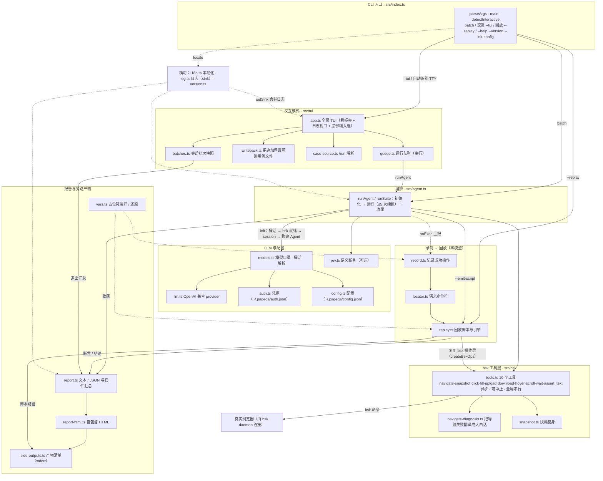

# pageqa

> English documentation: [README.md](./README.md)

用自然语言驱动的页面测试 agent：**LLM 解析意图 → browserskill（`bsk`）驱动真实浏览器执行 → 产出文本/JSON 报告与可接入 CI 的退出码**。首次跑通后把操作序列固化成回放脚本，之后可零模型重跑同一条用例。

交互模式（TUI）是默认且推荐的使用方式：一个长流程动辄十几分钟，期间你还能随时追加场景、切换模型、看实时进度与 token 消耗。

<https://github.com/user-attachments/assets/d5315f93-7e02-4445-a7cf-506b3bfcaa2d>

---

## 安装与前置

**1. 安装 `pageqa`**：需要 Node.js ≥ 22.19。

```bash
npm install -g pageqa      # 或 pnpm add -g pageqa
pageqa --init-config       # 在用户目录创建 ~/.pageqa/config.json
```

**2. 安装并连接 browserskill（`bsk`）**（驱动真实浏览器的插件，[项目主页](https://github.com/Tencent/BrowserSkill)）：

```bash
bsk status                 # 查看 daemon 与已连接浏览器
bsk session start          # 可选：手动建 session（不传 --session 时 pageqa 自动建）
```

> pageqa 运行时会自动后台启动 bsk daemon（每个进程一次）。但**浏览器连接要你自己做**：在浏览器里装好 bsk 扩展并完成连接。启动时检测不到已连接浏览器会明确报错并提示先连接，而不是卡死。

**3. 配置 LLM 端点**（默认 `http://127.0.0.1:3000/v1`，key 默认 `codebuddy-proxy-key`）：写入 `~/.pageqa/config.json`，或用环境变量 `PAGEQA_LLM_BASE_URL` / `PAGEQA_LLM_API_KEY` / `PAGEQA_LLM_MODEL`（环境变量 > 配置文件 > 内置默认）。

```json
{ "baseUrl": "http://127.0.0.1:3000/v1", "apiKey": "codebuddy-proxy-key", "model": "hunyuan-2.0-instruct", "locale": "zh" }
```

---

## 交互模式（TUI）—— 核心用法

在交互终端里直接运行就进入 TUI（stdin/stdout 都是 TTY 时自动进入）：

```bash
pageqa                       # 空会话：队列为空、无落点，随时 /run 加载用例
pageqa examples/smoke.md     # 打开一个用例文件并交互式运行
pageqa --tui examples/smoke.md   # 显式强制进入（非 TTY 下会直接报错）
```

进入条件（自动）：终端是 TTY 且未给 `--json`，且满足「给了用例文件」或「什么都没给」。**内联文本不会进入 TUI**（走批处理）；`--json` / `--replay` / `--session` 会阻止进入。想关掉交互：`pageqa --no-tui` 或 `PAGEQA_NO_TUI=1`。

### 界面布局

```text
┌──────────────────────────────────────────────────────────┐
│ 看板带（仅终端列宽 ≥ 90 时渲染）：5 列按状态汇总场景       │  ← 等待中/进行中/成功/失败/已取消
├──────────────────────────────────────────────────────────┤
│                                                            │
│   滚动日志视口（跟随末尾；可上滚回看，进度/耗时/成败实时）  │
│                                                            │
├──────────────────────────────────────────────────────────┤
│ 状态栏：当前模型 · 待办数 · 落点（写回目标）                │
│ > 输入框（底部固定）                                        │
│ Token 消耗：input … / output … / total … (LLM calls n)      │
│ 提示行                                                      │
└──────────────────────────────────────────────────────────┘
```

- **看板带**：把当前全部场景按状态分成 5 列（等待中 / 进行中 / 成功 / 失败 / 已取消），进行中的场景尾部带实时耗时；列内只放得下的最近若干张，超出显示 `+N 更多`。纯展示、点击不做操作；终端列宽低于 90 时不渲染，整片留给日志视口。
- **状态栏**常驻显示：当前模型、待办数、已写回数、**落点**（追加场景写回的用例文件；无落点时提示「无」，此时追加场景只存在于本次会话、关掉就没）。

### 提交场景

- 输入框直接敲自然语言，**Enter** 提交；若文本含 `## 标题` 则该行作为场景名，否则取首行摘要。**Shift+Enter** 换行（写多场景用例）。
- 提交即「写回 + 入队」：有落点时先追加写回落点文件再入队（保证「敲下去就留下了」）；正在跑则排队，当前场景结束后自动接上。

### 命令（`/` 开头，行首输入 `/` 弹出模糊补全列表）

| 命令 | 作用 |
| --- | --- |
| `/run <路径或关键字>` | 运行时加载用例文件进队列：精确路径、目录（该目录下全部用例）、文件名关键字都行；多个命中先让模型从文件名里挑，挑不出再弹选择器。落点切到它 |
| `/status` | 查看运行队列（每场景一行带状态与来源） |
| `/cancel <n>` | 取消队列里还没开始的第 n 个场景 |
| `/new` | 开新会话：清空视口与队列、token 重新计，但**上一批归档**（仍进退出报告与回放脚本）。队列还有在跑/待办时拒绝 |
| `/model` | 切换本会话模型（`Enter` 本次生效，`Ctrl+S` 同时存为启动默认） |
| `/login` · `/logout` | 登录 / 移除某 provider 的本地凭据（写入 `~/.pageqa/auth.json`） |
| `/setting` | 改持久化偏好：测试报告(HTML) / 回放脚本 开关、语言 |
| `/help` · `/exit` | 帮助 / 收工退出（`/quit` 同义） |

### 键位

| 键 | 作用 |
| --- | --- |
| `Enter` | 提交输入 |
| `Shift+Enter` | 换行 |
| `Esc` | 中止正在跑的场景（记为「已取消」，不计退出码、不写回放）；提问中则取消提问 |
| `Ctrl+C` | 收工：中止当前 + 取消全部待办 → 还原终端 → 打印汇总报告（正常退出，非硬杀；收尾期间再按一次表示立刻收尾） |
| `PageUp`/`PageDown` | 日志翻页 |
| `↑`/`↓` | 输入框为空时滚日志（部分终端把滚轮翻译成这两个键） |
| `Ctrl+↑`/`Ctrl+↓` | 日志逐行滚（写多行用例时也生效） |
| `Ctrl+P`/`Ctrl+N` | 输入历史上/下 |
| `Home`/`End` | 跳到日志开头 / 回到底部（恢复跟随） |
| 鼠标滚轮 | 日志滚动（每次 3 行；上滚暂停跟随，点末行提示或 `End` 回底部） |

> `/run` 加载的场景**不写回**（本就在文件里），仅切换落点；只有你追加的场景才写回。无落点的追加场景关掉即丢，退出时会如实说明数量。

---

## 批处理模式（Batch）—— 一次性运行 / CI

不适合边跑边交互时用，或直接接 CI：

```bash
pageqa "打开 https://example.com 并断言标题包含 Example"   # 内联自然语言
pageqa examples/smoke.md        # 读用例文件（自动识别 ## 分隔的多场景）
pageqa --json examples/smoke.md # 输出 JSON 报告
pageqa --suite "..."            # 强制多场景套件模式
pageqa --out report.txt ...     # 报告另存文件
```

- stdout 只放最终报告，日志走 stderr（互不干扰，方便 `pageqa --json … > report.json`）。
- 退出码：`0` 全部断言通过；`1` 任一断言失败/报错/无法执行——可直接作 CI 门槛。
- 每个场景开跑前先探一次模型连通性；不通则如实记该场景失败并取消后续待办，不浪费浏览器窗口。

---

## 回放（Replay）—— 零模型重跑

首次带模型跑通后，操作序列默认固化成回放脚本（`*.replay.json`，贴着源用例；可在 `/setting` 关掉，`--emit-script` 显式开关优先）。之后用回放脚本零模型重跑，秒级完成、不依赖 LLM，适合「跑一次建模、日后每天回归」接 CI：

```bash
pageqa --emit-script examples/smoke.md              # 显式生成脚本（默认已自动生成）
pageqa --replay examples/smoke.replay.json          # 零模型回放
pageqa --replay examples/smoke.replay.json --json   # 机器可读报告
pageqa --replay examples/smoke.replay.json --semantic  # 断言改用 Jev 语义判断
```

要点：脚本存**语义定位符**（角色+可访问名+同名序号+祖先路径），重跑时按当前快照重定位，小改动通常仍命中；找不到元素时如实说明原因而非乱猜。元素未找到 → 跳过并继续（报告中列出），其它失败 → 记失败并跑完整个用例；`navigate` 失败 → 直接中止。想「遇错即停」加 `--fail-fast`。

---

## 编写用例

用例是一段自然语言文本，按非空行拆成步骤（`#`/`>` 注释行不计）。用 `## 标题` 分隔多个独立场景（各自独立的 bsk session 与浏览器窗口）。

**断言行要对齐工具调用**：报告会核对「用例里含『断言』的行数」与「实际产生的断言结果数」，两者必须相等——每个 `assert_text` 产一个断言，`download` 本身也算一个断言（别再单写一行「断言已下载」）。注释行不计，所以解释性文字不会虚增计数。

**运行时占位符**（一处展开、同一次运行共用同一时刻）：

| 占位符 | 展开为 |
| --- | --- |
| `${timestamp}` | `yyyyMMddHHmm` |
| `${date}` / `${time}` | `yyyyMMdd` / `HHmmss` |
| `${datetime}` | `yyyyMMddHHmmss` |
| `${timestamp:<格式>}` | 自定义，支持 `yyyy yy MM dd HH mm ss SSS` |

未识别的占位符（如 `${PATH}`）原样保留。

**文件上传**：用例里写「点击上传按钮上传本地文件 `<绝对路径>`」，agent 调 `upload`（先给 bsk 扩展开启「允许访问文件网址」）。**文件下载/导出**：写「点击导出、在对话框确认、验证文件已下载」，agent 调 `download`（`target` 是触发下载的元素，`expectName` 用 glob 匹配文件名，如 `*.xls`）。下载断言成立后会自动清理落盘文件（可在 config 关 `downloadCleanup`）。

---

## 配置与可选增强

- **配置文件**：`~/.pageqa/config.json`，字段 `baseUrl`/`apiKey`/`model`/`locale`/`htmlReport`/`replayScript`/`downloadDir`/`downloadCleanup`。优先级：环境变量 `PAGEQA_*` > 配置文件 > 内置默认。
- **Jev 语义断言（可选）**：在 config 加 `jev` 字段（或 `PAGEQA_JEV_*` 环境变量），用于字面未命中时的语义复检，纠正同义/近义/格式差异造成的假 FAIL；调用失败自动降级回字符串匹配。
- **语言**：`--locale zh|en` 或 `PAGEQA_LOCALE`；默认 `zh`。数据契约（JSON 字段、退出码）与语言无关。

---

## CLI 选项

| 选项 | 说明 |
| --- | --- |
| `--session <id>` | 指定已有 bsk session（默认自动建） |
| `--locale <zh\|en>` | 界面/日志/报告语种（默认 zh） |
| `--json` | 输出 JSON 报告（与 TUI 互斥） |
| `--suite` | 强制多场景套件模式 |
| `--tui` / `--no-tui` | 强制开/关交互模式（`PAGEQA_NO_TUI=1` 同效） |
| `--emit-script [path]` | 固化回放脚本（默认已开，路径贴源用例） |
| `--replay <file>` | 零模型回放已有脚本 |
| `--semantic` | 回放时断言用 Jev 语义判断 |
| `--fail-fast` | 回放时任一失败即停该场景 |
| `--init-config` | 创建/重置配置文件 |
| `--out <file>` | 报告另存文件 |
| `--debug` | 调试日志（bsk 命令与耗时、快照瘦身、Jev 请求等） |
| `-v, --version` · `-h, --help` | 版本 / 帮助 |

---

## 架构（分层 / 模块视图）

下图是**分层与模块视图**——各层职责与模块间产物流向；运行时的实际时序见下方「工作原理」。



### 工作原理

```
自然语言意图
   └─> pi-agent-core agent（LLM：可配置 OpenAI 兼容端点）
          └─> bsk 工具：navigate / snapshot / click / fill / upload / download / hover / scroll / wait / assert_text
                 └─> 真实浏览器（由 bsk 连接）
          └─> 结论与证据 → 报告（文本/JSON）+ 退出码
          └─> 默认：把成功操作录制为回放脚本（*.replay.json；可在 /setting 关）

回放脚本 → pageqa --replay → 复用同一 bsk 操作层 → 真实浏览器 → 报告 + 退出码（全程不调 LLM）

交互模式（pageqa --tui <用例文件>）
   ├─> TUI：看板带（按状态 5 列）+ 滚动日志视口（经 setSink 合并进度日志）+ 底部固定输入框
   ├─> 运行队列：串行执行；提交的新场景先写回落点再入队
   └─> 退出 → 还原主屏 → 汇总报告（stdout/--out）+ 退出码（已取消不计入）
```

可用工具（`src/bsk/tools.ts`）：`navigate` 打开页面；`snapshot` 读取页面 aria 树与可见文本（含瘦身与复用）；`click`/`fill`/`hover` 元素交互；`upload` 上传本地文件；`download` 捕获浏览器下载（本身即一项断言）；`scroll`/`wait` 滚动与等待；`assert_text` 断言页面含指定文本。

长流程保护（自动续跑）：一轮对话后若 agent 自报进度未满（`steps done: k/n` 且 `k < n`）或用例有断言但报告只解析到部分，pageqa 自动追加「继续剩余步骤」提示，最多 5 轮；续跑后进度与断言数仍无推进则停止。

完整目录结构与各模块说明见 `src/`。

---

## 验证与 CI

```bash
pnpm install --frozen-lockfile && pnpm run build
pnpm run test:unit     # 单测：无浏览器/LLM/TTY 依赖
pnpm test              # 端到端冒烟：需 bsk 已连浏览器 + 可用 LLM 端点
```

`examples/smoke.md` 可直接当端到端样例跑（`pageqa examples/smoke.md --json`）。CI 注入 LLM 端点即可把本工具当质量门槛（`node dist/index.js --json examples/smoke.md`）。
