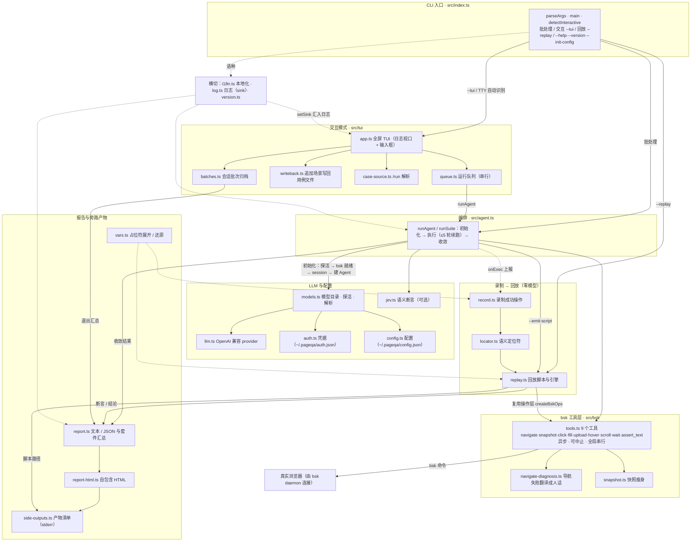

# pageqa

> English documentation: [README.md](./README.md)

用自然语言驱动的页面测试 agent。基于 **pi-agent-core**（状态化 LLM agent）编排测试步骤，**browserskill（`bsk`）** 驱动真实浏览器执行，自然语言解析由可配置的 LLM 端点完成。最终产出可读文本报告与机器可读 JSON 报告，返回可接入 CI 的退出码。

<https://github.com/user-attachments/assets/d5315f93-7e02-4445-a7cf-506b3bfcaa2d>

- 运行时：**Node.js + TypeScript**，以 npm 包分发、CLI 入口；仓库开发使用 **pnpm**（锁文件为 `pnpm-lock.yaml`）。
- 浏览器驱动：**browserskill（`bsk`）**，连接一个已运行的真实浏览器（Chrome/Edge），支持公开页与登录态页面。
- 自然语言驱动：**pi-agent-core** 状态化 agent，把自然语言意图解析为浏览器操作步骤并自动编排；LLM 后端通过可配置的 OpenAI 兼容端点接入（base URL / API Key / 模型均可配置）。

## 前置

### 1. 安装并配置 browserskill（`bsk`）

`bsk` 是连接真实浏览器（Chrome/Edge）的驱动，本项目通过它执行页面操作。

- 项目主页与安装方式：**<https://github.com/Tencent/BrowserSkill>**
- 按仓库 README **安装 `bsk` CLI**（只需装一次）。

> **无需手动启动 daemon**：运行 `pageqa` 时会自动检查并在 daemon 未运行时后台启动它（`bsk daemon start`），每个进程只启动一次。你也可以用 `bsk status` 查看状态。

**浏览器连接仍需你来做**（这是物理操作，pageqa 无法自动完成）：在浏览器中安装 bsk 扩展并完成连接。若启动时检测不到任何已连接浏览器，pageqa 会明确报错并提示你先连接，而不是卡死。

验证安装与连接：

```bash
bsk status           # 查看 daemon 与已连接浏览器
bsk session start    # 可选：手动创建 session（不传 --session 时 pageqa 会自动创建）
```

> 提示：本工具的 `--session <id>` 即来自 `bsk session start` 返回的 `session_id`；不传时 CLI 会自动新建一个（前提已有浏览器连接）。

> **重点提示：要执行「文件上传」用例，必须先给 bsk 浏览器扩展开启「允许访问文件网址（Allow access to file URLs）」，否则上传一定失败。**
>
> 开启方式（Edge / Chrome）：打开 `edge://extensions`（或 `chrome://extensions`）→ 找到 BrowserSkill 扩展 → 点「详细信息」→ 打开「允许访问文件网址」开关 → 回到扩展卡片点一次「重新加载」（必要时重启浏览器）。
>
> 未开启时的典型报错：`the upload trigger did not activate a file input`，以及 `the browser could not attach the staged file to the input ... {"code":-32000,"message":"Not allowed"}`。
>
> 这是浏览器级设置，**pageqa 与 bsk 都无法自动开启**（Agent Window 也无法打开 `edge://` 页面），必须人工开一次；开启后本机所有上传用例都可用。

### 2. LLM 后端（可配置 OpenAI 兼容端点）

自然语言解析依赖一个 OpenAI 兼容的 LLM 端点。端点地址、密钥与模型均可通过配置文件或环境变量设置：

- 默认地址：`http://127.0.0.1:3000/v1`（可被覆盖为任意 OpenAI 兼容端点）
- 默认 Key：`codebuddy-proxy-key`

可用环境变量覆盖（优先级高于配置文件）：

- `PAGEQA_LLM_BASE_URL`
- `PAGEQA_LLM_API_KEY`
- `PAGEQA_LLM_MODEL`

### 3. 用户级配置文件（可选但推荐）

工具会在**用户主目录**自动创建配置文件，持久化 LLM 设置，避免每次用环境变量：

- 配置目录：`~/.pageqa`（Windows：`%USERPROFILE%\.pageqa`）
- 配置文件：`config.json`

```json
{
  "baseUrl": "http://127.0.0.1:3000/v1",
  "apiKey": "codebuddy-proxy-key",
  "model": "hunyuan-2.0-instruct",
  "locale": "zh"
}
```

- 首次运行（或执行 `pageqa --init-config`）会自动创建该文件，编辑即可切换模型/端点地址/密钥。
- **优先级（高 → 低）**：环境变量 `PAGEQA_LLM_*`  >  用户配置文件 `config.json`  >  内置默认值。
- 例如要改用其他兼容 OpenAI 的端点，把 `baseUrl`/`apiKey`/`model` 改掉即可，无需改代码。

### 4. Jev 语义断言（可选增强）

> **什么是 Jev？** Jev 是 TypeSafe AI 推出的 [System One 模型](https://docs.typesafe.ai)，专为结构化决策设计。它不做文本生成，而是直接返回校准后的概率值（如匹配度 0.93）。pageqa 用它做**字面匹配失败后的语义复核**，把「同义词 / 近义表达 / 格式差异」造成的误报 FAIL 纠正过来。

**启用方式**：在 `~/.pageqa/config.json` 中添加 `jev` 字段，或设置环境变量：

```json
{
  "baseUrl": "http://127.0.0.1:3000/v1",
  "apiKey": "codebuddy-proxy-key",
  "model": "hunyuan-2.0-instruct",
  "jev": {
    "enabled": true,
    "apiKey": "your-typesafe-api-key",
    "model": "jev-latest",
    "threshold": 0.5
  }
}
```

| Jev 配置项 | 说明 | 默认值 |
| --- | --- | --- |
| `enabled` | 是否启用 Jev 语义断言 | `false` |
| `apiKey` | TypeSafe API 密钥 | （无） |
| `model` | Jev 模型 ID | `jev-latest` |
| `threshold` | 语义匹配概率阈值（0~1） | `0.5` |

**环境变量覆盖**（优先级高于配置文件）：

- `PAGEQA_JEV_ENABLED=true`
- `PAGEQA_JEV_API_KEY=<your-key>`
- `PAGEQA_JEV_MODEL=jev-latest`
- `PAGEQA_JEV_THRESHOLD=0.6`

**获取 API Key**：

1. 访问 [console.typesafe.ai/settings/keys](https://console.typesafe.ai/settings/keys)（需等待早期访问权限）
2. 或通过 Vercel AI Gateway 获取

**工作原理（按需调用）**：`assert_text` 先做字符串包含匹配——**字面命中即成立，不调用 Jev**（省掉一次远端往返，也避免把肉眼可见的文本判成不成立）；只有**字面未命中**时才把页面快照文本发给 Jev 做一次语义复核，由 Jev 判断页面内容是否语义匹配断言期望（匹配概率 ≥ `threshold` 即成立）。所以 Jev 只用在真正需要它的地方：同义词、近义表达、格式差异导致的误报 FAIL。每条断言最多一次 Jev 调用，长流程不会被逐条断言拖慢。

**降级机制**：若 Jev API 调用失败（网络/超时/鉴权错误），会自动回退到原有的字符串包含匹配，确保测试不因 Jev 服务中断而失败。

**架构示意**：

```text
自然语言意图
   └─> pi-agent-core Agent（LLM → 可配置 OpenAI 兼容端点）
          └─> bsk 工具：navigate / snapshot / click / fill / hover / scroll / wait
                 └─> 真实浏览器（bsk 连接）
          └─> assert_text ──→ 字面命中即成立；未命中才问 Jev Noul API（可选，语义复核）
          └─> 结论与证据 → 报告（文本/JSON）+ 退出码
```

## 安装

> **Node 版本要求：≥ 22.19**。交互模式依赖 `@earendil-works/pi-tui`，该包要求 `node >= 22.19.0`（`package.json` 的 `engines` 已声明此下限）。

本地开发（仓库使用 pnpm，请先安装：`npm install -g pnpm`）：

```bash
pnpm install --frozen-lockfile
pnpm run build
```

全局安装（发布后）：

```bash
npm install -g pageqa   # 或 pnpm add -g pageqa
pageqa --init-config   # 在用户目录创建配置文件 ~/.pageqa/config.json
```

> 全局安装后首次运行也会自动创建配置文件；用 `--init-config` 可显式创建/重置。

## 使用

```bash
# 内联自然语言（多句按行分隔）
pageqa --session <id> "打开 https://example.com
并断言标题包含 Example"

# 读取脚本文件（自动识别 `## ` 分隔的多个场景，逐个运行并汇总）
pageqa examples/smoke.md

# JSON 报告
pageqa --json examples/smoke.md

# 强制按多场景套件运行（即使只有一个场景）
pageqa --suite "打开 https://example.com 并断言标题包含 Example"
```

### 多场景套件

脚本（`.md`/`.txt`）中用 `## 场景名` 分隔多个独立测试场景，CLI 会逐个运行、分别给出结论，并汇总整体 PASS/FAIL 与总退出码（任一场景失败则整体失败）。

### 模型连通性检查（跑用例前先探活）

每个场景开跑前，pageqa 先用一次极小的真实请求（同一条 provider 通路、`max_tokens=16`）确认模型能不能连通。探活在**检查 bsk daemon、建 session、开浏览器窗口之前**，因此模型不通时一个窗口都不会开。不通就**不执行任何用例**：

- **批处理**：stderr 打印「模型不可达：`<provider>/<model>`：<原因>」与出路，退出码 `1`，stdout 不打印报告（一条用例都没跑，就不该出现一份看起来像结果的报告）；
- **交互模式**：该场景如实记为 FAIL（不混进「已取消」——那类不计入退出码），并把剩余待办全部取消，视口里说明原因与出路。

为什么是**每个场景**都探、而不是只在启动时探一次：模型可能是上个场景跑到一半才断的，「启动那次通了」不代表第 8 个场景时还通。覆盖的失败面：端点没起（连接被拒）、`baseUrl`/`apiKey` 写错（401）、模型名不存在（404）、网络不通（超时，20s）。用户按 `Esc` 造成的中止不算「模型不可达」，仍按「已取消」处理。设计细节见 `docs/adr/0006`。

### 交互模式（跑用例的同时追加场景）

长流程单次可能跑十几分钟，而这段时间里想补一条用例只能干等。交互模式让用例继续跑的同时随时可以提交新场景：

```bash
pageqa --tui examples/smoke.md

# 也可以先开一个会话，之后再决定跑什么（不需要用例文件）
pageqa
```

进入条件：在交互式终端（`stdin` 与 `stdout` 都是 TTY）里直接运行、且没给 `--json` 时**自动进入**；`--tui` / `--no-tui` 可显式开关，也可用 `PAGEQA_NO_TUI=1` 关闭。**什么参数都不给**时同样会进入——这样的会话一开始队列为空、**没有落点**，你随时可以用 `/run` 加载一个用例文件。内联文本仍不进入（临时试一条该走批处理），`--tui "<内联文本>"` 也仍报错。显式 `--tui` 但非 TTY 会直接报错，不静默降级（静默降级会让人以为界面坏了）。

**落点**就是追加场景写回的那个用例文件：启动时给的源用例文件，或最近一次 `/run` 加载的那个（谁更晚算谁）。它常驻状态栏，切换时会在视口里明说。没有落点时，追加场景只存在于本次会话、不写任何文件——提交时视口里会写明白，退出时还会报出「有几个场景没能写回」。

界面是「上方可滚动日志 + 底部固定输入框」：进度日志、bsk 命令耗时、每一步成败都实时进视口，stdout 仍只留给最终报告。日志长过一屏时，用 `PageUp`/`PageDown`、`Ctrl+↑`/`Ctrl+↓`、`↑`/`↓` 或鼠标滚轮回看；上滚会暂停跟随末尾，视口末行会给出提示，点它（或按 `End`）回到底部继续跟随。提交输入时也会自动回到末尾。

**输入框下方**常驻一行本次会话的 token 消耗，内容与报告末行完全一致：

```text
Token 消耗: 输入 301 / 输出 117 / 缓存读 9536 / 缓存写 0 / 合计 9954（LLM 调用 4 次）
```

它是**会话累计**（已结束场景的结算值 + 正在跑的场景的实时值），每轮 LLM 调用后刷新——长流程跑到一半也能看出已经烧了多少；端点没返回 usage 时那一行会自己说明（不会拿 0 冒充）。每个场景结束后，视口里还会补一行该场景自己的明细，退出时的汇总报告与 `--json` 口径不变。

**有些终端会把鼠标滚轮当成 `↑`/`↓` 送给应用**（VS Code 的全屏缓冲就是如此：应用拿不到鼠标事件时，终端把滚轮翻译成方向键，好让 less/man 这类程序能翻页）。滚轮与真方向键在字节上无法区分，所以按上下文分派：**输入框为空时 `↑`/`↓` 归日志视口**（滚轮因此能滚日志，步长与滚轮一致），历史输入改用 `Ctrl+P`/`Ctrl+N`；输入框里一旦有内容，`↑`/`↓` 立刻回到编辑器手里（光标移动 / 历史浏览）。理由见 `docs/adr/0007`。

| 按键 | 作用 |
| --- | --- |
| `Enter` | 提交（输入里写了 `## 标题` 就用它作场景名，否则取首行摘要） |
| `Shift+Enter` | 换行（写多场景用例时用） |
| `Esc` | 中止当前场景：记为「已取消」，不计入退出码、不写入回放脚本 |
| `Ctrl+C` | 收工：中止当前 + 取消全部待办，还原终端并输出汇总报告（**正常退出，不是硬杀**；收尾期间再按一次 = 不再等队列停下） |
| `PageUp` / `PageDown` | 日志上下翻一页 |
| `↑` / `↓` | 日志滚动（仅当输入框为空；滚轮常被终端翻译成它们） |
| `Ctrl+↑` / `Ctrl+↓` | 日志逐行滚动（任何时候都生效，输入框里在写多行用例时也可用） |
| `Ctrl+P` / `Ctrl+N` | 历史输入：上一条 / 下一条提交过的文本（原来是 `↑`/`↓`） |
| `Home` / `End` | 跳到日志开头 / 回到末尾继续跟随 |
| 鼠标滚轮 | 滚动日志（一格 3 行）；上滚同样暂停跟随，末行提示可点击回到底部 |

`Ctrl+C`（与 `/exit` 同义）走的是**正常退出路径**：中止当前场景 → 取消全部待办 → 还原终端（退出 alt 屏、恢复光标）→ 打印汇总报告，然后才退出进程。它不会把进程当场杀掉——被信号杀掉的进程不会还原终端，会把它留在 alt 屏 + 光标隐藏的状态里（看起来就像终端被关掉/卡死，报告也一个字都没有）。终端在 raw 模式没生效的时刻（启动早期、收尾还原终端之后）会把 `Ctrl+C` 变成 `SIGINT` 信号，pageqa 把信号接到同一条路上；收尾期间再按一次表示「别再等队列了」，报告仍然会打印。设计细节见 `docs/adr/0008`。

命令：`/status`（查看运行队列）、`/run <路径或关键字>`（加载一个已有用例文件）、`/new`（开一个新会话：清空视口与运行队列）、`/cancel <n>`（取消一个尚未开始的待办）、`/model`（选择本次会话使用的模型）、`/login`（登录一个 provider）、`/logout`（移除某 provider 的本地凭据）、`/setting`（修改设置：测试报告 / 回放脚本 / 语言，写回 `~/.pageqa/config.json`）、`/help`、`/exit`。在输入行首键入 `/` 会弹出命令联想列表（支持模糊过滤；`/cancel` 还会补全待办编号，Tab 可补全）。

- **`/run` 在运行中加载用例文件**：`/run examples/github-star.md`（精确路径）、`/run examples`（该目录下的全部用例文件）、`/run github-star`（文件名关键字，会跳过 `node_modules`、点目录之类）。命中唯一就直接加载；命中多个时把**候选文件名**（不含文件内容）交给模型挑，模型挑不出来或不可用就弹选择器让你自己挑。加载进来的场景并入队列，它们的来源是那个文件、**不会**被写回（本来就在文件里），而落点会切到它。刻意**不**给模型读文件的工具：内容一旦绕过 pageqa，步骤编号、`k ↔ 用例原文` 映射与写回/录制的对应关系全断，模型还会获得读取本机任意文件的能力。

- **`/model` 切换模型**：弹出可用模型列表（`↑↓` 选择、`Enter` 本次会话生效、`Ctrl+S` 同时设为启动默认写回 config.json、`Esc` 取消）。列表里的模型来自两类 provider——**自定义端点**（`config.json` 的 `baseUrl`/`apiKey`/`model` 总是可用）和**内置 provider**（anthropic / openai / deepseek / github-copilot 等，需先 `/login` 或设置对应环境变量如 `ANTHROPIC_API_KEY` 才会出现）。切换只影响**之后**的场景，正在跑的不被打断。设计细节见 `docs/adr/0004`。
- **`/login` 登录**：先选 provider，再按它支持的登录方式（API Key 或订阅 OAuth）走引导；期间授权链接/设备码会打印到界面，需要文本/密钥时用底部输入框提交，`Esc` 取消。凭据写入 `~/.pageqa/auth.json`，**不属于** git 仓库。登录后 `/model` 即可选该 provider 的模型。
- **`/logout` 移除凭据**：列出本地已存凭据的 provider，`Enter` 移除对应的 `~/.pageqa/auth.json` 条目（环境变量与 `config.json` 的鉴权不受影响）。
- **启动默认**：`~/.pageqa/config.json` 的 `modelProvider` + `model` 决定下次启动用哪个模型；`/model` 按 `Ctrl+S` 会改写它们。若启动默认指向的内置 provider 后来没登录/模型已下线，交互模式会警告并退回自定义端点的默认模型，不会让第一条场景直接失败。

要点：

- **`/new` 开新会话（不用退出进程）**：清空视口与运行队列、token 计数从头开始，但**上一批不会被丢掉**——它仍进退出时的汇总报告与回放脚本（「清了屏」不等于「没跑过」）。新视口开头会给上一批的归档小结（一行场景名与结论）。队列里还有在跑或待办的场景时 `/new` 会拒绝执行并告诉你怎么办（`Esc` 中止正在跑的、`/cancel <n>` 取消待办），不静默丢「已提交但没跑」的场景。**落点不跟着换**（静默丢落点会让之后敲下的用例不再写回文件），想换用例文件就用 `/run`。见 `docs/adr/0009`。
- **模型不通就不跑**：每个场景开跑前先探活；不通时该场景记为 FAIL、剩余待办全部取消，并在视口里说明原因与出路（见「模型连通性检查」）。
- **追加场景会立即写回落点文件**（纯 append，用例原文与运行时占位符原样保留，绝不写展开后的具体值）。因为「敲下来的就是你想留下的用例」，等跑完再写会让 Ctrl+C 把整条待办队列丢掉。
- **`/run` 只往队尾追加，不替换队列**：正在跑的场景不受影响，新场景排在待办后面。加载本质上只是一次批量提交——「提交了就一定会跑」（`docs/adr/0002`）这条承诺正是不让加载顺手动破坏的理由。想少跑一条请用 `/cancel` 或 Ctrl+C。
- **加载进来的场景不会被写回**：它们本来就在那个文件里，只有追加场景才写。加载文件里的占位符按**会话启动那一刻**展开（与追加场景同一个时刻），而不是按加载时刻——回放脚本靠「具体值 → 占位符」反查还原，而一个文件里的场景与写回它的追加场景会进同一份脚本。
- **场景串行执行**：每个场景各自创建并关闭自己的 bsk session 与浏览器窗口（排队中的场景轮到它执行时才创建），不会几个窗口抢焦点；一个场景结束（通过／失败／已取消）后自动开始下一个。
- **「已取消」是第三种终态**：Esc 表达的是「我不想再等这个了」，不是「这条用例挂了」，所以它不进退出码、也不写进回放脚本（半截轨迹录进去会让回放跑半个用例还可能报 PASS）。
- **中止是真的中止**：按 Esc 会 kill 掉正在跑的 bsk 命令，而不是等它自己超时。这要求 bsk 操作层异步化（同步子进程会阻塞事件循环，界面在这期间完全不渲染、也收不到 Esc），理由见 `docs/adr/0003`。
- **回放脚本默认生成**（可在 `/setting` 里关掉；`--emit-script` 显式请求永远优先）：退出时把跑过的场景固化成回放脚本——**每个用例文件一份**，各自贴着它的源用例写（`examples/smoke.replay.json`），因为脚本头部只有单值的 `source { path, hash }`。已取消的不含在内；追加场景归它写回的那个落点。**完全没有落点的场景不生成脚本**（清单里写明原因），要让它可回放请先用 `/run` 打开一个用例文件。生成的路径逐份进收尾的「本次产物」清单。**显式给了脚本路径、而本次运行有多个来源时会直接报错**，不静默只收其中一个；一个场景都没跑过时不落盘。脚本哈希基于**写回之后**的文件内容，因此第一次回放不会误报「源用例已变更」。
- 不能与 `--json`（要独占 stdout）、`--replay`（秒级零模型，无需等待）、`--session`（与「场景各有独立 session」冲突）同时使用。
- 批处理模式（管道、重定向、`--json`、CI）行为完全不变：`tests/smoke.test.mjs` 走管道 stdio，会自动降级。

### 失败定位（步骤编号 + 执行轨迹）

长流程失败时，只看到「步骤完成：23/42」是没法改用例的——不知道卡在用例的哪一句。为此：

1. **步骤由 pageqa 统一编号**：用例的每个非空行（忽略 `#`/`>` 说明行）会被编号为 `### 步骤 k：<原文>` 后再交给模型。模型必须按编号执行，并输出同一套编号的「第 k 步完成：…」「步骤完成：k/n」。因此 `k` 能直接映射回用例的某一行。
2. **报告输出执行轨迹**：套件报告里每个场景会附上工具调用与步骤自述（末尾 25 条），失败原因与卡点一目了然。
3. **未跑完时直接点名下一步**：完整性校验的失败项会给出「最后进展」和「未执行到的步骤（第 k/n 步）：<用例原文>」，照着它就能定位到要改的那句。
4. JSON 报告额外提供 `steps`（用例步骤清单）与 `trace`（执行轨迹数组）字段；套件模式还提供 `scenarios[]`（逐场景的 `name/status/steps/trace/assertions`），便于 CI 侧做失败归因。

- `durationMs`（可选，毫秒）：本场景/套件耗时；套件逐场景明细 `scenarios[].durationMs` 同义。

失败时的报告片段示例：

```text
--- 场景 1：P1 产品 → 目录 → 物料 → … [FAIL] ---
  - [PASS] 页面中已出现产品 `自动化测试产品202609210905` (证据：列表首行显示…)
  - [FAIL] 全部步骤执行完成（23/36） (agent 自报的步骤完成度不足；最后进展：第 23 步完成：已点击「操作」下拉并选择「检出」；未执行到的步骤（第 24/36 步）：点击页面右侧菜单栏的「待办事项」，进入「待办列表」；轨迹末尾：[tool] snapshot → [tool-ok] click → [tool-error] click)
  - [FAIL] 用例中的断言全部执行（实际 2/6） (…；最后进展：第 23 步完成…)
  执行轨迹（末尾 25/25 条）:
    [tool] navigate
    第 1 步完成：已打开产品列表页
    [tool-ok] snapshot
    …
    [tool-error] click
    第 23 步完成：已点击「操作」下拉并选择「检出」
```

### Token 消耗

每次运行结束后，报告**末尾**会给出本次运行的 LLM token 消耗（多场景套件在每个场景与末尾合计处各输出一行）：

```text
---
Token 消耗: 输入 446 / 输出 136 / 缓存读 6720 / 缓存写 0 / 合计 7302（LLM 调用 4 次）
```

- 数据来自各轮 assistant 消息的 `usage`（含自动续跑的轮次），`输入/输出/缓存读/缓存写` 为分项，`合计` 取端点返回的 `totalTokens`。
- JSON 报告（`--json`）中为 `usage` 字段：`{ input, output, cacheRead, cacheWrite, reasoning, total, calls }`。
- 若 LLM 端点未返回 usage（合计为 0），会在同一行标注「端点未返回 usage」，避免把 0 误读成真实消耗。

### HTML 报告

每次运行结束（批处理、回放、交互退出）都会在当前目录生成一份可直接用浏览器打开的
自包含 HTML 报告，路径与生成时间打印在 stderr：

```text
pageqa-report/report-20260923-153001.html
```

- 文件名带时间戳，多次运行互不覆盖；`pageqa-report/` 已在 `.gitignore` 中忽略。
- 内容：整体汇总（场景数/通过/失败/已取消/耗时/token）、逐场景状态与断言、可折叠执行轨迹。
- 测试报告与回放脚本合称**旁路产物**：都不进 stdout、只把路径打到 stderr；写盘失败只警告、**不改退出码**。
- JSON 报告（`--json`/`--out`）新增可选字段 `durationMs`（毫秒），旧报告无此字段。

### 旁路产物与 `/setting`

一次运行结束会落两类**旁路产物**（都不进 stdout，只把路径打到 stderr）：

| 产物 | 默认 | 落点 |
| --- | --- | --- |
| 测试报告（HTML） | 生成 | `pageqa-report/report-<时间戳>.html` |
| 回放脚本 | 生成 | 贴着**当前打开的用例文件**（`examples/smoke.md` → `examples/smoke.replay.json`），固定命名、可覆盖 |

收尾时会打一份清单，把路径与回放命令一次说清：

```text
[pageqa] 本次产物：
[pageqa]   测试报告: pageqa-report/report-20260923-153001.html
[pageqa]   回放脚本: examples/smoke.replay.json
[pageqa]   回放方式: pageqa --replay examples/smoke.replay.json
```

在交互模式里用 `/setting` 关掉任意一项（面板三项：`测试报告（HTML）` / `回放脚本` / `语言`；`↑↓` 选择、`Enter` 切换、`Esc` 关闭）。开关写进 `~/.pageqa/config.json` 的 `htmlReport` / `replayScript`——**没改过的键不会被写进配置**，缺失即视为开。

- 开关只管**旁路产物**：`--json`、`--out`、stdout 文本报告永远照旧。
- **显式参数优先**：`--emit-script`（含显式路径）在开关关掉时照样生成。
- 没有落点的场景（无源会话里的追加场景、内联文本）**不生成脚本**，清单里会写明原因；要让它可回放，请先用 `/run` 打开一个用例文件。
- **一条用例都没跑过时不生成报告**：空会话直接退出、或场景还没开始就被全部取消时，不留空的报告文件（清单里写「本次没有执行任何用例」）。跑了但被中止的场景仍有半截轨迹，会照常留档。
- 交互模式里的 `/toggle-language` 仍可用，但已不再出现在 `/help` 与命令补全里（新入口是 `/setting`）。

设计取舍见 `docs/adr/0011`。

### 快照瘦身与复用（省 token 与时间）

长页面的一次快照几千至上万字符，而它在长流程里要被读几十次——既吃上下文，也吃推理时间。为此 pageqa 对快照做了两件事：

**1）瘦身**：只有原文超过 8000 字符才启用，规则保守且不改变定位：

- **带 `@eN` 的行永不截断、永不丢弃**（模型靠它点击，录制/回放的语义定位符也靠它解析 role/name）；
- `@eN` 行的**祖先链永不丢弃**（祖先路径是同名元素消歧的依据，见「回放脚本」一节）；
- 元信息行（`@vom`/`@view`/`@layers`/`L1 page`）保留；空行省略；
- 其余文本行：超过 160 字符才截断（保留开头）；瘦身后仍超 20000 字符时，再从最长的非关键行开始整行省略，短文本（标题/标签/状态提示）优先保留；
- 结尾附一行说明（`[pageqa] 快照已瘦身：a → b 字符…`），让模型知道有些内容没看到，而不是以为页面就这么点内容。

因此**模型看到的文本与定位解析用的文本是同一份**，role/name/祖先路径都不变；`--debug` 会打印每次瘦身的字符数变化。

**2）复用**：所有会改动页面的动作（`navigate`/`click`/`fill`/`upload`/`hover`/`scroll`/`wait`）都会让上一份快照失效，因此复用只发生在**纯读取之后**：

- 模型「刚 `snapshot` 完就 `assert_text`」→ 断言直接复用那份快照，省掉一次 bsk 往返（断言窗口 5s，`snapshot` 自身去重窗口 1s）；注意断言的字面匹配用**瘦身前**的完整快照——瘦身只影响喂给模型的上下文，不影响断言所依据的页面全文；
- 回放中「上一步是断言、下一步要定位元素」同理；而重试前会 `wait`，等待必然置为失效，所以「每次重试重新取快照」的既有行为保持不变。

页面自身异步更新带来的偏差，靠短窗口兜住：窗口外一律重新抓取。

### 脚本占位符（运行时变量）

脚本里可以写 `${timestamp}` 之类的占位符，CLI 在读取脚本时按本机当前时间展开。同一次运行内所有占位符共用同一时刻，所以「名称 + 时间戳」这类用例既不会重名，也不必每次手工改时间戳：

```md
## P1 创建产品

打开 https://example.com/product
点击「新增」，填写产品名称 `自动化测试产品${timestamp}`
断言页面包含 `自动化测试产品${timestamp}`
```

| 占位符 | 展开结果 |
| --- | --- |
| `${timestamp}` | `yyyyMMddHHmm`，如 `202609191146` |
| `${date}` / `${time}` | `yyyyMMdd` / `HHmmss` |
| `${datetime}` | `yyyyMMddHHmmss` |
| `${timestamp:<格式>}` | 自定义格式，支持 `yyyy` `yy` `MM` `dd` `HH` `mm` `ss` `SSS`，如 `${timestamp:yyyy-MM-dd HH:mm}` |

未识别的占位符（如 `${PATH}`）原样保留，不会被替换。完整示例：`examples/smoke.md`。

### 回放脚本（零模型重跑同一用例）

一条用例被 LLM 跑通一次后，它的操作序列就确定了。pageqa **默认**会把这次的成功操作固化成**回放脚本**（`--emit-script` 仍是显式开关，也可在 `/setting` 里关掉默认生成），之后用 `--replay` 零模型重跑：不再调用任何大模型，秒级完成，也不必再配置 LLM 端点。适合把「先用模型跑通一次、之后每天用脚本回归」接进 CI。

```bash
# 1) 先用 LLM 跑通一次，并生成脚本（不给路径时写到源用例同目录 examples/smoke.replay.json）
pageqa --emit-script examples/smoke.md

# 2) 之后每次零模型回放
pageqa --replay examples/smoke.replay.json
pageqa --replay examples/smoke.replay.json --json       # 机器可读报告，接 CI
pageqa --replay examples/smoke.replay.json --semantic   # 断言改用 Jev 语义判断
```

要点：

- **不存 `@eN`**：bsk 的 `@eN` 只在产生它的那次快照内有效，回放时编号会重排。脚本里存的是**语义定位符**（角色 + 可访问名 + 同名序号），回放时用当次快照重新解析，因此页面小幅调整（改文案、加前后缀、换节点类型）后通常仍能命中；解析不到时退回录制时的 target（是 CSS 就还能用），两者都失败就明确报错，而不是猜一个「最像的」元素——点错元素制造的是假通过。
- **占位符保持可复用**：`自动化测试产品${timestamp}` 会以占位符形式写进脚本——包括**定位符里的名字**（列表里点「刚创建的那条」时，名字里同样带时间戳）与用例原文；回放时重新展开（同一次回放共用一个时刻），所以「创建 xxx${timestamp}」这类用例可以反复回放而不撞名。模型若自己编了值（没沿用占位符），则按录制当次的具体值冻结。
- **旧脚本会自愈**：早期版本生成的脚本可能在定位符名或用例原文里残留录制当次的具体取值。脚本自带 `recordedValue` / `recordedExpectation` 作为证据，因此 `--replay` 加载时会据此把这些写死的取值还原成占位符（会打印一行「已把脚本里写死的录制取值还原为占位符」），**不必为一个字段重跑一次十几分钟的 LLM 用例**。本地文件路径（`upload` 的 `file`）与 `target`/`url` 刻意不改写。
- **悬停触发的下拉菜单**：这类用例要写成「先悬停触发按钮、等菜单展开，再点菜单项」（agent 系统提示已内置该约定）。`hover` 会被正常录制与回放，脚本里能看到 `hover` 步骤；直接 click 触发按钮在回放时常常点不开菜单，或点到页面里另一个同名下拉（如详情页同时存在页面级与区域级的「操作」），导致后续步骤连锁失败。
- **同名元素靠祖先路径消歧**：定位符除「角色 + 可访问名 + 同名序号」外还记录**祖先路径**（如 `menu "Dropdown List"`、`tabpanel "结构"`）。页面里同名元素很多时（多个「操作」下拉、每行一个「删除」），「同名第几个」会随元素数量变化而指错，而「在哪个区域下」更抗漂移。路径名做过截断（长到 60 字符）与层数限制（只留最深 3 层），避免 `main` 这类整页文本混进来。
- **每步最多重试 3 次**（间隔 500ms，且每次重新取快照）：对齐 bsk 侧时序抖动（如 `el-upload` 首次触发失败、重试即成功）与页面动画/弹窗延迟。
- **定位失败会说明原因**：报告区分三种情况——名字相近的元素存在（改名了）、该角色元素存在但名字都不同（多半点错了另一个同名菜单）、该角色元素一个都没有（菜单/弹窗并未打开）。
- **失败语义分三类**：
  - **元素未找到 → 跳过并继续，不算失败**。实测教训：录制期模型常顺手点一下「取 消」这类补救动作（提交后弹窗没关，补点一下），回放时页面更顺利、弹窗早已关闭，那个按钮根本不存在。若按失败即停，一条 65 步的用例会在第 12 步整条报废、拿不到后面 53 步的任何信息。跳过会**显式列在报告里**（`跳过 N 步（元素未找到）` 与执行轨迹中的 `[replay-skip]`），不会被悄悄略过。
  - **其它失败**（元素找到了但操作报错、断言不成立）→ 记为失败并**继续跑完**，一次拿到整条用例的完整健康报告；报告指出「回放第 n 步（kind）／对应用例第 k 步：<用例原文>」。退出码仍为非零，失败不会被吞掉。
  - **navigate 失败** → 后续步骤没有意义，直接中止。
  - 想回到「一失败就停」的旧行为：加 `--fail-fast`。
- **断言默认是字符串包含**：零模型回放不碰任何远端服务。录制时**靠 Jev 语义复核才成立**的断言（如「检出成功」「标题包含 Example」这类字面不出现在页面上的措辞）会逐条标记为语义断言：回放**开始前**就提示脚本里有几条这类断言（字面匹配必然不成立），失败时再提示「可加 `--semantic` 重试」。字面命中的断言不标记——回放用字符串匹配同样能通过。
- **多场景**：一个脚本文件包含全部场景，逐个回放（各自独立 session 与浏览器窗口），任一场景失败则整体失败、退出码 `1`。
- **源用例变更**：脚本记录源用例内容哈希，回放时若源文件已改动会在 stderr 提示（只警告、不失败），提示你重新生成脚本。
- **PASS/FAIL 都会生成**：失败轨迹同样能导出，便于排查「模型这次到底做了什么」；但模型一步都没成功执行时脚本为空，回放会直接拒绝执行，不会伪装成「0 步全通过」。
- **已取消的场景不入脚本**：交互模式下按 Esc 中止的场景只留下半截轨迹，写进脚本会让 `--replay` 跑半个用例还可能报 PASS——这是「假通过比报错危险得多」那条教训的翻版。
- **输出路径写法**：`--emit-script ./replay`、`--emit-script reports/run1.json` 都可以（不必是 `.json` 结尾）。紧跟其后的 token 只有在「像路径」时才被当作输出路径——若它是 `.md`/`.txt` 或含空格的文本，则按用例输入处理，因此 `pageqa --emit-script examples/smoke.md` 也能正常工作。只接受一个用例输入，多给一个会直接报错。

### 运行进度日志

长流程（建产品 → 建物料 → 检定 → 审批 …）单次可能跑十几分钟。为避免「终端没输出、不知道卡在哪一步」，pageqa 会把**带时间戳的进度日志实时输出到 stderr**（stdout 只保留最终报告，两者互不干扰）：

```text
08:48:45 [pageqa] ===== 启动 =====
08:48:45 [pageqa] 已读取脚本文件 examples/smoke.md（892 字符）
08:48:45 [pageqa] 运行模式：单场景
08:48:45 [pageqa] 用例开始：打开 http://localhost/ …（892 字符）
08:48:45 [pageqa] LLM 已就绪：model=hunyuan-2.0-instruct
08:48:45 [pageqa] 检查 bsk daemon 与浏览器连接…
08:48:45 [pageqa] bsk daemon 未运行，正在后台启动（首次可能需数秒）…
08:48:47 [pageqa] bsk daemon 已就绪（1.6s）
08:48:47 [pageqa] bsk 已连接浏览器 1 个
08:48:47 [pageqa] bsk session=abc123
08:48:47 [pageqa] 已提交用例，等待模型与浏览器执行…
08:48:48 [pageqa] 模型已开始输出，正在推进步骤…
08:48:49 [pageqa] ▶ #1 navigate …
08:48:52 [pageqa] ✓ #1 navigate 2874ms
08:48:52 [pageqa] ▶ #2 snapshot …
08:48:53 [pageqa] ✓ #2 snapshot 412ms
...
08:53:10 [pageqa] 步骤未跑完，发起第 1 次续跑（进度 12/16，断言 2/4）
08:55:02 [pageqa] 用例结束：PASS，断言 4 条，耗时 376.4s
```

- 覆盖的关键节点：脚本读取、LLM 就绪、bsk daemon 启动/就绪耗时、浏览器连接数、session、每一步工具调用（编号 + 名称 + 耗时 + 成败 + **失败原因**）、自动续跑、最终结论与总耗时。
- 工具失败会带上原因（如 `✗ #1 navigate：net::ERR_CONNECTION_REFUSED 169ms`），并写进报告的执行轨迹。没有它就无法区分「本地服务没起」「URL 写错」「选择器匹配不上」——三者的处理方式完全不同。
- **`navigate` 失败会翻译成人话**（`src/bsk/navigate-diagnosis.ts`）。bsk 对任何导航失败都回同一套三段式文本：

  ```text
  error: browser rejected the underlying CDP call
  hint: confirm the tab is still in a loaded state and retry; reloading the tab usually resets a stuck DevTools session
  details: Page.navigate rejected: net::ERR_CONNECTION_REFUSED
  ```

  真正有用的只有第三行的 `net::ERR_*` 码，而它排在噪声后面；那句 `hint` 更是**在劝人重试**——实测中模型正是据此在「本机服务没起」时反复重试 `navigate`。pageqa 现在把这个码翻译成确切解释与下一步，并丢掉那句通用 hint：

  ```text
  无法打开 http://localhost:18888/smoke-test-page.html：连接被拒绝——目标端口没有服务在监听（net::ERR_CONNECTION_REFUSED）。
  这是本机地址：请先启动该端口的服务再重试；服务没起来之前重复 navigate 不会成功
  ```

  边界刻意划得很死：**只翻译，不猜测**。认得 `net::ERR_*` 就解释；是 `net::ERR_*` 但没收录，就如实说「尚未收录、未做解释」并保留原始 `details:` 行；**完全没有 `net::ERR_*`**（bsk daemon 挂了、session 失效等）则原样抛出，一个字都不加工——硬套一个分类比不解释更糟，理由同「回放不猜元素」。
- 加 `--debug` 可看到更细的明细：每条 `bsk` 命令原文与耗时、快照体积与瘦身统计、快照复用、上下文裁剪、Jev 请求详情。
- 需要把日志与报告分开处理时：报告在 stdout（`--json` 也走 stdout），日志始终在 stderr，`pageqa --json … > report.json` 即可不受日志干扰。

### CLI 选项

| 选项 | 说明 |
| --- | --- |
| `--session <id>` | 指定已存在的 bsk session（默认自动创建） |
| `--locale <zh\|en>` | 界面 / 进度日志 / 报告的显示语种（默认 `zh`；也可用 `PAGEQA_LOCALE` 环境变量） |
| `--json` | 输出 JSON 报告 |
| `--suite` | 强制按多场景套件运行 |
| `--tui` | 强制进入交互模式（默认在交互式终端下自动进入；不传用例文件时会开一个可以用 `/run` 加载用例的会话，见「交互模式」） |
| `--no-tui` | 不要交互模式（只想看滚动日志、或排障时用）；也可用 `PAGEQA_NO_TUI=1` |
| `--emit-script [path]` | 把成功操作固化成回放脚本（**默认开启**，可在 `/setting` 里关掉；PASS/FAIL 都生成）。每个用例文件一份，默认贴着它的源用例 `<用例名>.replay.json`。`path` 可选，写成路径形式（`./replay`、`reports/run1.json`；含空白用引号），仅在本次运行只有一个来源时可用 |
| `--replay <file>` | 零模型回放已有脚本（不调用任何大模型） |
| `--semantic` | 回放时断言改用 Jev 语义判断（默认纯字符串匹配） |
| `--fail-fast` | 回放时任一失败（含元素未找到）即停止该场景；默认跑完剩余步骤 |
| `--init-config` | 在用户目录创建/重置配置文件 |
| `--out <file>` | 将报告写入文件 |
| `--debug` | 显示调试日志（bsk 命令与耗时、快照体积、上下文裁剪、Jev 请求详情） |
| `-v, --version` | 显示版本号（形如 `pageqa 0.10.0`，方便脚本/CI 取值） |
| `-h, --help` | 帮助 |

退出码：`0` 全部断言通过；`1` 任一断言失败/错误/无法执行。可直接接入 CI。

### 自动关闭浏览器窗口

用例跑完后（无论 PASS、FAIL 还是中途报错），pageqa 都会执行 `bsk session stop <id>` 收尾：

- 关掉本次自动化操作所在的浏览器窗口（bsk Agent Window），并归还借用过的用户标签页；
- 多场景套件是逐个场景运行，因此每个场景结束后各自关闭自己的窗口，不会越跑越多；
- `--session <id>` 传入的 session 也会在运行结束后被关闭（下次运行会重新创建）；
- 关闭失败只在日志里提示，不会改变测试结论。

### 文件上传

脚本里直接写「点击某个上传按钮上传本地文件 `<绝对路径>`」，agent 会调用 `upload` 工具完成（可运行 `examples/element-plus-upload.md` 体验）：

```md
## U1 点击 Click to upload 上传图片

打开 https://element-plus.org/zh-CN/component/upload
点击示例中的「Click to upload」按钮并上传本地文件 D:\Downloads\example.png
等待 2 秒，让上传列表完成渲染
断言页面中已出现上传的文件名 example.png
```

```bash
pageqa examples/element-plus-upload.md
```

要点（踩过的坑）：

- **先开扩展权限**：见「前置 → 1. 安装并配置 browserskill」中的重点提示。未开启时上传必然失败，报 `Not allowed`。
- `target` 传**触发文件选择器的元素**（按钮的 `@eN` 或 CSS 选择器）；不要传隐藏的 `input[type=file]`——它没有可见几何，bsk 会拒绝点击并报 `target element has no visible geometry`。省略 `target` 时由 bsk 自动在页面中查找文件输入框。
- **不要先 `click` 上传按钮再调用上传**：原生系统文件选择框无法被自动化操作，单独 click 会把流程挂住。`upload` 会自己点击触发元素并接管文件选择器。
- 路径必须是**本机绝对路径且文件真实存在**：`upload` 会先校验，不存在直接报错，不会默默跳过。
- 像 `el-upload` 这类「点击按钮 → 页面 JS 触发隐藏 input」的组件，首次尝试可能返回 `did not activate a file input`（时序问题，不是权限问题）；此时重试一次即可成功。
- 上传动作成功不等于用例通过：**真伪仍由页面断言决定**。若站点把文件提交到外部接口而接口不可用（例如 element-plus 文档示例提交到 `run.mocky.io`，本机证书校验失败），组件会在上传失败后移除该文件，此时「断言文件出现在列表中」会如实报 FAIL——这是被测页面的真实行为，不是工具问题。

## 架构

下图是**分层与模块视角**：哪一层拥有什么、产物在模块之间怎么流动；运行时的先后顺序见下一节「工作原理」。



## 工作原理

```
自然语言意图
   └─> pi-agent-core Agent（LLM: pi-ai 自定义 provider -> 可配置 OpenAI 兼容端点）
          └─> bsk 工具：navigate / snapshot / click / fill / upload / hover / scroll / wait / assert_text
                 └─> 真实浏览器（bsk 连接）
          └─> 结论与证据 -> 报告（文本/JSON）+ 退出码
          └─> 默认录制成功操作 -> 回放脚本（*.replay.json；可在 /setting 关掉）

回放脚本 -> pageqa --replay -> bsk 操作层 -> 真实浏览器 -> 报告 + 退出码（全程不调用大模型）

交互模式（pageqa --tui <用例文件>）
   ├─> TUI：滚动日志视口（进度日志经 setSink 汇入）+ 底部固定输入框
   ├─> 运行队列：串行执行；提交的新场景写回源用例文件后入队
   └─> 退出 -> 恢复主屏 -> 汇总报告（stdout/--out）+ 退出码（已取消不计入）
```

可用工具（`src/bsk/tools.ts`）：

- `navigate(url)` 打开网页
- `snapshot()` 读取页面 aria 树与可见文本（标题、段落、链接、按钮等）；返回前会做瘦身（见「快照瘦身与复用」），短期内无页面改动时直接复用上一份
- `click(target)` / `fill(target, value)` / `hover(target)` 元素交互（target 用 `@eN` 引用或 CSS 选择器）
- `upload(target, file)` 上传本地文件（target 为触发文件选择器的元素，省略则由 bsk 自动查找文件输入框）
- `scroll(target)` / `wait(ms)` 滚动与等待
- `assert_text(expectation)` 断言页面是否包含指定文本，返回「成立/不成立」与证据

**长流程保护（自动续跑）**：一轮对话结束后，如果 agent 自报的进度没跑满（`步骤完成：k/n` 且 `k < n`），或者用例里写了断言但报告只解析到一部分，pageqa 会自动补一次「继续执行剩余步骤」的提示并继续跑，最多 5 轮；续跑后进度与断言数都没有推进就停止。这样可以避免模型做完一两步就自行收尾、却让报告看起来正常的情况。

断言的准源是 `assert_text` 工具返回的结构化结果（期望值 + 成立/不成立 + 证据），而不是模型自述的措辞：模型常写成「…，断言成立。」，从文本反推既不可靠，也会把一条**全部通过**的用例报成「用例中的断言全部执行（实际 0/N）」的假失败。只有在拿不到工具结果时（回放、纯文本输入）才退回解析结论文本。

## 验证

```bash
pnpm test            # 端到端冒烟：需 bsk daemon 已连接浏览器 + LLM 端点可用
pnpm run test:unit   # 仅单元测试：不依赖浏览器与 LLM（报告解析 + 定位符/录制/回放脚本 + 快照瘦身）
```

冒烟测试覆盖：A1 打开+标题断言、A2 元素交互与断言、A3 失败可读原因与退出码、A4 文本/JSON 报告。需 bsk daemon 连接浏览器且 LLM 端点可用。

也可直接运行套件脚本：

```bash
pageqa examples/smoke.md --json
```

## CI 集成

**`.github/workflows/ci.yml`**：在 `master`/`main` 的 push 与 PR 上运行，流程为 pnpm 冻结锁文件安装（`pnpm install --frozen-lockfile`）→ `pnpm run build` → `pnpm run test:unit`。

端到端冒烟（`examples/smoke.md`）需要 bsk daemon、已连接的真实浏览器与可用的 LLM 端点，GitHub 托管 runner 上不具备这些条件，因此不在仓库 CI 中运行。若要在自己的 CI 里跑端到端，用环境变量注入 LLM 端点（`PAGEQA_LLM_BASE_URL` / `PAGEQA_LLM_API_KEY` / `PAGEQA_LLM_MODEL`，建议放仓库 Secrets）：

```bash
pnpm run build
node dist/index.js --json examples/smoke.md
```

任一断言失败会返回非零退出码，可直接作为 CI 门禁。

**`.github/workflows/release.yml`**：推送 `v*` tag 时触发，`check` job 先冻结锁文件安装并构建，随后通过 npm **OIDC 可信发布**（依赖 `id-token: write`，无需 `NPM_TOKEN`）发布到 npm 并自动创建 GitHub Release。发布产物附带 SLSA provenance 证明，因此 `package.json` 中的 `repository` 字段必须与仓库地址一致，不可删除。

## 目录

```text
src/
  index.ts       CLI 入口
  agent.ts       编排器（pi-agent-core Agent + bsk 工具 + 报告）
  llm.ts         LLM 后端（pi-ai 自定义 provider -> 可配置 OpenAI 兼容端点）
  log.ts         进度日志（默认写 stderr；落点可通过 setSink 注入，交互模式接进界面视口）
  bsk/tools.ts   browserskill 操作层与工具层（异步、可中止、全局串行；含 upload 与录制上报）
  bsk/navigate-diagnosis.ts  把导航失败翻译成人话（只翻译不猜测，认不出的原样透传）
  tui/app.ts     交互模式界面（pi-tui TuiAltScreen：滚动日志视口 + 固定输入框，延迟加载）
  tui/queue.ts   运行队列（场景串行执行、追加、取消、中止）
  tui/writeback.ts  追加场景写回落点文件（纯 append，占位符原样保留）
  tui/case-source.ts  把 `/run` 的「路径或关键字」解析成用例文件（确定性优先，模型只从候选文件名里挑）
  tui/batches.ts  会话批次快照（`/new` 归档上一批，退出报告与回放脚本据此不丢场景）
  tui/theme.ts   交互界面配色（库不提供默认主题，自持 16 色 + truecolor 探测）
  tui/keys.ts    按键调整（视口滚动键位、历史键位、滚轮步长，含为什么这么定）
  record.ts      录制层（把成功操作与断言记成可回放步骤）
  locator.ts     语义定位符（快照解析 + 回放时按 role/name/序号重定位）
  snapshot.ts    快照瘦身（保留可交互节点与祖先链，截断长文本；降低上下文压力）
  replay.ts      回放脚本（格式、读写校验 + 零模型回放引擎）
  report.ts      报告解析、渲染与套件汇总（LLM 运行与回放共用）
examples/
  smoke.md                  示例套件（A1–A3）
  github-star.md            GitHub Star 用例
  element-plus-upload.md    文件上传用例（点击 Click to upload 上传本地图片）
tests/smoke.test.mjs 端到端验证
tests/report.test.mjs / tests/replay.test.mjs / tests/snapshot.test.mjs / tests/tui.test.mjs
  单元测试（无浏览器/LLM/TTY 依赖）：报告解析、定位符与回放、快照瘦身、追加场景写回、运行队列、「已取消」判定、日志落点、运行时用例文件查找（/run）、按来源拆分回放脚本、报告标注场景来源
```
