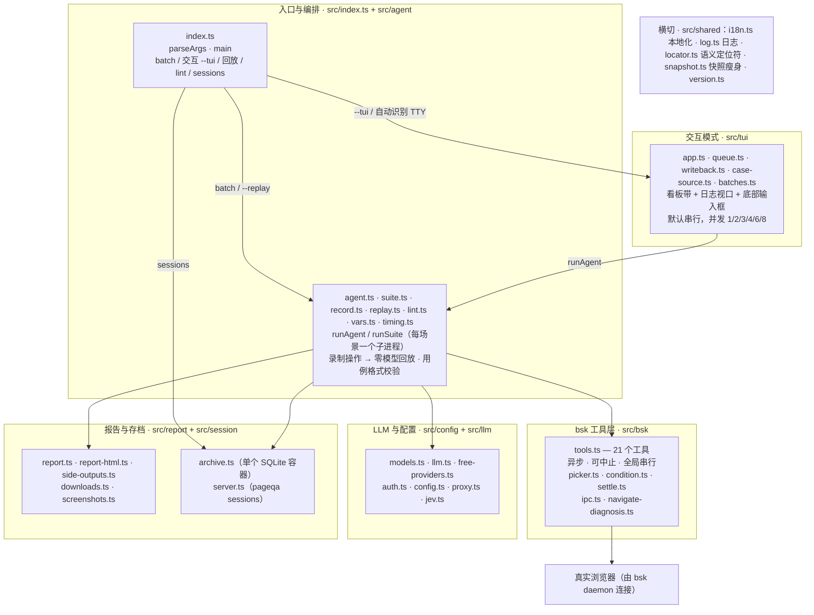

# pageqa

> English documentation: [README.md](./README.md)

用自然语言驱动的页面测试 agent：**LLM 解析意图 → browserskill（`bsk`）驱动真实浏览器执行 → 产出文本/JSON 报告与可接入 CI 的退出码**。首次跑通后把操作序列固化成回放脚本，之后可零模型重跑同一条用例。

交互模式（TUI）是默认且推荐的使用方式：一个长流程动辄十几分钟，期间你还能随时追加场景、切换模型、看实时进度与 token 消耗。

<https://github.com/user-attachments/assets/d5315f93-7e02-4445-a7cf-506b3bfcaa2d>

---

## 安装与前置

**1. 安装 `pageqa`**：需要 Node.js ≥ 22.19。

```bash
npm install -g pageqa      # 或 pnpm add -g pageqa
pageqa --init-config       # 在用户目录创建 ~/.pageqa/config.json
```

**2. 安装并连接 browserskill（`bsk`）**（驱动真实浏览器的插件，[项目主页](https://github.com/Tencent/BrowserSkill)）：

```bash
bsk status                 # 查看 daemon 与已连接浏览器
bsk session start          # 可选：手动建 session（不传 --session 时 pageqa 自动建）
```

> pageqa 运行时会自动后台启动 bsk daemon（每个进程一次）。但**浏览器连接要你自己做**：在浏览器里装好 bsk 扩展并完成连接。启动时检测不到已连接浏览器会明确报错并提示先连接，而不是卡死。

**3. 配置 LLM 端点**（默认 `http://127.0.0.1:3000/v1`，key 默认 `codebuddy-proxy-key`）：写入 `~/.pageqa/config.json`，或用环境变量 `PAGEQA_LLM_BASE_URL` / `PAGEQA_LLM_API_KEY` / `PAGEQA_LLM_MODEL`（环境变量 > 配置文件 > 内置默认）。

```json
{ "baseUrl": "http://127.0.0.1:3000/v1", "apiKey": "codebuddy-proxy-key", "model": "hunyuan-2.0-instruct", "locale": "zh" }
```

---

## 交互模式（TUI）—— 核心用法

在交互终端里直接运行就进入 TUI（stdin/stdout 都是 TTY 时自动进入）：

```bash
pageqa                       # 空会话：队列为空、无落点，随时 /run 加载用例
pageqa examples/smoke.md     # 打开一个用例文件并交互式运行
pageqa --tui examples/smoke.md   # 显式强制进入（非 TTY 下会直接报错）
```

进入条件（自动）：终端是 TTY 且未给 `--json`，且满足「给了用例文件」或「什么都没给」。**内联文本不会进入 TUI**（走批处理）；`--json` / `--replay` / `--session` / `--only` 会阻止进入（`--tui` 与 `--only` 同给则直接报错）。想关掉交互：`pageqa --no-tui` 或 `PAGEQA_NO_TUI=1`。

### 界面布局

```text
┌──────────────────────────────────────────────────────────┐
│ 看板带（仅终端列宽 ≥ 90 时渲染）：5 列按状态汇总场景       │  ← 等待中/进行中/成功/失败/已取消
├──────────────────────────────────────────────────────────┤
│                                                            │
│   滚动日志视口（跟随末尾；可上滚回看，进度/耗时/成败实时）  │
│                                                            │
├──────────────────────────────────────────────────────────┤
│ 状态栏：当前模型 · 待办数 · 落点（写回目标）                │
│ > 输入框（底部固定）                                        │
│ Token: ⬇ … / ⬆ … / 读 … / 写 … / 总 … · 命中 …%             │
│ 提示行                                                      │
└──────────────────────────────────────────────────────────┘
```

- **看板带**：把当前全部场景按状态分成 5 列（等待中 / 进行中 / 成功 / 失败 / 已取消），进行中的每张卡尾部带自己的实时耗时；列内按**入队顺序**取放得下的前若干张，超出显示 `+N 更多`。纯展示、点击不做操作；终端列宽低于 90 时不渲染，整片留给日志视口。
- **状态栏**常驻显示：当前模型、待办数与**落点**（追加场景写回的用例文件；无落点时提示「无」，此时追加场景只存在于本次会话、关掉就没）；**已写回数**只在真的写过之后才出现。
- **Token 行**（输入框下方）与报告末行同一句话，含正在跑的场景的实时值，**外加缓存命中率与当前上下文长度**：

  ```text
  Token: ⬇ 1.2k / ⬆ 567 / 读 8.9k / 写 42 / 总 10.7k（LLM 调用 3 次）  ·  命中 92%  ·  上下文 24.1k/128k（19%）
  ```

  省字全靠**位置**当图例：`⬇` = 输入（喂进模型的）、`⬆` = 输出、`读`/`写` = 缓存读/缓存写、`总` = 合计。末尾那段 `命中 92%` = 缓存读 /（输入 + 缓存读），也就是这次输入里几成是命中缓存的。跑着看到它稳定在高位，说明 prompt 前缀没被改动、缓存一直在命中。分母为 0（回放、端点没返回用量、还没开始调用）时不显示这一段，而不是写个 0%。`上下文 24.1k/128k（19%）` 是最近一轮**实际发出去**的 token 数，对照模型窗口（窗口大小未知时只显示 `上下文 24.1k`；没有场景在跑时不显示，免得留着上一条场景的残影）。这行每轮刷新，所以用 `1.2k` / `24.1k` 的紧凑写法；报告末行仍是精确值。

### 提交场景

- 输入框直接敲自然语言，**Enter** 提交；若文本含 `## 标题` 则该行作为场景名，否则取首行摘要。**Shift+Enter** 换行（写多场景用例）。
- 提交即「写回 + 入队」：有落点时先追加写回落点文件再入队（保证「敲下去就留下了」）；正在跑则排队，当前场景结束后自动接上。

### 命令（`/` 开头，行首输入 `/` 弹出模糊补全列表）

| 命令 | 作用 |
| --- | --- |
| `/run <路径或关键字>` | 运行时加载用例文件进队列：精确路径、目录（该目录下全部用例）、文件名关键字都行；多个命中先让模型从文件名里挑，挑不出再弹选择器。落点切到它 |
| `/status` | 查看运行队列（每场景一行带状态与来源） |
| `/cancel <n>` | 取消队列里还没开始的第 n 个场景 |
| `/new` | 开新会话：清空视口与队列、token 重新计，但**上一批归档**（仍进退出报告与回放脚本）。队列还有在跑/待办时拒绝 |
| `/model` | 切换本会话模型——`Enter` 即切换**并**存为启动默认。列表自带一批**免费网关**，带「免费」标记——见[免费模型网关](#免费模型网关) |
| `/login` · `/logout` | 登录 / 移除某 provider 的本地凭据（写入 `~/.pageqa/auth.json`） |
| `/setting` | 改持久化偏好：测试报告(HTML) / 回放脚本 开关、语言、**并发量**（1/2/3/4/6/8） |
| `/proxy` | 模型请求的代理路由：开关（写回 `~/.pageqa/proxy.json`）、仅本次会话直连、重新加载配置、查看统计与规则——见[模型请求的代理](#模型请求的代理) |
| `/help` · `/exit` | 帮助 / 收工退出（`/quit` 同义） |

### 键位

| 键 | 作用 |
| --- | --- |
| `Enter` | 提交输入 |
| `Shift+Enter` | 换行 |
| `Esc` | 中止正在跑的场景（记为「已取消」，不计退出码、不写回放）；提问中则取消提问 |
| `Ctrl+C` | 收工：中止当前 + 取消全部待办 → 还原终端 → 打印汇总报告（正常退出，非硬杀；收尾期间再按一次表示立刻收尾） |
| `PageUp`/`PageDown` | 日志翻页 |
| `↑`/`↓` | 输入框为空时滚日志（部分终端把滚轮翻译成这两个键） |
| `Ctrl+↑`/`Ctrl+↓` | 日志逐行滚（写多行用例时也生效） |
| `Ctrl+P`/`Ctrl+N` | 输入历史上/下 |
| `Ctrl+Home`/`Ctrl+End` | 跳到日志开头 / 回到底部（恢复跟随） |
| 鼠标滚轮 | 日志滚动（每次 3 行；上滚暂停跟随，点末行提示或 `Ctrl+End` 回底部） |

> `/run` 加载的场景**不写回**（本就在文件里），仅切换落点；只有你追加的场景才写回。无落点的追加场景关掉即丢，退出时会如实说明数量。

---

## 批处理模式（Batch）—— 一次性运行 / CI

不适合边跑边交互时用，或直接接 CI：

```bash
pageqa "打开 https://example.com 并断言标题包含 Example"   # 内联自然语言
pageqa examples/smoke.md        # 读用例文件（自动识别 ## 分隔的多场景）
pageqa --json examples/smoke.md # 输出 JSON 报告
pageqa --suite "..."            # 强制多场景套件模式
pageqa --concurrency 4 examples/smoke-test.md   # 同时跑最多 4 个场景（默认 1 = 逐个跑）
pageqa --only 2 examples/smoke.md    # 只跑第 2 个场景
pageqa --only "表单填写测试" ...      # 按标题只跑一个（精确匹配）
pageqa --no-side-outputs ...    # 不写 HTML 报告与默认回放脚本，只给 stdout
pageqa --out report.txt ...     # 报告另存文件
```

- stdout 只放最终报告，日志走 stderr（互不干扰，方便 `pageqa --json … > report.json`）。
- 退出码：`0` 全部断言通过；`1` 任一断言失败/报错/无法执行——可直接作 CI 门槛。
- 每个场景开跑前先探一次模型连通性；不通则如实记该场景失败并取消后续待办，不浪费浏览器窗口。

**场景隔离**（见 `docs/adr/0013-scenario-process-isolation.md`）：套件模式下**每个场景在独立的子进程里执行**，父进程 fork 并汇总。因此某个场景把浏览器或 bsk daemon 搞崩（原生崩溃、被 OOM 杀掉）时，只会记这一个场景失败（报告里带 `reason: "crash"`），后面的场景照跑；失败后想单独重跑它，用 `--only <序号|标题>` 即可——`--only` 与父进程 fork 子进程走的是**同一条代码路径**。

**并行跑场景**：默认**逐个**跑（顺序是「场景之间可能有隐含顺序依赖」的保护，比如「创建 → 编辑 → 删除」）。确认这些场景互不依赖时，用 `--concurrency <n>`（或 `PAGEQA_CONCURRENCY` / 配置项 `concurrency`）同时跑最多 n 个：每个场景仍然各自一个子进程、一个 session、一个**浏览器窗口**（n 就是同时开着的窗口数，所以上限 8，超过直接报错而不是静默截断）。结果顺序不变——报告与回放脚本一律按用例原文排，谁先跑完不影响。并发时每行日志会带 `[#序号 场景名]` 前缀，否则几路输出混在一起没法看。

**交互模式同样认并发量**：启动时的 `--concurrency` 只是本次会话的起点，进去之后用 `/setting` → 「并发量」随时改（档位 1/2/3/4/6/8），**改完立刻生效**——之后派发的场景就按新值来，已经在跑的不受打扰——并写回 `~/.pageqa/config.json`。并发时看板带的「进行中」列会同时挂多张卡（各带自己的实时耗时），状态栏那句「第 k/n 个」换成「运行中 N 个 · 最早…已跑 …」，`Esc` 则一次中止**全部**在跑的场景（并发之后「当前场景」不再唯一）。`--replay` 不走场景调度器，并发对回放没有意义。

崩溃与超时都记失败、不牵连别人；只有环境级故障（模型端点不可达、bsk/浏览器不可用）才会把剩余场景记为「已取消」。会话与浏览器窗口的生命周期归父进程，所以被强杀的子进程不会留下孤儿窗口。

---

## 回放（Replay）—— 零模型重跑

首次带模型跑通后，操作序列默认固化成回放脚本（`*.replay.json`，贴着源用例；可在 `/setting` 关掉，`--emit-script` 显式开关优先）。之后用回放脚本零模型重跑，秒级完成、不依赖 LLM，适合「跑一次建模、日后每天回归」接 CI：

```bash
pageqa --emit-script examples/smoke.md              # 显式生成脚本（默认已自动生成）
pageqa --replay examples/smoke.replay.json          # 零模型回放
pageqa --replay examples/smoke.replay.json --json   # 机器可读报告
pageqa --replay examples/smoke.replay.json --semantic  # 断言改用 Jev 语义判断
```

要点：脚本存**语义定位符**（角色+可访问名+同名序号+祖先路径），重跑时按当前快照重定位，小改动通常仍命中；找不到元素时如实说明原因而非乱猜。元素未找到 → 跳过并继续（报告中列出），其它失败 → 记失败并跑完整个用例；`navigate` 失败 → 直接中止。想「遇错即停」加 `--fail-fast`。

---

## 编写用例

用例是一段自然语言文本，按非空行拆成步骤（`#`/`>` 注释行不计）。用 `## 标题` 分隔多个独立场景（各自独立的 bsk session 与浏览器窗口）。

**断言行要对齐工具调用**：报告会核对「用例里含『断言』的行数」与「实际产生的断言结果数」，两者必须相等——每个 `assert_text` 产一个断言，`download`、`assert_no_console_error`、`assert_network` 同样各算一个（`download` 别再单写一行「断言已下载」）。注释行不计，所以解释性文字不会虚增计数。

**运行时占位符**（一处展开；因为每个场景各自在独立子进程里执行，时刻按**场景**取，不再整轮共用一个——见 ADR-0013）：

| 占位符 | 展开为 |
| --- | --- |
| `${timestamp}` | `yyyyMMddHHmm` |
| `${date}` / `${time}` | `yyyyMMdd` / `HHmmss` |
| `${datetime}` | `yyyyMMddHHmmss` |
| `${timestamp:<格式>}` | 自定义，支持 `yyyy yy MM dd HH mm ss SSS` |

未识别的占位符（如 `${PATH}`）原样保留。

**文件上传**：用例里写「点击上传按钮上传本地文件 `<绝对路径>`」，agent 调 `upload`（先给 bsk 扩展开启「允许访问文件网址」）。**文件下载/导出**：写「点击导出、在对话框确认、验证文件已下载」，agent 调 `download`（`target` 是触发下载的元素，`expectName` 用 glob 匹配文件名，如 `*.xls`）。下载断言成立后会自动清理落盘文件（可在 config 关 `downloadCleanup`）。

### 格式校验：`pageqa lint`

上面这些约定只靠人记不住，而且违反了往往**跑完十几分钟才说**，还常以「断言数不足」「步骤未跑满」这类**假失败**的样子出现。`pageqa lint` 把同一套口径搬到开跑之前——只读文本，**不开浏览器、不调模型**，秒级给出「第几行、哪条规则、为什么」：

```bash
pageqa lint examples/smoke-test.md                        # 人看
pageqa lint --json examples/smoke.md examples/smoke-test.md   # 机器看（CI 消费）
pageqa lint --strict cases/login.md                       # 告警也算失败（提交钩子用）
```

判定用的步骤数与断言数直接复用运行时那份代码（`numberSteps` / `countAssertions`），所以**不会出现「lint 说没事、一跑报断言不足」**。

| 级别 | 规则 |
| --- | --- |
| `error`（退出码 1） | 空场景、重名场景、`@e3` 快照编号、导航动词（`打开`/`访问`/`前往`/`跳转到`/`进入`）后面缺 http/https、未知占位符（`${PATH}` 会被原样保留）、上传没给绝对路径 |
| `warn`（`--strict` 时也非零） | `## ` 之前的正文被丢弃、`等待 N 秒` 这类固定等待、下拉框写成「填写/填入」、下载后又单写一行「断言文件名…」、说明性文字被当成步骤、整个场景没有断言、**断言里没有可字面匹配的文本**（如「存在数据行」「弹框已打开」） |

退出码：`0` 没问题；`1` 有 `error`（`--strict` 时 `warn` 也算）。

**跑用例时也会自动预检**：每次 `pageqa` 跑用例（批处理 / 交互模式 / `--only`）之前都用同一份口径扫一遍，把问题打在 stderr 上（最多展开 5 条）。它**只提示、不拦**——能跑起来的用例就该让它跑完，真失败比格式告警值钱；要设门槛就把 `pageqa lint` 接进 CI。不想看这段加 `--no-lint`。

> `examples/smoke.md` 的 `## ` 之前的说明改成 `>` 引用行不是洁癖：那段正文会被整体丢弃，而且它还会计进「步骤总数」——留着的唯一效果是让 n 比模型实际能跑的步数多 1。

---

## 配置与可选增强

- **配置文件**：`~/.pageqa/config.json`，字段 `baseUrl`/`apiKey`/`model`/`modelProvider`/`locale`/`htmlReport`/`replayScript`/`downloadDir`/`downloadCleanup`/`autoScreenshot`/`scenarioTimeoutMs`/`concurrency`。优先级：环境变量 `PAGEQA_*` > 配置文件 > 内置默认——但只有端点 / 模型 / 语言 / 超时 / 并发这几组有环境变量覆盖；旁路产物开关（`htmlReport`、`replayScript`、`downloadDir`、`downloadCleanup`、`autoScreenshot`）只读配置文件。
- **并行度（可选）**：`concurrency` 或 `PAGEQA_CONCURRENCY`（**默认 1** = 逐个跑，上限 8）。并行等于声明「这些场景互不依赖」，所以默认不开；同时开着的浏览器窗口数就等于这个值。
- **场景级执行上限（可选）**：`scenarioTimeoutMs` 或 `PAGEQA_SCENARIO_TIMEOUT`（毫秒，**默认不限**）。套件模式下单个场景超过上限即终止它的子进程、该场景记失败（报告里带 `reason: "timeout"`）、**继续跑后面的场景**。默认关着：长流程十几分钟是常态，凭空定一个上限就是给自己造新的失败来源；CI 要门禁时显式设。
- **Jev 语义断言（可选）**：在 config 加 `jev` 字段（或 `PAGEQA_JEV_*` 环境变量），用于字面未命中时的语义复检，纠正同义/近义/格式差异造成的假 FAIL；调用失败自动降级回字符串匹配。
- **关闭端点的思考模式（可选）**：混元 / DeepSeek / Qwen / GLM 这类**混合推理**模型在 OpenAI 兼容端点上默认开着思考，模型会先吐一大段思考内容——慢、烧 token，还把 agent 的步骤编号与结论搅乱。配 `thinkingFormat`（或环境变量 `PAGEQA_LLM_THINKING_FORMAT`）后，pageqa 会在**每次请求**里显式带上该端点认的关闭字段：

  | `thinkingFormat` | 关思考时请求体里发的字段 |
  | --- | --- |
  | `deepseek` / `zai` | `thinking: { "type": "disabled" }` |
  | `qwen` | `enable_thinking: false` |
  | `qwen-chat-template` | `chat_template_kwargs: { "enable_thinking": false, "preserve_thinking": true }` |
  | `together` | `reasoning: { "enabled": false }` |
  | `openrouter` | `reasoning: { "effort": "none" }` |
  | `string-thinking` | `thinking: "none"` |
  | `openai` / `ant-ling` / `baseten` / `chat-template` | **发不出关闭开关**（只在请求了思考档位时才带字段），配了等于没配 |

  **默认就是关**：不配时按模型 id 自动判断该端点认哪个字段（`qwen*`/`qwq*` 走 `enable_thinking: false`；`deepseek*`、`hunyuan*`、`hy*`、`glm*` 走 `thinking: {"type":"disabled"}`；认不出时用最常见的 deepseek 约定）。要改写法就填上表里的取值，要「不要关」就填 `none`/`off`。
  启动时会打印实际生效的取值与发出的字段。**万一端点不认这个字段**（严格实现会直接 400），探活会自动去掉它重试一次并把这次降级写进模型对象，本进程后续都不再发，同时打一行说明。所以「默认关闭」不会把本来能用的端点弄坏，代价只在真不兼容时多一次探活请求。
- **语言**：`--locale zh|en` 或 `PAGEQA_LOCALE`；默认 `zh`。数据契约（JSON 字段、退出码）与语言无关。
- **模型请求代理（可选）**：`~/.pageqa/proxy.json`，见下面的[模型请求的代理](#模型请求的代理)。
- **免费模型网关（可选）**：`/model` 里自带一批免费/免登录的 OpenAI 兼容网关，见下面的[免费模型网关](#免费模型网关)。

---

## 免费模型网关

`/model` 里除了自定义端点与 pi-ai 内置 provider，还自带一批**免费**网关（数据取自[pi-free](https://github.com/apmantza/pi-free) 的整理，`/model` 里带「免费」标记）：

| provider | 端点 | key 环境变量 | 备注 |
| --- | --- | --- | --- |
| `cline` | `https://api.cline.bot/api/v1` | `CLINE_API_KEY` | 目录公开；**聊天仍需登录**（`/login cline`）。未登录时模型照常列出，探活会给出可读报错 |
| `llm7` | `https://api.llm7.io/v1` | `LLM7_API_KEY` | 两个免费 selector：`default` / `fast` |
| `fastrouter` | `https://api.fastrouter.ai/api/v1` | `FASTROUTER_API_KEY` | 目录公开；`:free` 路由有每分钟/每天限额 |
| `orcarouter` | `https://api.orcarouter.ai/v1` | `ORCAROUTER_API_KEY` | 需 key；只列 `-free` 路由 |
| `xkiro` | `https://api.xkiro.com/v1` | `XKIRO_API_KEY` | 需 key；只列 `:free` 路由 |
| `kilo` | `https://api.kilo.ai/api/gateway` | `KILO_API_KEY` | 需 key，或用设备码登录（`/login kilo`）；唯一一个 `/models` 带权威 `isFree` 标记的网关，免费清单不靠命名规律猜 |
| `opencode-free` | `https://opencode.ai/zen/v1` | *（无，固定匿名 bearer `public`）* | OpenCode Zen 的匿名免费车道；恒出现在列表里、无需任何凭据，但请求必须带下面的工具指纹 |

- **不用装 Pi CLI**：pi-free 本身是 Pi 的扩展（依赖 `@earendil-works/pi-coding-agent`），pageqa 只把它整理出来的数据搬了过来。
- **目录先远端后快照**：打开 `/model` 时并发拉各网关的公开 `/v1/models`，只保留免费条目；拉不到就用内置快照（pi-free 2026-08-26 审计的结果），因此断网也总有模型可选。刷新失败不报错，静默回落。
- **凭据**：写环境变量或直接 `/login <provider>`，都落 `~/.pageqa/auth.json`。`cline` / `llm7` / `fastrouter` / `opencode-free` 不配也能用、装完就出现在列表里；`kilo` / `orcarouter` / `xkiro` 必须配 key 才出现（kilo 也可用 `/login kilo`）。
- **不保证**：免费网关的限流、模型下线、目录改名都由上游说了算。探活（开跑前那次 `ping`）就是为此存在的——不通会直接中止并说明原因，不会让场景跑出一堆假失败。
- **`opencode-free` 也搬了，代价是一道指纹门禁**：OpenCode Zen 的免费层会指纹请求里的工具列表——`tools[]` 必须同时含 `bash`/`edit`/`glob`/`grep`/`read`，否则 403 `FreeTierError`。pageqa 的工具集是浏览器动作，五个一个都没有，所以**只在选中这个网关时**才补五个占位工具：它们只为过门禁而声明，模型真去调时如实回答「pageqa 未实现，请改用浏览器工具」。别的 provider 不受影响（桩是**按运行**追加的，不是全局的），代价是这条车道上每轮多几百 token。

---

## 模型请求的代理

有的网络里模型端点直连不通，而 `127.0.0.1` 上的本地端点与 bsk daemon **必须**直连。一刀切地设 `HTTP_PROXY` 会把本地端点也塞进代理，症状是「连上了但不回话」。所以 pageqa 按域名逐条路由：

| 动作 | 含义 |
| --- | --- |
| `direct` | 永远直连 |
| `proxy` | 永远走代理 |
| `fallback` | 先直连，遇到**网络层**错误再走代理重试（默认） |

- **配置文件**：`~/.pageqa/proxy.json`（`pageqa --init-config` 会生成一份）。优先级：环境变量 `PAGEQA_PROXY_*` > 配置文件 > 内置默认。

```json
{
  "proxy": "http://127.0.0.1:7890",
  "enabled": true,
  "mode": "fallback",
  "rules": [
    { "match": "localhost,127.0.0.1,*.local,10.*,192.168.*", "action": "direct", "comment": "本机 / 内网" },
    { "match": "api.deepseek.com", "action": "proxy", "comment": "强制走代理" },
    { "match": "*", "action": "fallback", "comment": "先直连，失败再走代理" }
  ]
}
```

规则自上而下匹配，第一条命中者胜；都没命中按全局 `mode` 走。`"rules": []` 表示「不设任何规则，全部按 `mode`」。

| 模式 | 匹配 |
| --- | --- |
| `example.com` | 只匹配该域名 |
| `*.example.com` | 任意层级子域（含裸域本身） |
| `10.*` · `172.2*` | IP 前缀/网段（`*` 可在任意位置） |
| `*` | 全部 |

- **默认行为**：完全没有 `proxy.json` 时也会路由——本机与内网 `direct`，其余 `fallback`。因此本机端点不受影响，墙外的模型端点自动改走代理；唯一的行为变化是「直连失败的请求会多一次经 `http://127.0.0.1:7890` 的尝试」。想彻底关掉：`"enabled": false`（或 `PAGEQA_PROXY_ENABLED=false`）。
- **环境变量覆盖**（CI 里常用）：`PAGEQA_PROXY_URL`、`PAGEQA_PROXY_ENABLED`、`PAGEQA_PROXY_MODE`。想沿用 shell 里的 `HTTPS_PROXY` 就显式传：`PAGEQA_PROXY_URL=$HTTPS_PROXY pageqa 用例.md`。
- **交互模式**：`/proxy` 面板可开关（写回文件）、仅本次会话直连（不写盘）、重新加载文件、查看统计与规则。`--debug` 启动时会打一行当前状态。
- Jev 语义复核（`--semantic`）的对外请求走同一套路由。

---

## CLI 选项

| 选项 | 说明 |
| --- | --- |
| `--session <id>` | 指定已有 bsk session（默认自动建） |
| `--locale <zh\|en>` | 界面/日志/报告语种（默认 zh） |
| `--json` | 输出 JSON 报告（与 TUI 互斥） |
| `--suite` | 强制多场景套件模式 |
| `--only <序号\|标题>` | 只跑其中一个场景（序号 1 起，或标题精确匹配）；输出仍是套件形态。与 `--suite`/`--tui`/`--replay` 互斥 |
| `--concurrency <n>` | 同时跑最多 n 个场景（**上限**，默认 1 = 逐个跑；`PAGEQA_CONCURRENCY` / 配置项 `concurrency` 同效）。上限 8，超过报错；交互模式也认它（进去后用 `/setting` 的「并发量」随时改），`--replay` 不用 |
| `--tui` / `--no-tui` | 强制开/关交互模式（`PAGEQA_NO_TUI=1` 同效） |
| `--emit-script [path]` | 固化回放脚本（默认已开，路径贴源用例） |
| `--no-side-outputs` | 不写旁路产物（HTML 报告、默认回放脚本）；显式 `--emit-script <path>` 仍然生效 |
| `--usage-stream` | 把 LLM 用量逐次打到 stderr（一行一次，前缀 `[pageqa:usage]`）；场景在子进程里跑时父进程靠它取实时用量 |
| `--no-lint` | 跳过「跑用例前的格式预检」（默认开；预检只在 stderr 提示、不拦执行）。要设门槛就用 `pageqa lint` |
| `lint`（子命令） | `pageqa lint <用例文件…>`：静态校验用例格式，不开浏览器、不调模型（`--json` / `--strict`）；退出码 `1` 表示有 `error` |
| `--replay <file>` | 零模型回放已有脚本 |
| `--semantic` | 回放时断言用 Jev 语义判断 |
| `--fail-fast` | 回放时任一失败即停该场景 |
| `--settle-waits` | 回放时把 `wait` 步骤执行成「等页面稳定，上限为脚本记下的毫秒数」而不是等满。更快，但「为页面之外的事情留的等待」（服务端导出、后台排队）可能被提前放行 |
| `--locate-timeout <ms>` | 回放时，定位符**所在区域整体缺失**时等页面就绪的上限（默认 8000；`0` = 不等，立刻判「元素未找到」） |
| `--init-config` | 配置文件不存在时创建它（不会重置已有的那份） |
| `--out <file>` | 报告另存文件 |
| `--debug` | 调试日志（bsk 命令与耗时、快照瘦身、Jev 请求等） |
| `sessions`（子命令） | `pageqa sessions`：起本地存档查询服务，回看每次运行交给模型的参数与完整交互（`--port <n>` / `--dir <path>` / `--no-open`） |
| `-v, --version` · `-h, --help` | 版本 / 帮助 |

---

## 查看运行存档（`pageqa sessions`）

出问题时能看到多少现场，决定了能不能查下去。每次运行都会把「交给 agent 的参数」与「运行中的完整交互」写进 `~/.pageqa/sessions/sessions.sqlite`（**SQLite 单容器**，走 pi 的 `@earendil-works/pi-durable`：一次运行 = 文档族 `pageqa.archive` 的一个成员（键就是运行 id），列表页的摘要存在单例文档 `pageqa.index` 里，档案与索引整条一次事务落库），`pageqa sessions` 起一个本地服务把它们摆出来：

- **传给 agent 的参数**：系统提示词、模型、工具声明（含 JSON Schema）、编号后的用例与占位符取值；
- **每轮 LLM 的上下文**：这一轮**实际发出去**的消息（含上下文裁剪的结果）——回答「模型到底看到了什么、是不是把前面的步骤挤掉了」；
- **每次工具调用**：模型给的入参、工具返回的结果或失败原因、耗时与成败。

```bash
pageqa sessions                  # 默认 http://127.0.0.1:7331/（端口被占用会自动顺延）
pageqa sessions --port 8080      # 指定端口
pageqa sessions --dir ./archives # 换一个存档目录
pageqa sessions --no-open        # 不自动打开浏览器
```

存档由每次运行自动写入，无需额外开关；套件模式下逐场景各一条。它落在**用户目录**而不是工作目录，也不受 `--no-side-outputs` 影响——它是排查工具，不是测试产物；默认只保留最近 200 次运行。存档里含系统提示词、用例文本与页面快照，因此服务只监听回环地址（`127.0.0.1`）。

---

## 架构（分层 / 模块视图）

下图是**分层视图**——一层一个框（模块清单写在框里），只画层与层之间的主流程；运行时的实际时序见下方「工作原理」，逐文件的结构见 `src/`。


```mermaid
flowchart TD
  subgraph ENTRY["入口与编排 · src/index.ts + src/agent"]
    CLI["index.ts<br/>parseArgs · main<br/>batch / 交互 --tui / 回放 / lint / sessions"]
    RUN["agent.ts · suite.ts · record.ts · replay.ts · lint.ts · vars.ts · timing.ts<br/>runAgent / runSuite（每场景一个子进程）<br/>录制操作 → 零模型回放 · 用例格式校验"]
  end

  subgraph TUI["交互模式 · src/tui"]
    APP["app.ts · queue.ts · writeback.ts · case-source.ts · batches.ts<br/>看板带 + 日志视口 + 底部输入框<br/>默认串行，并发 1/2/3/4/6/8"]
  end

  subgraph BSK["bsk 工具层 · src/bsk"]
    TOOLS["tools.ts — 21 个工具<br/>异步 · 可中止 · 全局串行<br/>picker.ts · condition.ts · settle.ts<br/>ipc.ts · navigate-diagnosis.ts"]
  end

  subgraph LLMC["LLM 与配置 · src/config + src/llm"]
    MODELS["models.ts · llm.ts · free-providers.ts<br/>auth.ts · config.ts · proxy.ts · jev.ts"]
  end

  subgraph SIDE["报告与存档 · src/report + src/session"]
    REPORT["report.ts · report-html.ts · side-outputs.ts<br/>downloads.ts · screenshots.ts"]
    ARCHIVE["archive.ts（单个 SQLite 容器）<br/>server.ts（pageqa sessions）"]
  end

  XCUT["横切 · src/shared：i18n.ts 本地化 · log.ts 日志 · locator.ts 语义定位符 · snapshot.ts 快照瘦身 · version.ts"]
  BROWSER["真实浏览器（由 bsk daemon 连接）"]

  CLI -->|"batch / --replay"| RUN
  CLI -->|"--tui / 自动识别 TTY"| APP
  CLI -->|"sessions"| ARCHIVE
  APP -->|"runAgent"| RUN
  RUN --> MODELS
  RUN --> TOOLS
  RUN --> REPORT
  RUN --> ARCHIVE
  TOOLS --> BROWSER
```

### 工作原理

```
自然语言意图
   └─> pi-agent-core agent（LLM：可配置 OpenAI 兼容端点）
          └─> 每次请求先过 proxy.ts：按域名决定直连 / 走代理 / 先直连后代理
          └─> bsk 工具：navigate / snapshot / click / fill / select_option / pick_date / upload / download / hover / scroll / press / wheel / focus / blur / get_html / screenshot / wait / wait_for / assert_text / assert_no_console_error / assert_network
                 └─> 真实浏览器（由 bsk 连接）
          └─> 结论与证据 → 报告（文本/JSON）+ 退出码
          └─> 默认：把成功操作录制为回放脚本（*.replay.json；可在 /setting 关）

回放脚本 → pageqa --replay → 复用同一 bsk 操作层 → 真实浏览器 → 报告 + 退出码（全程不调 LLM）

交互模式（pageqa --tui <用例文件>）
   ├─> TUI：看板带（按状态 5 列）+ 滚动日志视口（经 setSink 合并进度日志）+ 底部固定输入框
   ├─> 运行队列：默认串行（并发量 1/2/3/4/6/8 可在 /setting 改）；提交的新场景先写回落点再入队
   └─> 退出 → 还原主屏 → 汇总报告（stdout/--out）+ 退出码（已取消不计入）
```

可用工具（`src/bsk/tools.ts`）：`navigate` 打开页面；`snapshot` 读取页面 aria 树与可见文本（含瘦身与复用，`refs` 档位只留可交互元素清单）；`click`/`fill`/`hover` 元素交互（带 `showPage: true` 时在结果里附一份动作后的元素清单，省掉紧接着的那次 snapshot）；`select_option` 一步完成下拉框/级联选择（点开 → 等浮层 → 按可见文本选中；**默认附**一份动作后的可交互元素清单，因为这类操作必然改动页面、旧 `@eN` 随即失效，传 `showPage: false` 可关）；`pick_date` 一步完成日期选择（点开面板 → 翻到目标年月 → 点中那一天，支持 `2026-09-29` / `today` / `+3` / `-7`；**日期范围**控件把结束日期传进 `endDate`，工具按「选开始 → 选结束 → 确定」走，类型与参数不一致时明确报错而不是留下半截范围）；`upload` 上传本地文件；`download` 捕获浏览器下载（本身即一项断言）；`scroll` 滚动到元素；`press` 真实键盘按键（输入框里回车提交、`Escape` 关掉弹窗、`Tab` 走焦点顺序；传 `target` 可先聚焦某个元素，不传则按在当前焦点上，即上一步 `fill` 的位置）；`wheel` 派发**真实滚轮事件**（无限加载的触底回调、横向滚动容器只认它——`scroll` 是「把元素滚进视口」、不产生滚动事件；`deltaY` 向下为正，一屏约 600–800）；`focus`/`blur` 聚焦与失焦（表单校验大多挂在 blur 上，「填完 → 失焦 → 断言报错提示」是常规链路，比「点一下别处」干净）；`get_html` 取原始 DOM HTML（补快照的盲区——`class`/`data-*`/`value` 这些**属性**快照看不到；默认只回 16KiB，要更大范围就传 `out` 落盘）；`screenshot` 截图留证（默认截视口，`fullPage: true` 截整页，`target` 传 `@eN` 只截那个元素；**图会内联进 HTML 报告**，`~/.pageqa/screenshots` 下也留一份；它是只读动作、**不产生断言**）；`wait`/`wait_for` 等待；`assert_text` 断言页面含指定文本（传 `absent: true` 反过来断言页面**不含**该文本——否定写在参数里，不要写进被断言的文本）；`assert_no_console_error` 断言页面没有 JavaScript 报错（未捕获异常与 `console.error`/浏览器错误日志——**这类错误不体现在页面文字上**，`assert_text` 永远看不到它；`ignore` 可放行已知噪音，`warnings: true` 把警告也算失败）；`assert_network` 断言某个请求发生了且状态符合期望（`url` 按子串匹配，`status` 写 `200` 或 `2xx`，不给 `status` 表示「请求成功完成」）。

**引用失效是自愈的**：任何动作用了过期的 `@eN` 都会被拒——这是为了防止静默点到同编号的另一个元素（见 `locator.ts` 的文件头）——而报错里会**直接附上当前页面的可交互元素清单**，模型不必再单独拍一次快照，拿新编号重试即可（`select_option` / `pick_date` 还会在**成功**结果里主动附上那份清单，「选完一个控件接着选下一个」因此不再多付一轮）。

选择类控件（Element Plus 等）走**混合策略**：优先用 `.el-*` 类名契约（比 aria 树稳），命不中时退回 `[role=listbox]` 等通用 ARIA 选择器；都找不到就如实报错并列出当前可选项，让模型退回「看快照自己点」的通用路径——**绝不猜元素**。这类控件为什么单独做一层：通用路径下「点开 → 看快照 → 点选项」是三轮 LLM 往返，选日期翻月份时更是一次点击一轮快照；压成一次调用后，一次选日期的墙钟从十几秒降到几秒。

长流程保护（自动续跑）：一轮对话后若 agent 自报进度未满（`steps done: k/n` 且 `k < n`）或用例有断言但报告只解析到部分，pageqa 自动追加「继续剩余步骤」提示，最多 5 轮；续跑后进度与断言数仍无推进则停止。

完整目录结构与各模块说明见 `src/`。

---

## 验证与 CI

```bash
pnpm install --frozen-lockfile && pnpm run build
pnpm run test:unit     # 单测：无浏览器/LLM/TTY 依赖
pnpm test              # 端到端冒烟：需 bsk 已连浏览器 + 可用 LLM 端点
```

`examples/smoke.md` 可直接当端到端样例跑（`pageqa examples/smoke.md --json`）。CI 注入 LLM 端点即可把本工具当质量门槛（`node dist/index.js --json examples/smoke.md`）。
